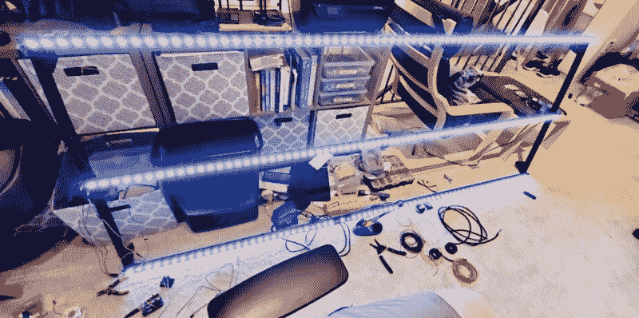

# 声控 RGB LEDs 变大

> 原文：<https://hackaday.com/2020/10/02/voice-controlled-rgb-leds-go-big/>

当我们在项目中看到 RGB LEDs 时，它们通常更多地用于美学目的，而不是作为实用的光源。这是一种简单的点缀颜色的方法，但肯定不是那种你想用来照亮比桌子大的东西的方法。显然，在布莱恩·哈姆斯建造光明井之前，没有人向他解释这些规则。

信不信由你，这个超大型灯光装置没有使用任何你不熟悉的外来硬件。从根本上说，我们看到的是支持 WiFi 的 Arduino MKR1000 驱动新像素 led 灯条。它只是比我们习惯的规模大得多，一个巨大的 4 x 8 铝挤压框架悬挂在客厅上方。

 【布莱恩】在那个框架上安装了一个由 74 片激光切割卡片制成的波浪形扩散器。唤起波浪或云的想法，光看起来像是自然的，甚至是生物的起源，同时又有一种独特的超凡脱俗的品质。

由于颜色之间的平滑过渡，当 RGB LEDs 开始工作时，这种效果甚至更加明显。在休息后的视频中，你可以看到光线从明亮的白色变成动画彩虹。作为一个附加的触摸，他通过 Arduino 的物联网云服务添加了 [Alexa 语音控制。](https://blog.arduino.cc/2019/11/12/create-a-voice-controlled-device-with-alexa-and-arduino-iot-cloud-in-7-minutes/)

[虽然 LED 家居照明越来越成为常态](https://hackaday.com/2020/02/16/have-led-bulbs-reached-their-final-and-cheapest-form/)，但像 Light 这样的项目提醒我们，我们并没有真正拥抱这项技术所提供的可能性。该行业如此努力地试图让 led 融入白炽灯泡的传统角色，但也许是时候重新思考了。

 [https://www.youtube.com/embed/JBNFrtWiiJ4?version=3&rel=1&showsearch=0&showinfo=1&iv_load_policy=1&fs=1&hl=en-US&autohide=2&wmode=transparent](https://www.youtube.com/embed/JBNFrtWiiJ4?version=3&rel=1&showsearch=0&showinfo=1&iv_load_policy=1&fs=1&hl=en-US&autohide=2&wmode=transparent)

