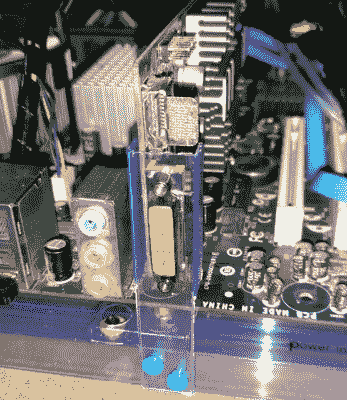

# Arduino 让旧电脑启动并重新投入使用

> 原文：<https://hackaday.com/2020/10/11/arduino-gets-old-pc-booted-and-back-into-action/>

2020 年还有多少人有 PS/2 键盘踢来踢去？诚然，向普通读者提出这样的问题可能是欺骗(你们中的一个人很有可能会对一个问题发表评论，只是为了证明一个观点)，但即使是最迂腐的读者也不得不承认，这是一个早已过时的标准。因此，当我们听到[缠头巾的工程师]试图启动一个太旧的主板，以至于无法通过 USB 键盘访问 BIOS 时，他没有一个现成的笔记本电脑，我们一点也不感到惊讶。

 但是他决定[装配一个 Arduino Nano 来模仿 PS/2 键盘](https://turbanedengineer.wordpress.com/2020/10/04/resurrection-of-an-old-pc/)的长度刚好够他浏览系统配置，而不是等待一个适配器出现在邮件中。因为这基本上意味着他只需要箭头键和回车键，他能够装配一些瞬时按钮作为输入。我们不建议用这样一个简单的板来打印你的回忆录，但是它确实足够好来改变引导设备的顺序。

然而，乐趣并没有就此停止。[缠头巾的工程师]还必须清理一些腐蚀，并在一排 RAM 上固定一个熔断的电阻，以便将这个老兵拖过终点线。他手边没有箱子，所以他用 ICs 自带的聚碳酸酯包装做了一个自由形状的箱子。最终的机器并不完全是一个沉睡者，但它足以在电视上玩*超级马里奥兄弟 3* 。

说到底，我们最近看到的其他自制键盘和[戴头巾的工程师]组装的最小输入设备[并没有多大区别。似乎 QMK 甚至对 PS/2 接口有一些基本的支持。不是说它会经常出现，但是“复古”模式可能是你下一个定制键盘版本的一个有趣的补充。](https://hackaday.com/2020/09/07/40-keyboard-build-is-100-open-source/)