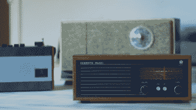

# 使用 ESP32 构建互联网收音机既快速又简单

> 原文：<https://hackaday.com/2020/10/15/building-an-internet-radio-is-quick-and-easy-with-the-esp32/>

地面广播固然很好，但它会限制你收听本地电台。[Nick Koumaris]住在希腊南部的一个小镇上，遗憾的是，他最喜欢的电台在他所在的地区没有信号。因此，网络收音机是自然的解决方案。

【大卫·沃茨】也做了类似的构建，将硬件放入一台上世纪 70 年代的惊艳的罗伯茨 RM20 收音机中。

虽然在这些情况下树莓派是一种常见的方式，但 ESP32 有足够的工作量来完成这项工作，而不会像运行完整的 Linux 发行版那样需要很长的启动时间。结合 VS1503 MP3 解码板和 PAM8403 放大器，它能够在线调谐流。[Nick]在 LCD 上使用复古界面，使用 Nextion 部件作为其板载控制器和内置 GUI 工具。从该项目中获得灵感，[【大卫·沃茨】执行了一个类似的构建](https://www.youtube.com/watch?v=afBSpobG6Zo&feature=emb_title)，但改为使用 Arduino Nano 来连接老式罗伯茨 RM20 收音机的控制。

虽然我们都有智能手机可以用来听在线内容，但如果有一款设备可以让我们播放一些音乐，而不是在每次收到电子邮件或附近国家爆发政府丑闻时不断发出通知和钟声，那会很好。当构建自己的收音机时，你可以根据自己的喜好定制界面——[就像这个构建，它让用户扫描全球寻找收听](https://hackaday.com/2020/07/27/radioglobe-takes-the-world-of-internet-radio-for-a-spin/)的电台。休息后的视频。

 [https://www.youtube.com/embed/eFs2ePMQz8c?version=3&rel=1&showsearch=0&showinfo=1&iv_load_policy=1&fs=1&hl=en-US&autohide=2&wmode=transparent](https://www.youtube.com/embed/eFs2ePMQz8c?version=3&rel=1&showsearch=0&showinfo=1&iv_load_policy=1&fs=1&hl=en-US&autohide=2&wmode=transparent)

 [https://www.youtube.com/embed/afBSpobG6Zo?version=3&rel=1&showsearch=0&showinfo=1&iv_load_policy=1&fs=1&hl=en-US&autohide=2&wmode=transparent](https://www.youtube.com/embed/afBSpobG6Zo?version=3&rel=1&showsearch=0&showinfo=1&iv_load_policy=1&fs=1&hl=en-US&autohide=2&wmode=transparent)

