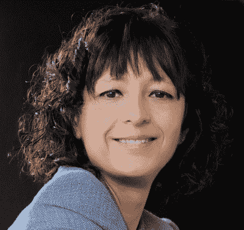
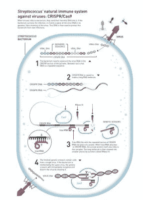

# 艾曼纽尔·查彭蒂尔和詹妮弗·杜德纳改进了大自然母亲的基因剪刀，并因此获得了诺贝尔奖

> 原文：<https://hackaday.com/2020/11/03/emmanuelle-charpentier-and-jennifer-doudna-sharpened-mother-natures-genetic-scissors-and-won-the-nobel-for-it/>

这听起来像科幻小说——直到 2012 年，廉价而容易地编辑 DNA 串的能力正是如此。但事实证明，CRISPR/Cas9 基因编辑是一种完全自然的功能，在这种功能中，细菌通过提取病毒遗传物质的片段来记录其与病毒的相互作用，并将其存档以备后用。

[现在，两名女性因“开发了一种基因组编辑方法”而获得 2020 年诺贝尔化学奖](https://www.nobelprize.org/prizes/chemistry/2020/summary/)。Emmanuelle Charpentier 和 Jennifer Doudna 利用 CRISPR 制作了一把基因剪刀，并通过证明他们可以用这种方式编辑任何 dna 字符串来展示他们有多锋利。自从 Emmanuelle 和 Jennifer 在 CRISPR/Cas9 上发表[他们的 2012 年论文以来，研究人员已经使用这些基因剪刀来创造抗旱植物，并寻找新的基于基因的癌症疗法。研究人员还希望利用 CRISPR/Cas9 来治疗亨廷顿舞蹈症和镰状细胞性贫血等遗传疾病。](https://science.sciencemag.org/content/337/6096/816)

这一发现始于 Emmanuelle Charpentier 对化脓性链球菌的研究。她试图了解它的基因是如何调节的，并希望制造一种抗生素。一旦她与詹妮弗·杜德纳合作，他们反而发现了一项科学突破。

Dr. Emmanuelle Charpentier via [Wikimedia Commons](https://commons.wikimedia.org/w/index.php?curid=44041020)

### Emmanuelle Charpentier 对抗食肉细菌

Emmanuelle Charpentier 于 1968 年 12 月 11 日出生于法国奥尔盖河畔胡维西。她在皮埃尔和玛丽·居里大学，也就是现在的索邦大学学习生物化学、微生物学和遗传学。然后，她获得了巴斯德研究所的研究博士学位，并担任大学助教和研究科学家。Charpentier 博士目前是柏林马克斯·普朗克感染生物学研究所的主任，2018 年，她成立了一个独立的研究单位。

完成博士学位后，Charpentier 博士在美国工作了几年，然后在维也纳大学结束了工作，在那里她成立了一个研究小组。她的重点仍然是细菌*化脓性链球菌*，这种细菌每年导致数百万人遭受扁桃体炎和脓疱病等感染。它还会导致败血症，这正式使它成为一种食肉细菌。

2009 年，Charpentier 博士搬到了瑞典北部，接受了一个研究机会。她继续研究化脓链球菌，并绘制其中发现的小 RNA 图谱。在此过程中，Charpentier 博士发现了一种小 RNA 分子，其遗传密码非常接近其基因组中的 CRISPR 序列。

尽管她以前从未与 CRISPR 合作过，Charpentier 博士还是让她的团队绘制出了化脓链球菌中的 CRISPR 系统。该系统已经被证明只需要一个 Cas 蛋白来切割病毒 DNA，但 Charpentier 博士发现，现在被命名为反式激活 crispr RNA 或 [tracrRNA](https://en.wikipedia.org/wiki/Trans-activating_crRNA) 的小 RNA 分子对于 crispr 过程中产生的长 RNA 的成熟是必要的。当时，Charpentier 博士对 CRISPR 感到兴奋，并希望与生物化学家合作推进这项研究。她的第一选择是詹妮弗·多娜。

Dr. Jennifer Doudna via [Wikimedia Commons](https://upload.wikimedia.org/wikipedia/commons/5/5d/Professor_Jennifer_Doudna_ForMemRS.jpg)

### 詹妮弗·多娜负责 RNA 干扰

詹妮弗·a·杜德纳 1964 年 2 月 19 日出生于 DC 华盛顿州，但在夏威夷州的希洛长大。她于 1985 年获得波莫纳学院学士学位，1989 年获得哈佛医学院博士学位。Doudna 博士目前是加州大学伯克利分校的化学、分子和细胞生物学教授，也是加州大学旧金山分校的细胞和分子药理学副教授。

在她职业生涯的初期，Doudna 博士研究 RNA 酶，希望揭示它们的结构和生物功能。二十年后，她的实验室仍然专注于 RNA，他们现在正在通过结合使用 CRISPR、微小 RNA 和 RNA 干扰来理解涉及 RNA 的生物过程。

最后一个， [RNA 干扰](https://en.wikipedia.org/wiki/RNA_interference)，是 RNA 处理基因调控的过程。这也被称为 RNA 沉默。在 RNA 干扰中，一个基因的蛋白质生产被一个小干扰 RNA 关闭——一个微小的 RNA 分子，它会追捕任何与之完全匹配的信使 RNA 并将其扼杀。

2006 年，Doudna 博士接到一位微生物学家同事的电话，告诉她一项名为 CRISPR 的新发现。这位同事说，还没有人对它了解多少，但他们怀疑它的工作方式很像 RNA 干扰。研究人员比较了一些非常不同的细菌，发现它们都有一些重复的 DNA 序列。重复序列本身被称为 CRISPR——成簇的、规则间隔的短回文重复序列。在这些序列中有更短的、独特的、不重复的序列，它们与各种病毒的基因相匹配。因此，假设是细菌从每一个存活下来的病毒身上拿走一个纪念品，就像收集项链上的牙齿一样。

Doudna 博士还了解到，研究人员已经发现了特殊的基因，他们称之为 CRISPR 相关基因，或 Cas。她让她的研究小组追踪 Cas 蛋白，想知道它们的目的是否是切断 DNA 链。

The CRISPR/Cas9 natural gene-editing process of strep bacteria. Image via [Nobel Prize](https://www.nobelprize.org/prizes/chemistry/2020/popular-information/)

## 结对寻找剪刀

2011 年春天，Charpentier 博士应邀在波多黎各的一次会议上发言，讨论她围绕 tracrRNA 的发现。她决定利用这个机会向杜德纳博士介绍自己。

两人在会议的第二天偶然在一家咖啡馆相遇，由 Doudna 博士的一位同事介绍。第二天，他们漫步在古老的首都街道上，决定合作研究化脓性链球菌中 Cas9 蛋白的功能。他们怀疑更长的 CRISPR-RNA 是识别病毒 DNA 的东西，而 Cas9 蛋白进行实际切割。

在接下来的几个月里，两个团队进行了许多 DNA 切割实验，但什么也没发生。最终，他们将 tracrRNA 加入到罐子中，瞧，DNA 分子被一分为二。

他们并不满足于此，他们将 tracrRNA 和 CRISPR-RNA 结合成一个分子，现在称为 guide RNA，从而简化了剪刀。他们接着在五个不同的地方精确切割了一个基因，然后在 CRISPR/Cas9 上发表了他们的 2012 年论文。

## 基因编辑的未来

CRISPR 是一个令人兴奋的领域，因为它在动物和植物领域有很多不同的用途。Doudna 博士在获得诺贝尔奖后不久接受《未来人类》采访时讨论了其中的一些方法。她的公司 Mammoth Biosciences 正在为新冠肺炎研究一种快速的基于 CRISPR 的测试，并希望有一种像家庭妊娠测试一样简单的测试。她有另一家 CRISPR 公司，专注于阿尔茨海默氏症和帕金森氏症等神经退行性疾病。

我们很兴奋地看到 CRISPR/Cas9 基因编辑带我们去的所有地方。恭喜查彭蒂尔和杜德纳博士！