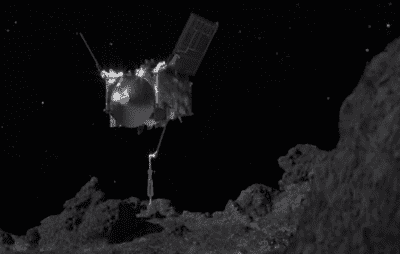

# 奥西里斯-雷克斯伸出手触摸小行星贝努鸟

> 原文：<https://hackaday.com/2020/10/20/osiris-rex-reaches-out-and-touches-asteroid-bennu/>

经过四年在深空中的跋涉，OSIRIS-REx 今晚创造了历史，它成为美国宇航局第一艘试图从小行星收集表面样本的航天器(编者注:服务器可能因突发新闻而停机)。一旦传感器确认收集到的物质已经安全装载，飞行器将开始远离 490 米宽的贝努鸟，为最终离开和返回地球做准备。如果一切按计划进行，运载珍贵货物的圆锥形样本返回舱将于 2023 年 9 月进入大气层并降落在犹他州测试和训练靶场。

OSIRIS-REx with solar panels in “Y-Wing” configuration.

由于其极低的重力和岩石表面，传统的在贝努鸟着陆被认为是不切实际的。相反， [OSIRIS-REx](https://www.nasa.gov/osiris-rex) 执行了一个大胆的接触和启动操作，使航天器与地表接触仅几秒钟。

在下降过程中，车辆底部的摄像头每隔几分钟拍摄一次图像，并通过一个名为自然特征跟踪(NFT)的车载系统进行处理，该系统可以自动驾驶车辆远离危险的表面特征。作为预防措施，OSIRIS-REx 上的太阳能电池板在下降前不久以“Y 翼”构型向后倾斜，以帮助保护它们不撞击表面或被喷出的物质损坏。

一旦安装在航天器 3.35 米(11 英尺)铰接机械臂末端的漏勺状接触式样本采集机制(TAGSAM)与风化层接触，加压氮气就被用来踢起材料，并将其推向机制中的存储缓存。由于成功收集表面物质非常重要，所以选择了这个主要是被动的系统，以最大限度地减少 OSIRIS-REx 与贝努鸟接触的关键几秒钟内可能出现的故障。任务规划者表示，可能要到周六才能确定样本是否成功采集，如果需要，飞船有能力再进行两次尝试。

在 1999 年 9 月发现它之后，阿雷西博天文台和戈德斯通深空网络都被用来对贝努鸟进行雷达观测，以研究它的形状和大小。计算显示，到 2199 年，它撞击地球的概率累计为 2700 分之一。通过绘制小行星的地图，近距离研究它，并将地质样本带回家，[美国宇航局希望获得关于如何探测类似近地天体的宝贵见解](https://hackaday.com/2020/07/22/the-wise-in-neowise-how-a-hibernating-satellite-awoke-to-discover-the-comet/)，并在需要时最终转移。