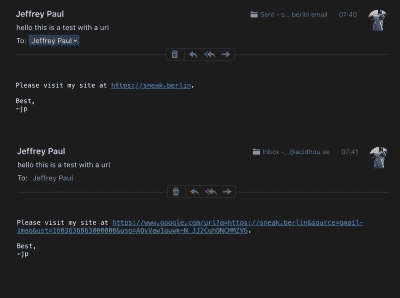

# 谷歌干预电子邮件中的网址，引发安全担忧

> 原文：<https://hackaday.com/2020/10/21/google-meddling-with-urls-in-emails-causing-security-concerns/>

尽管社交媒体很受欢迎，但对于真正重要的交流来说，电子邮件占据着至高无上的地位。对于全球企业的平稳运营至关重要，它因其可靠性而备受推崇。谷歌是世界上最大的电子邮件提供商之一，既有面向消费者的 Gmail 产品，也有面向企业客户的 G Suite【Jeffrey Paul】是后者[的用户，他惊讶地发现，当通过外部电子邮件阅读器使用的互联网消息访问协议(IMAP)获取时，收到的电子邮件中的 URL 会被服务](https://twitter.com/sneakdotberlin/status/1317734739537653760)修改。

这一变化似乎使 IMAP 用户在不登录 web 界面的情况下无法看到原始电子邮件，它破坏了加密签名的验证，这是一个惊喜。

## 安全事项

A test email sent to verify the edits made by Google’s servers. Top, the original email, bottom, what was received.

对于一部分用户来说，谷歌似乎正在修改电子邮件正文中的网址，转而通过他们自己的链接检查和重定向服务。这实际上包括在电子邮件到达用户之前编辑邮件正文。这意味着，即使那些使用外部客户端通过 IMAP 获取电子邮件的人也会受到影响，无法访问他们收到的原始电子邮件。

安全隐患非常严重，许多人怀疑最初的故事，怀疑编辑只发生在 Gmail 应用程序内或通过网络客户端进行。然而，一位声称为谷歌工作的消息人士证实，这项新功能正在向 G 套件客户推出，如果需要，可以关闭。联系谷歌寻求评论，我们被引导到他们关于这个话题的[帮助页面。](https://support.google.com/mail/answer/10173182)

谷歌的重定向服务包括一个链接检查器，以警告用户前往潜在的危险网站，此举据称是为了防止网络钓鱼。然而，对许多人来说，这种解释并不符合要求。强迫用户前往谷歌服务器查看他们被发送的原始 URL 对许多人来说是对隐私的严重侵犯，也是一个安全问题。它允许搜索巨头进一步将其点击跟踪的触角延伸到甚至私人电子邮件对话中。对一些人来说，影响更大。加密签名的消息，如使用 PGP 或 GPG 的消息，会被该工具破解；由于在此过程中修改了电子邮件正文的内容，因此邮件不再符合原始签名。当然，这就是对消息进行签名的价值——检测发送内容和接收内容之间的这种变化变得容易得多。

## 披露不充分

可以理解的是，许多人强烈反对该公司在没有事先咨询或警告的情况下实施这样的措施。在许多方面，电子邮件的内容是神圣不可侵犯的，以任何形式篡改它都会受到安全意识的谴责。如果这个特性是用户的选择，并且可以随意关闭，那么对于那些想要它的人来说，它就是一个有用的工具。但这一发现令许多人大吃一惊，很难相信它在推出前得到了充分披露。上面 FAQ 截图中的问题暗示这是谷歌 A/B 测试的一部分，并不适用于所有账户。在你的电子邮件账户上测试的功能应该被公开，但他们没有。

保护无辜用户免受网络钓鱼攻击是一个值得称赞的目标，我们可以想象许多企业主启用这样的功能来避免网络钓鱼攻击。这是另一个愿意用隐私换取安全的例子。尽管由于迄今为止实施的具体性质，这种骚动是有限的，但我们预计，如果这种做法蔓延到主流的 Gmail 产品，技术娴熟的人将进一步抛弃谷歌的电子邮件服务。不管接下来会发生什么，重要的是要记住你读的邮件可能不是你收到的那封，并据此采取行动。

*2020 年 10 月 30 日更新:人们发现，对于启用了高级保护的 G Suite 用户来说，根本不可能禁用这一功能。*