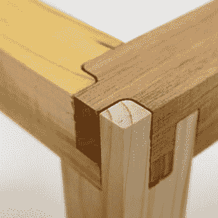

# 得益于新软件的交互功能，复杂的木材接头

> 原文：<https://hackaday.com/2020/10/23/complex-wood-joints-thanks-to-new-softwares-interactive-features/>

工艺精湛的木制关节像拼图一样拼在一起，既不需要胶水也不需要钉子，这是一种迷人的东西，但称手工设计和制造它们的过程“耗时”是一种轻描淡写。为了改变这种情况，东京大学的一个研究小组展示了一款用于交互式设计和制造复杂木制关节的软件系统[*。它以日语中的细木工一词命名，旨在使胶水和无紧固件连接的设计和制造变得更加容易。*](https://dl.acm.org/doi/10.1145/3379337.3415899)

*

Three-way joint that requires no glue or fasteners.

看起来该软件目前只是一个研究项目，并不是可以下载的东西 [该软件可以在 GitHub](https://github.com/marialarsson/tsugite) 上下载，它采用的方法很有趣。[这份可下载的 PDF 文件](https://dl.acm.org/doi/pdf/10.1145/3379337.3415899)解释了该软件如何处理如何使这样的任务具有交互性和实用性的问题。

巧妙之处在于，该软件不仅以所见即所得(WYSIWYG)的界面为关节本身提供设计帮助，还基于使用三轴数控工具作为制造方法来生成实时反馈。这意味着系统理解来自制造方法的约束，并将其结合到设计反馈中。

使用三轴 CNC 的两个主要限制是切削工具只能从上面接近材料，并且标准铣刀不能产生尖锐的内角；它们将具有与切割钻头半径相同的圆角。设计可以手动完成，也可以从预定义的库中选择关节。设计完成后，系统会生成用于制造的刀具路径。

目前，Tsugite 仅限于框架结构的单个接头，但没有理由不能扩展到这个范围之外。下面嵌入了本文附带的一个视频，它短小精悍，展示了该软件的运行情况，所以一定要看一看。

 [https://www.youtube.com/embed/a4jNpHJ9lp0?version=3&rel=1&showsearch=0&showinfo=1&iv_load_policy=1&fs=1&hl=en-US&autohide=2&wmode=transparent](https://www.youtube.com/embed/a4jNpHJ9lp0?version=3&rel=1&showsearch=0&showinfo=1&iv_load_policy=1&fs=1&hl=en-US&autohide=2&wmode=transparent)

我们喜欢这个想法，[它让我们想起了火柴棍项目](https://hackaday.com/2018/08/28/a-cnc-woodworking-tool-that-does-the-hard-parts/)，该项目也使用 CNC 来简化接头的制作。

[via [科技日报](https://scitechdaily.com/simple-software-creates-complex-wooden-joints-that-interlock-with-no-nails-glue-or-tools-needed/)*