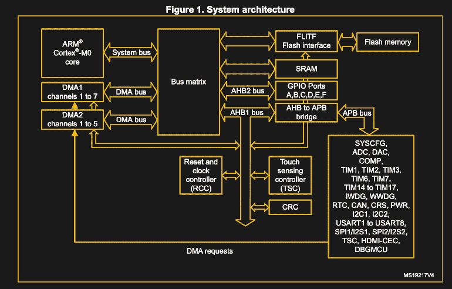

# 裸机 STM32: Blinky 和延迟函数的秘密

> 原文：<https://hackaday.com/2020/12/11/bare-metal-stm32-blinky-and-the-secret-of-delay-functions/>

MCU 或 SoC 的第一个例子通常涉及著名的“ [Blinky](https://github.com/MayaPosch/Nodate/blob/master/examples/stm32/blinky/src/blinky.cpp) ”例子，其中 LED 以固定延迟脉冲开启和关闭。这实际上比我们在本系列第一部分的[中看到的“](https://hackaday.com/2020/11/17/bare-metal-stm32-from-power-up-to-hello-world/)[爱出风头的](https://github.com/MayaPosch/Nodate/blob/master/examples/stm32/pushy/src/pushy.cpp)”例子要复杂得多。这样做的原因是，在一个简单的调用`delay()`或它的等价物的背后，实际上有一个相当大的故事。

原因在于，在微控制器(MCU)上实现延迟功能有多种方法，每种方法都有各自的优缺点。在 STM32 MCU 上，我们可以在主动延迟(`while`环路)、使用 SysTick 定时器实现的延迟和使用外设定时器之一之间进行选择。在后两种情况下，我们也必须使用中断。

在本文中，我们将看看所有这三种方法，以及它们的优缺点。

## 概述基础知识

在 Arm MCU 架构中，ST 微电子公司(“ST”)等制造商通常在相同系列的 MCU 中使用相同的 Cortex-M 处理器内核。该内核通过各种 [AMBA](https://en.wikipedia.org/wiki/Advanced_Microcontroller_Bus_Architecture) (高级微控制器总线架构)总线连接，其中 AHB 是快速总线。AHB 将内核连接到所有需要低延迟和速度的外设，如 RAM、ROM、GPIO 组和显示控制器。



STM32F0xx system architecture (RM 2.1).

同时，较慢的 APB 连接带宽较低、速度较慢的外设，包括 I2C、定时器、USARTs 和 SPI 外设。在 Pushy 示例中，处理器内核会不断查询 GPIO 外设的输入数据寄存器(GPIO_IDR ),并根据这些输入值写入输出数据寄存器(GPIO_ODR)。

## 输入 Blinky

在 Blinky 示例中，我们移除了用于读取按钮输入的 GPIO_IDR 的主动轮询，而是依赖于添加的延迟功能。每当我们从这个阻塞延迟功能返回时，我们切换 GPIO_ODR 位，这导致该引脚上连接的 LED 点亮或不点亮。

使用我的 [Nodate](https://github.com/MayaPosch/Nodate) 框架实现的代码示例因此变成:

<template class="js-file-alert-template"></template><template class="js-line-alert-template"></template>

|  | # 包括<gpio . h> |
|  | # 包括<timer . h> |
|  |  |
|  |  |
|  | int main () { |
|  | /初始化。 |
|  | 小时数； |
|  |  |
|  | //const uint 8 _ t led _ pin = 3；//Nucleo-f 042k 6:B 口，3 脚。 |
|  | // 常量 GPIO _ ports led _ PORT = GPIO _ PORT _ B； |
|  | //const uint 8 _ t led _ pin = 13；//STM 32 f 4-发现:D 口，13 号针(橙色) |
|  | // 常量 GPIO _ ports led _ PORT = GPIO _ PORT _ D； |
|  | //const uint 8 _ t led _ pin = 7；// Nucleo-F746ZG:端口 B，第 7 针(蓝色) |
|  | // 常量 GPIO _ ports led _ PORT = GPIO _ PORT _ B； |
|  | constuint 8 _ tled _ pin =13； // 蓝色药丸:C 口，13 号针。 |
|  | constGPIO _ ports led _ PORT = GPIO _ PORT _ C； |
|  |  |
|  | // 在 LED 管脚上设置管脚模式。 |
|  | GPIO::set _ output(led _ port，led_pin，GPIO _ PULL _ UP)； |
|  | GPIO::write (led_port，led_pin，GPIO _ LEVEL _ LOW)； |
|  |  |
|  | 而 ( 1 ) { |
|  | GPIO::write (led_port，led_pin，GPIO _ LEVEL _ HIGH)； |
|  | 计时器。延时(1000)； |
|  | GPIO::write (led_port，led_pin，GPIO _ LEVEL _ LOW)； |
|  | 计时器。延时(1000)； |
|  | } |
|  |  |
|  | 返回0； |
|  | } |

[view raw](https://gist.github.com/MayaPosch/bcc02c9e35dd8f825cb0c6398089db9a/raw/447fabf7e64144c394fc6617e8cc534e8e3280fa/stm32_example_blinky_nodate.cpp) [stm32_example_blinky_nodate.cpp](https://gist.github.com/MayaPosch/bcc02c9e35dd8f825cb0c6398089db9a#file-stm32_example_blinky_nodate-cpp) hosted with ❤ by [GitHub](https://github.com)

本例为不同的电路板定义了一些预设，这里使用的是“Blue Pill”(STM 32 f 103 c 8)版本。我们在这里不再讨论 [GPIO](https://github.com/MayaPosch/Nodate/blob/master/arch/stm32/cpp/core/src/gpio.cpp) 模块，因为这个例子中使用的 GPIO 函数已经在本系列的第一篇文章中解释过了。不过，如果你需要复习的话，可以随意看看。

我们的重点将放在[定时器](https://github.com/MayaPosch/Nodate/blob/master/arch/stm32/cpp/core/src/timer.cpp)模块上，它的`delay()`功能的实现方式，以及两种替代方法。

## 低技术含量的主动延迟

在裸机环境中，只需使用一个简单的`while()`环路，就可以实现一个完全可维护的、实用的、相当精确的延迟特性。这利用了处理器周期的离散特性，并结合了对当前系统时钟的了解。本质上，这意味着将所需的延迟转换为处理器时间，并向下(或向上)计数到该时间间隔。

假设 MCU (SysClock)的时钟频率为 48 MHz。如果我们想要以微秒级的分辨率延迟，我们需要将μs 间隔值乘以 48，以获得我们希望等待的目标时钟周期数。自然地，`while()`循环的每次迭代需要一个以上的时钟周期，所以我们必须用时钟周期数除以循环迭代的持续时间。假设一次循环迭代需要 4 个时钟周期，我们得到:

```

int count = (usecs * 48) / 4;
while (int i = 0; i < count; ++i) {
    count--;
}

```

显然，一旦计算出适当的参数，这是实现延迟函数的一种相当容易的方法。就像生活中的许多事情一样，当事情如此简单时，它必须有一个完整的清单。在这种延迟函数的情况下，人们不会对此感到失望。

首先也是最重要的是它缺乏准确性。即使我们没有使用整数值来计算适当的时钟周期间隔，仍然存在不可避免的缺点，即该功能完全运行在(单个)处理器内核上。单个中断发生的时刻(例如，来自定时器、USART、I2C 或 GPIO 外设)，它将根据处理该中断并返回到主任务执行所花费的周期数进行计数。

事实上，这是一个主动延迟，它完全占用(换句话说，阻塞)处理器，这进一步意味着它不适合多任务环境。实际上，这是一种延迟函数，在测试或调试过程中，您真的只想把它作为一个快速而无用的函数来使用。

## 计数系统

Cortex-M 内核还集成了一些标准外设。这些在每个 MCU 系列的编程手册(PM)中有所涉及，例如 [STM32F0](https://www.st.com/resource/en/programming_manual/dm00051352-stm32f0xxx-cortexm0-programming-manual-stmicroelectronics.pdf) 。这些所谓的核心外设包括 SysTick 定时器(STK 或 SysTick)、嵌套向量中断控制器(NVIC)和系统控制块(SCB)。其中，顾名思义，NVIC 对于注册和处理中断至关重要。

SysTick 定时器是一个相当简单的定时器，它可以从设定值递减计数到零。虽然这听起来并不令人惊讶，但它使用处理器时钟，这意味着它不会受到中断和其他事件的影响，这些事件会中断我们前面提到的活动延迟定时器。

正如我们在 Blinky 示例代码中看到的，我们首先创建一个 Timer 类的实例。这在 Timer 类的构造函数中设置了一些项目:

<template class="js-file-alert-template"></template><template class="js-line-alert-template"></template>

|  | 小时:小时小时({ }) |
|  | // 设置重载寄存器每毫秒产生一次中断。 |
|  | sy stick->LOAD=(uint 32 _ t)((syscoreclock/1000)-1)； |
|  |  |
|  | // 重置 SysTick 计数器值。 |
|  | sy stick->VAL=0UL； |
|  |  |
|  | // 设置 SysTick 源和 IRQ。 |
|  | sy stick->CTRL=(sy stick _ CTRL _ clk source _ Msk &#124; sy stick _ CTRL _ tick int _ Msk)； |
|  | } |

[view raw](https://gist.github.com/MayaPosch/62653ebd97f8c0e84d9c225844445cf4/raw/9f1f8faef4b8578e29f8bd68d6b5fd13a735826c/stm32_timer_systick_init.cpp) [stm32_timer_systick_init.cpp](https://gist.github.com/MayaPosch/62653ebd97f8c0e84d9c225844445cf4#file-stm32_timer_systick_init-cpp) hosted with ❤ by [GitHub](https://github.com)

最重要的是，我们将该值设置为从。这将全局 SystemCoreClock 值与当前系统时钟(单位为赫兹)一起使用，除以它来创建 1 毫秒的等效值。这被写入 STK_RVR(在 CMSIS 中称为 LOAD)。

我们还选择了用于 SysTick 外设的时钟源，这里是“处理器时钟”。最后，每当计数达到零时，我们使能中断的产生。完成所有这些配置后，可以使用`delay()`功能:

<template class="js-file-alert-template"></template><template class="js-line-alert-template"></template>

|  | 静态 波动 uint32_t 延迟计数器； |
|  |  |
|  | voidsy stick _ Handler(){ |
|  | delay counter++； |
|  | } |
|  |  |
|  | void 定时器::延时 ( uint32_t ms) { |
|  | // 启用 SysTick 定时器 |
|  | sy stick->CTRL&#124; = sy stick _ CTRL _ ENABLE _ Msk； |
|  |  |
|  | // 等待指定的毫秒数 |
|  | 延迟计数器=0； |
|  | while (延时计数器<ms)； |
|  |  |
|  | // 禁用 SysTick 定时器 |
|  | sy stick->CTRL&= ~ sy stick _ CTRL _ ENABLE _ Msk； |
|  | } |

[view raw](https://gist.github.com/MayaPosch/030d02d12e29a128fff4d8f5bd908b8c/raw/3f2c9763fbf3ea092761725ae947305075a29931/stm32_timer_systick_delay.cpp) [stm32_timer_systick_delay.cpp](https://gist.github.com/MayaPosch/030d02d12e29a128fff4d8f5bd908b8c#file-stm32_timer_systick_delay-cpp) hosted with ❤ by [GitHub](https://github.com)

如上所述，每当 SysTick 定时器达到零时，它就会产生一个中断。我们重新实现了中断处理程序`SysTick_Handler()`，这样每次调用我们都可以增加一个全局计数器变量。delay 函数本身启动 SysTick 计时器，并等待全局计数器变量达到作为参数传递给它的目标值。完成后，SysTick 定时器再次禁用，功能返回。

相对于有源延迟环路的优势应该相当明显:通过在 Cortex-M 内核中使用硬件外设，我们可以确保良好的精度。通过改变，例如使用目标间隔作为 STK_RVR 值，我们可以进一步减少任何主动等待。SysTick 还可以用作中央系统计时器，记录正常运行时间和时间间隔。然而，在这里，人们很快就会进入成熟的嵌入式操作系统领域。

虽然比简单的 while()循环要复杂一些，但是没有理由选择阻塞延迟来代替优越得多的 SysTick 方法。

## 定时器外设

虽然 SysTick 定时器很方便，因为它普遍存在于 STM32 MCUs 中，使用起来非常简单，但这种简单性也有一些缺点。尤其是只有一个 SysTick 外设。幸运的是，大多数 STM32 MCUs 都附带了一些额外的定时器外设，可以根据需要增加延迟功能。

ST 公司的【STM32 微控制器通用定时器指南 ( [AN4776](https://www.st.com/resource/en/application_note/dm00236305-generalpurpose-timer-cookbook-for-stm32-microcontrollers-stmicroelectronics.pdf) )给出了一个例子，说明如何使用 TIM6 外设实现第 1.3.2 节中的基本延迟环路:

<template class="js-file-alert-template"></template><template class="js-line-alert-template"></template>

|  | # 定义ANY _ DELAY _ required0x 0 fff |
|  |  |
|  | /* 利用 TIM6 定时器实现硬件精确延迟环路 |
|  | 外围。任何其他的 STM32 定时器都可以用来完成这个功能，但是 |
|  | 选择 TIM6 定时器是因为它的集成度较低。其他定时器 |
|  | 外围设备可能被保留用于更复杂的任务 */ |
|  |  |
|  | /* 清除更新事件标志*// |
|  | TIM6->SR = 0 |
|  |  |
|  | /*/*设定所需延迟 |
|  | /* 定时器预定时器复位值为 0。如果需要更长的延迟 |
|  | 预注册寄存器可以配置为*/ |
|  | /*Tim 6->PSC = 0*/ |
|  | TIM6->ARR = ANY_DELAY_RQUIRED |
|  |  |
|  | /*/*启动计时器 |
|  | 蒂姆 6->CR1 &#124;=蒂姆 CR1 CEN |
|  |  |
|  | /* 循环，直到设置了更新事件标志 */ |
|  | 而(！(TIM 6->SR&TIM _ SR _ UIF)； |
|  |  |
|  | /* 所需的延时已经过去 */ |
|  | /* 用户代码可以执行*// |

[view raw](https://gist.github.com/MayaPosch/32710d2aac8c46cb6327479b203f0b27/raw/4c1f1e0febf05e514b04e63c141d00336a73d9ce/AN4776_TIM6_delay_loop.c) [AN4776_TIM6_delay_loop.c](https://gist.github.com/MayaPosch/32710d2aac8c46cb6327479b203f0b27#file-an4776_tim6_delay_loop-c) hosted with ❤ by [GitHub](https://github.com)

当然，STM32 定时器外设的有趣之处在于有太多的选择。它们中的每一个都属于一定的复杂性范围，大致从“相当基本”到“所有东西和厨房水槽”。高级定时器是您想要用于脉宽调制(PWM)和更复杂任务的定时器，剩下一个具有几个基本定时器，其确切数量取决于 MCU。

虽然我们可以指望 SysTick 定时器始终存在，但其他定时器外设不太容易预测，需要更多的工作来设置它们。这使得它们更适合于专门的任务，而不是实现延迟循环。这并不是说一个人不能这样做，但好处必须是显而易见的。

## 定时失效

综上所述，我希望这能让我们更清楚地了解 STM32 MCUs 上的延迟环路。这些也不是所有的选择，一些有进取心的人甚至[使用内置的调试硬件](https://deepbluembedded.com/stm32-delay-microsecond-millisecond-utility-dwt-delay-timer-delay/)(例如数据观察点触发器，DWT)来实现定时器功能。然而，便携性和易用性也应该是考虑因素。

在这篇文章的最后，我想再次重申，尽管“Blinky”的例子很常见，但实际上有很多东西可以让它工作。