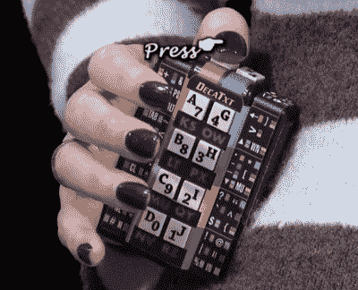

# 感兴趣的输入:DecaTxt 超便携和弦键盘

> 原文：<https://hackaday.com/2021/01/05/inputs-of-interest-decatxt-ultra-portable-chording-keyboard/>

这是一个键盘的填充物。DecaTxt 有一副纸牌那么大，乍一看像是某种袖珍基诺机或其他赌博或游戏设备。但那只是因为它太丰富多彩了。当你只有十个键来模拟一个完整的键盘时，肯定会有一些严重的标记在进行，这是应该的。

DecaTxt demonstration from [IN10DID](https://www.youtube.com/watch?v=MJNOcXw4HLU)

DecaTxt 是一款蓝牙 4.0 和弦键盘，可以与您的手机或任何您想与之配对的设备配合使用。它最初被称为 In10did，代表输入术语十位接口设备。朗朗上口，不是吗？在过去十年的某个时候，这个小家伙开始使用无线技术，并有了一个更酷的名字 DecaTxt。

和弦键盘本身并不特别，但这款键盘的设计相当有趣。你可以用一只手或两只手来操作它，但你应该想用两只手——毕竟它是 In10did，不是 In5did。所有的和弦最多只有三个键，所以你不需要用双手来弹奏。有些字母只需按一次键即可访问，即 A 到 j。字母表的其余部分使用顶部两个拇指键中的一个键和前面的八个键。其他一切都是一对或三对彩色编码的按键。

这种键盘背后的想法是最大限度地利用你的十个手指，将你的拇指放在上面，用双手握住这个东西，这看起来一点也不符合人体工程学，更适合，比如说，打开一个椰子或将一块拉面分成两份。实际用户报告说，单手使用它，同时将它支撑在自己身上的体验要好得多，如下面的视频所示。这看起来绝对是更舒服的方式。

 [https://www.youtube.com/embed/Lld1y8PnNjI?version=3&rel=1&showsearch=0&showinfo=1&iv_load_policy=1&fs=1&hl=en-US&autohide=2&wmode=transparent](https://www.youtube.com/embed/Lld1y8PnNjI?version=3&rel=1&showsearch=0&showinfo=1&iv_load_policy=1&fs=1&hl=en-US&autohide=2&wmode=transparent)

撇开人体工程学问题不谈，一旦你学会了布局，理论上 DecaTxt 可以放入任何外壳中，这并不重要。事实上，这是该公司的最终目标——用 DecaTxt 系统取代 QWERTY，并将其内置于世界上的所有东西中——手套、方向盘、自动取款机，只要你能想到的。

我认为这款键盘的基本理念是声音，布局肯定可以重新设计成更符合人体工程学的外壳(可能比贝佐斯谷仓的价格标签 125 美元便宜很多)。据发明者称，价格如此之高是因为每台 DecaTxt 都是在美国手工组装的。据我所知，它只有一种尺寸，这对于手特别大或特别小的人来说是个遗憾。

我最近看了另一个和弦键盘——[info grip BAT，这是一个只有七个键的全键盘](https://hackaday.com/2020/08/18/inputs-of-interest-the-infogrip-bat-chording-keyboard/)。两者都是用单个符号代替整个单词的合唱小精灵，[就像速记机器](https://hackaday.com/2015/07/06/stenography-yes-with-arduinos/)。这款球棒是为桌面使用而设计的，大小大约是 DecaTxt 的四倍，因此它不太便于携带，但它的大小和形状非常符合人体工程学的舒适性。DecaTxt 无疑更加便于移动——易于放入背包——但代价是失去了人体工程学设计。

你试过像这样的和弦键盘吗？你愿意尝一个吗？你会怎样做得更好？这里有一个你可以自己打造的。