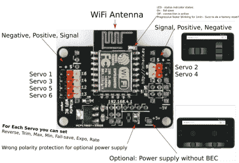

# ESP8266 在没有变送器的情况下执行 RC

> 原文：<https://hackaday.com/2020/10/30/esp8266-does-rc-without-the-transmitter/>

虽然业余爱好级别的遥控发射器的成本在过去十年左右已经显著下降，但即使是基本型号仍然相对昂贵。如果你只需要一台供个人使用，这没什么大不了的，但对于一所学校来说，为一个教室的学生配备他们自己的收音机，他们需要有一个严肃的 STEM 预算。

这就是为什么[Miharix]自己是一名拥有十年经验的教育工作者，他开发了一个项目，[利用 ESP8266 来创建可以用智能手机的网络浏览器控制的负担得起的 RC 车辆](https://github.com/miharix/miharix-wifi-rc)。有点讽刺的是，智能手机比遥控发射器更贵；但随着越来越多的学龄儿童拥有自己的移动设备，这减轻了教育者的成本负担。根据学生的年龄，老师只需要为没有自己设备的学生准备几部一次性手机。

A custom PCB makes connections easier for students.

在其完全实现的形式中，该项目使用开放的硬件板，允许标准 RC hobby 伺服系统连接到 ESP-12E 模块的 GPIO 引脚。但是，如果你不想经历构建定制硬件的麻烦，你可以将类似的东西与 ESP 开发板放在一起。从那里开始，只需要安装固件，这将启动一个服务器，提供一个基于触摸的控制器界面，非常适合智能手机的屏幕。

由于 ESP8266 会弹出作为客户端设备可以连接的接入点，您甚至不需要现有的网络。或者互联网接入。[Miharix]表示，在测试中，普通智能手机和 ESP8266 之间的距离约为 85 米(260 英尺)，这应该足以完成工作。

在休息后的视频中，你可以看到这个系统被用于一辆遥控汽车和一艘船，尽管[这个项目唯一的限制是你自己的想象力](https://hackaday.com/2020/08/21/student-rover-explores-the-backyard-in-tribute/)。

 [https://www.youtube.com/embed/RT00wBG8huE?version=3&rel=1&showsearch=0&showinfo=1&iv_load_policy=1&fs=1&hl=en-US&autohide=2&wmode=transparent](https://www.youtube.com/embed/RT00wBG8huE?version=3&rel=1&showsearch=0&showinfo=1&iv_load_policy=1&fs=1&hl=en-US&autohide=2&wmode=transparent)

 [https://www.youtube.com/embed/HDuuVXv958U?version=3&rel=1&showsearch=0&showinfo=1&iv_load_policy=1&fs=1&hl=en-US&autohide=2&wmode=transparent](https://www.youtube.com/embed/HDuuVXv958U?version=3&rel=1&showsearch=0&showinfo=1&iv_load_policy=1&fs=1&hl=en-US&autohide=2&wmode=transparent)

