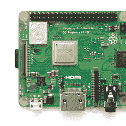
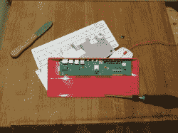
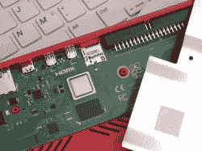
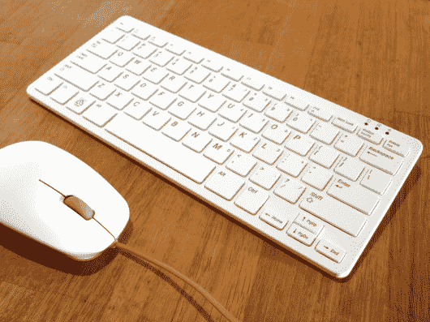
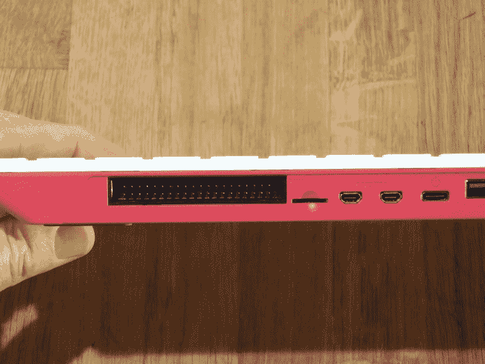

# 新的 Raspberry Pi 400 是一台配有键盘的电脑，售价 70 美元

> 原文：<https://hackaday.com/2020/11/02/new-raspberry-pi-400-is-a-computer-in-a-keyboard-for-70/>

最新的 [Raspberry Pi 400](https://www.raspberrypi.org/products/raspberry-pi-400/?resellerType=home) 几乎一体化的电脑非常非常光滑。它适合一个小型便携式键盘的大小，它有一个速度快 20%的 1.8 GHz 的 Pi 4 处理器，4 GB 的 RAM，无线，以太网，双 HDMI 输出，甚至在背面有一个 40 针的标准 IDE 电缆插头。零售价 70 美元，基本上是便宜的，如果它是你正在寻找的那种东西，因为它里面有价值 55 美元的树莓 Pi 4。

从某种意义上说，它正危险地接近实现树莓派的梦想。(它还有一个花招——它的袖子上有一大块散热到 CPU 上的铝，这让我们想到了“超频”。)

我们记得树莓派的创始梦想，仿佛就在大约 10 年前:制造一台足够便宜的电脑，让每个人都能买得起，让每个学生都能拥有一台，把我们带入一个全球计算机扫盲的世界。这是一个非常大的目标，虽然他们在早期的第一次计算中取得了成功，组装了一台 35 美元的单板计算机，但总体规划的第二部分仍在进行中。尽管树莓派在我们的圈子里无处不在，但它仍有待普及。

By [Gareth Halfacree](https://commons.wikimedia.org/w/index.php?curid=67384207)  CC BY-SA 2.0

Raspberry Pi Model B 过去不是，现在也不是，如果你不怀疑地问我岳父“那是台电脑吗？!"。这是一个绿色的印刷电路板，你必须自己安装强大的 5 V 电源，设计出某种外壳，找到键盘和鼠标，加上显示器，只有这样你才有一台电脑。我们已经问过这个问题好几次了，[最新的 Raspberry Pi 4B 可以用作日常驱动桌面吗，](https://hackaday.com/2019/09/09/can-you-really-use-the-raspberry-pi-4-as-a-desktop-machine/)我的回答是肯定的，当然是就它而言[有足够的性能](https://hackaday.com/2019/07/10/raspberry-pi-4-benchmarks-processor-and-network-performance-makes-it-a-real-desktop-contender/)。

但是强大并不一定意味着容易接近。如果你想建立自己的 cyberdeck，组装一个 arcade box，将一台计算机拧到你的工作台下面，或者将 Pi 帽子叠在一起，并在你的自动驾驶汽车测试床上安装所有的东西，Raspberry Pi 就是合适的选择。但这是为黑客群体设计的电脑，而不是为所有人设计的电脑。只是有点太*牵扯*了。

 相比之下，树莓派 400 则是一款时尚的设计。当然，你仍然需要一个电源、显示器和鼠标，但它比 Pi Model B 更像一台独立的计算机。它由高质量的塑料制成，配有一个像样的键盘。它很小，很轻，坦白说，很性感。这种东西将通过岳父的测试，我们认为这可能对真正实现廉价通用(开源)计算的梦想大有帮助。从某种意义上说，它是最不容易被黑客攻击的树莓派。但这并不是说你不想把它放进你的工具包里。

## 拆卸

没有我们的拆开，你不能把一件设备送给哈克达。愚蠢的是，我开始拉起贴纸，以为我摸到了一个隐藏的螺丝头。不，是注射成型的痕迹。然后，我脱下橡胶脚。更多的成型痕迹。(很好地隐藏了它们，值得称赞！)省去自己的麻烦；要打开 Pi 400，你只需轻轻撬开边缘，一个接一个地松开每个小塑料夹子。这只需要五分钟，正如摩托车维修手册上所说，安装是拆卸的相反过程。

在内部，有一个扁平的柔性连接键盘，你可以看到那个大的铝制散热器。它几乎是键盘的全尺寸，而且很厚，用热胶带粘在 CPU 上。你知道这意味着生意。它也正对着键盘的铝制底部，这表明它可以通过这种方式获得辐射帮助，也许可以在冬天让你的手指温暖。(我没有感觉到任何实际的热量，但它必须去某个地方，对不对？在箱子的底部也有通风孔。)

四个 PZ1 螺丝和一点点勇气解开衬垫让你在散热器下面发现，惊喜！，一个覆盆子 Pi 4。这有点虎头蛇尾，因为我刚刚花了几周时间查看新计算模块 4 的原理图，这正是你所期望的。这是一个树莓 Pi 4，所有端口都被打破了，在一个漂亮的键盘里，有一个结实的散热器。以太网磁铁位于一侧，无线模块位于另一侧。就是这样！

Pi 400 有多容易被黑？不是很喜欢。这里没有太多空间做任何蠢事，因为散热器占据了大部分内部空间。那些想用 PCIe 取代 USB 3.0 的人可能会这么做，当然，如果有计算模块和一些 DIY 会更好。你可以试着在这里塞进其他东西，但由于背面方便的 40 针端口，你无论如何都想用电缆连接任何大小的东西。与其说它不可破解，不如说我不知道为什么你可以。(一如既往，我们[很高兴被证明是错的](https://hackaday.com/submit-a-tip/)！)

## 整个

树莓 Pi 400 有两种包装:基础版和全套，分别为 70 美元和 100 美元。额外的 30 美元可以让你获得一个漂亮的 USB C 电源，一个树莓鼠标，一根微型 HDMI 到普通 HDMI 的电缆，一张预装树莓 Pi 操作系统的名牌 SD 卡，以及官方的树莓 Pi 初学者指南。简而言之，除了显示器之外，您需要的一切都准备好了。所有这些东西都是现成的，但是为了方便起见，您可以将它们捆绑在一起。

 这本书是一个很好的介绍，基本上是对树莓派网站上已经提供的大量学习内容的指导之旅。电缆、电源和鼠标都很好，不用下载和刻录另一个 SD 卡当然很好，但这些都是舒适而不是必要的。除了微型 HDMI 电缆，我手头上的一切反正，虽然如果这是一个永久的安装，我可能需要源另一个 USB C 壁灯。

我不知道这是否只是为了审查模式，但这是一个很好的接触，SD 卡已经在插槽中。这可能为我节省了 10 秒钟，但它可能会让不习惯将 SD 卡视为硬盘的人感到困惑。

方便、简单和易于设置正是这个游戏的名称，我认为完整的工具包兑现了这个承诺。这是尽可能即插即用。

## 是给你的吗？

Pi 400 是最不容易破解的树莓 Pi。这是一款面向大众的非常精巧的廉价消费电脑。全套绝对是我会给岳父的。这也使它成为第一台真正实现建国梦想的可访问性的 Raspberry Pi 计算机，在这方面他们已经敲定了价格。恭喜树莓派的人准备好了。这台电脑，加上他们十年来在制作教育材料方面的投资，以指导新手沿着这条道路前进，体现了这个梦想。

这可能不是您想要用于黑客项目的计算机。这就是 B 型车的用途。它可能并不充满修改的可能性，尽管我们会看看你们都怎么想。据我们所知，它也不具备全部的内存选项。如果你不需要全套设备的装饰，70 美元的价格比同等型号 B 的 55 美元有小幅提升，但当你不需要键盘或漂亮的外壳时，你可以把 15 美元用在其他地方。

        

尽管如此，将它与一个小触摸屏结合起来，并通过一个 5 V 的电源组运行它，你就可以在一个非常小的封装中获得大量的便携式计算。如果你不总是四处闲逛，这里有一种非常诱人的流线型的简单。背面的 40 针端口也便于添加您自己的设备，例如，如果您想将其用作便携式逻辑分析仪、微控制器编程器或 JTAG 平台。我实际上更喜欢这个 Pi 端口的水平方向，而不是 B 型的垂直方向——我的项目最终看起来总是像刺猬，重力希望电缆平放。这些都是小细节，但这就是可用性。

最后，我有一个计算模块，一个 Pi 4 模型 B，现在 Pi 400 都在桌子上。众所周知，Pi 4 在过热时会减速，这反过来意味着它在有散热器的情况下运行得更快，即使没有超频。计算模块数据表中提到了使用更少的功率进行更高效的处理，并且可能产生更少的热量。Pi 400 外壳内的这一大块铝向我召唤“超频”。只有一种方法可以弄清楚这一切意味着什么，那就是经验测试。敬请关注。