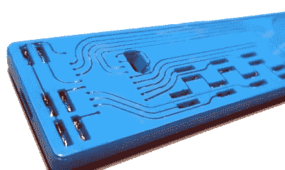

# 3D 打印到模块化 MIDI 玩具组

> 原文：<https://hackaday.com/2020/11/16/3d-print-your-way-to-a-modular-midi-playset/>

你有没有想过尝试 MIDI，却不知道从何下手？或者，也许你认为你负担不起适当装备你的数字节拍实验室，特别是考虑到一般黑客对闪光灯的嗜好？不用再担心了，Johan von Konow 已经展示了一系列 DIY MIDI 设备，任何拥有 3D 打印机的人都可以以低廉的价格制作。

LEET 模块化合成器由一个键盘、鼓垫、和弦键盘、自动琶音器和一个步进音序器组成，可插入您的电脑并与行业标准数字音频工作站(DAW)程序接口。不利的一面是，他们自己不做任何事情，但这种简化允许[Johan]真正简化设计，并将构建成本降至最低。

Integrated wire channels mean no PCB is required.

你也不需要构建所有的组件，尤其是如果你只是在试水的话。键盘是一个很好的起点，即使你不得不从易贝购买所有新的组件，[Johan]说你的成本不应该超过 10 美元。你只需要一个 Arduino Pro Micro，一些轻触开关，和一段 WS2812 RGB LED 灯条。很有可能你已经在零件箱里找到了一些，这会让它更便宜。

不过，还有一个缺失的元素:PCB。但不是因为你必须自己去找。[就像我们今年早些时候报道的聪明的 Arduboy 克隆体一样](https://hackaday.com/2020/02/08/3d-printing-for-wire-paths-yields-an-arduboy-minus-the-pcb/)，所有 LEET 设备的 3D 打印体都有集成的布线通道，作为传统电路板的替代品。只需放置所有组件，将一些直径为 0.3 毫米的硬金属丝推入通道，然后焊接末端。这是一种非常简洁的方法，随着[桌面 3D 打印机在家庭作坊中变得越来越常见，我们可以看到这种方法变得越来越受欢迎。](https://hackaday.com/2018/01/10/you-got-a-3d-printer-now-what/)

 [https://www.youtube.com/embed/ABjKIWZwcgA?version=3&rel=1&showsearch=0&showinfo=1&iv_load_policy=1&fs=1&hl=en-US&autohide=2&wmode=transparent](https://www.youtube.com/embed/ABjKIWZwcgA?version=3&rel=1&showsearch=0&showinfo=1&iv_load_policy=1&fs=1&hl=en-US&autohide=2&wmode=transparent)

