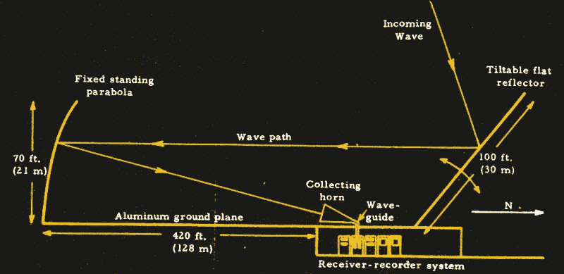
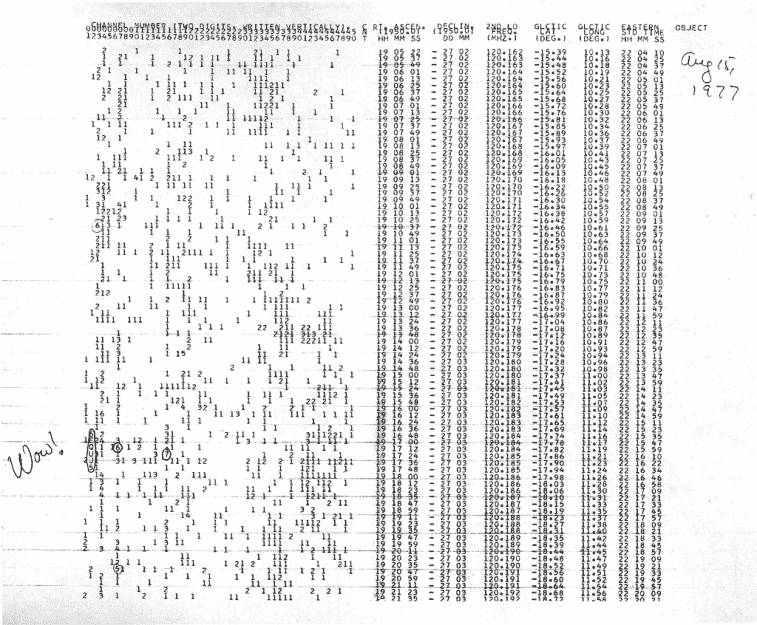
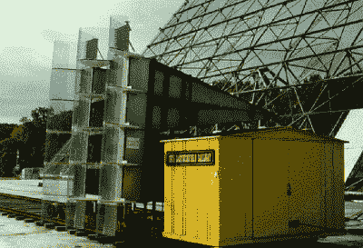
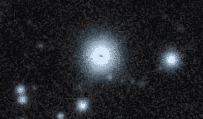

# 哇！信号和对外星智慧的探索

> 原文：<https://hackaday.com/2020/11/25/the-wow-signal-and-the-search-for-extraterrestrial-intelligence/>

1977 年一个温暖的八月夜晚，俄亥俄州中部田野里的一架巨大的射电望远镜静静地听着宇宙射电。晚上 10 点过后不久，地球的自转通过一个强大的无线电信号转动了望远镜，这个信号的传递只被记录当晚数据的行式打印机每 12 秒唱一次的歌曲中音调的轻微变化记录下来。

当数据稍后被分析时，天文学家对这个异常强大但转瞬即逝的信号发出的微弱感叹将赋予这个信号永远的名字:哇！信号。我们是如何听到这个信号的，它可能意味着什么，以及它可能来自哪里，这些都是一个事件的有趣细节，这个事件留下了一个谜，一个公民科学家正在以新的视角研究的事件。如果它是从有可居住行星的空间区域发出的，至少值得一听。

## 大耳朵

John D. Kraus, Ph. D. Source: [North American Astrophysical Observatory](http://www.bigear.org/Wow30th/wow30th.htm).

理解哇！信号需要观察产生它的仪器。被亲切地称为“大耳朵”的俄亥俄州立大学射电天文台是俄亥俄州立大学物理学家约翰·d·克劳斯的设想。克劳斯博士对大科学并不陌生——在二战期间，他开发了给海军舰艇消磁的方法，以保护它们免受磁引爆地雷的影响，他还为密歇根大学研究了一台大型回旋加速器。

克劳斯博士于 1955 年在《科学美国人》的一篇文章中首次描述了他关于能够探测外星无线电信号的望远镜的想法。望远镜的设计将非常简单，尤其是与更典型的完全可控的碟形天线相比。它由一个巨大的平面反射器钢网组成，横跨一个开阔的空间，由一个固定的抛物面反射器组成。在这两个元素之间是一大片平坦的铝覆盖路面。抛物面反射器的焦点是一个装有馈电喇叭的小棚屋，它可以在铁轨上横跨望远镜的宽度移动。虽然总的来说望远镜是静止的，并且指向地球自转所到的任何地方，但是喇叭天线的跟踪加上对平面反射镜倾斜的调整，可以在一定程度上控制天空的哪一部分被观测到。

Cross-section of the Big Ear telescope. Source: [North American Astrophysical Observatory](http://www.bigear.org/Wow30th/wow30th.htm).

大耳朵*是*大:仅平面反射器就有 33 米高，100 米宽，地平面在两个反射器之间延伸 150 米。但克劳斯博士实际上设计了一个大得多的天线。

他最初的设计要求 600 米宽的反射器，但当国家科学基金会在 1955 年以微不足道的 48，000 美元拨款时，这个设计被缩减到可能的程度。即使在那时，大量的“汗水资产”也投入到了“大耳朵”的建设中，研究生们专门学习焊接来建造望远镜，关键设备如接收器所需的参数放大器由 OSU 的一名校友按成本建造。

The Big Ear. The steerable flat reflector is in the background, the fixed parabolic reflector is in the foreground. At the far end of the ground plane is the track holding the twin feed horns. Source: [North American Astrophysical Observatory](http://www.bigear.org/Wow30th/wow30th.htm).

建造“大耳朵”花了将近十年的时间，一旦启动，它的主要目标就是完成俄亥俄巡天，寻找河外射电源。这座天文台也被用来研究仙女座星系。但是到了 20 世纪 70 年代初，通过收听特定的无线电信号来寻找潜在的外星智慧文明的兴趣开始占据射电天文学界。俄亥俄天文台凭借其独特的结构和进行天空调查的能力，很早就被 SETI 的科学家们确定为这项工作的完美工具。因此，在 1973 年，大耳朵开始了对外星人近乎不间断的搜寻。

## 6-E-Q-U-J-5

Jerry Ehman, Ph.D. Source: [North American Astrophysical Observatory](http://www.bigear.org/Wow30th/wow30th.htm).

尽管通过卡尔·萨根等支持者的明星效应抓住了大众的想象力，SETI 并没有特别充足的资金。大多数 SETI 项目都是填充项目，旨在利用射电望远镜观测之间的停机时间进行更传统的研究。在预算紧张的情况下，大多数早期的 SETI 计划将大部分资金投入到望远镜时间上，很少投入到数据分析上。因此，大量的人工工作都花在了搜索数据以寻找感兴趣的信号上。

就这样，1977 年 8 月，天文学家杰里·艾曼仔细研究了大耳星座巡天的数据，这些数据记录在一页又一页的扇形打印纸上。在每张纸的左边是 50 个垂直的字符列，每一列代表一个由大耳朵接收器监控的频道。记录数据的程序是由 Ehman 和他的同事 Bob Dixon 编写的，基本上是将 10 秒观察期内每个频道的信噪比记录为单个字符。零信噪比被记录为一个空格，后面是从 1 到 9 的信噪比数字。从 10 开始，增加的信噪比按字母顺序用一个字母表示。

艾曼面前的文件是空白和 1 的海洋，偶尔有六七个分散在各处。但是，当他扫描东部时间 1977 年 8 月 15 日晚上 10:15 左右捕获的数据时，他注意到数据最左侧的一系列数字让他震惊。在频道 2 上，序列“6EQUJ5”出现了，持续了 72 秒的爆发，然后消退到本底噪声(每次观察为 10 秒长，加上额外的 2 秒用于计算机处理。)信号在峰值时如此强烈，以至于它穿过了所有的数字和 80%的字母表——比噪声基底高 30 到 31 倍。当他看到这个信号时，埃曼惊呆了，他抓起红笔，在垂直的字符栏上画了个圈，写下了“哇！”在左边。他对结果的热情持续了下来，这个信号被称为“哇！信号“从此以后。

The Wow! Signal is born: Dr. Ehman’s notes from August 15, 1977\. Source: [North American Astrophysical Observatory](http://www.bigear.org/Wow30th/wow30th.htm).

## 哇的哪里！

哇！自 1977 年以来，Signal 一直受到大量审查，这是理所当然的。最初的想法是它来自地球，也许是来自未知军事卫星的杂散信号，或者是从月球反弹回来的信号。但是那天晚上没有其他运行的射电望远镜听到过同样的事情，这将是本地产生的信号的情况，而且月亮当时不在合适的位置作为反射器。其他假设，如恒星变成超新星、计算机故障、放射无线电的彗星或“星际闪烁”都受到了指责，但没有任何证据成立。话又说回来，尽管近 50 年的期待，没有任何东西甚至远远接近哇！信号已被记录。因此，很难对这一观察得出任何明确的结论。

这不言而喻的可能性哇！来自外星智慧的信号是对这一事件最不可能的解释之一。非同寻常的主张需要非同寻常的证据，在人们开始指责 ET 发出信号之前，需要排除所有平凡的可能性。但是有几个关于 Wow 的诱人事实！信号。

首先，它的频率。哇！信号出现在 1420 MHz——中性氢原子能量状态变化时出现的著名“氢线”频率。这些 21 厘米波长的微波信号是任何一个掌握了足够的物理知识来进行无线电通讯的文明都会知道的。这个频率是否可以被认为是技术文化文明之间的通用“欢呼频率”还有待讨论，但有趣的是，这个信号是在一个长期以来被推测为正是那个频率的频率上听到的。

The twin feed horns of the Big Ear. It’s impossible to say which horn received the Wow! Signal, but their footprints in the sky contain 66 Sun-like stars that may harbor habitable exoplanets. Source: [North American Astrophysical Observatory](http://www.bigear.org/Wow30th/wow30th.htm).

第二，信号的轮廓正是对外星信号的预期——从起源于当地地球环境之外的意义上来说，而不是来自非人类智慧。位于俄亥俄州纬度的望远镜使用地球的旋转来扫描天空，预计在天空的任何一点都有 72 秒的窗口，因此来自远处的信号将增加 36 秒，然后再次减弱和衰减。“6EQUJ5”信号强度形成了一条形状完全正确的曲线。

哇，另一个有趣的方面！信号是其明显的来源。大耳朵的焦点处有两个馈电喇叭，长轴相互平行，但每个都指向稍微不同的方向。由于数据处理的方式，不可能准确地说哪个馈电喇叭听到了信号，但已知只有一个馈电喇叭听到了信号。这意味着，除了一些地球起源或自然现象，信号可能来自人马座内的两个相对较小的区域。这给了天文学家开始寻找的地方。

## 六十六颗星星

一位天文学家正在寻找哇的潜在来源！信号是阿尔贝托·卡瓦列罗。阿尔贝托已经领导可居住的系外行星搜寻项目有一段时间了，该项目旨在吸引业余爱好者使用他们的望远镜来探测当一颗行星穿过其表面时恒星表观亮度的微妙变化。这似乎是一种需要花费数百万美元的设备才能完成的测量，但是正如我们去年 1 月在[的一次黑客聊天中与 Alberto 讨论的那样](https://hackaday.com/2020/01/13/habitable-exoplanets-hack-chat/)，所需要的设备令人惊讶地容易获得并且负担得起。

2MASS 19281982-2640123, a Sun-like star within the Wow! Signal footprint. Source: Alberto Caballero.

作为这项工作的一个分支，阿尔贝托深入观察了位于两片天空中的恒星。信号可能来自。在记录这项工作的论文的预印本中，阿尔贝托研究了目标区域的 66 颗 G 型和 K 型恒星，以及成千上万的其他恒星。(我们自己的太阳是 G 型星，而 K 型星更小更冷；两者都是有吸引力的 SETI 目标。)

在这组恒星中，有 15 颗看起来都像太阳。这些恒星中只有一颗，2MASS 19281982-2640123，有足够的光度数据来开始一次严肃的系外行星搜寻。

当然，这一切都只是推测。哇！信号很可能是人工制品、自然现象，甚至可能来自银河系之外。但是，如果 1977 年 8 月 15 日大耳朵收听的区域内的一颗恒星被证明有一颗潜在的可居住的行星围绕它旋转，这将是 Wow 之谜的又一层！信号。

【特色图片:[北美天体物理天文台](http://www.bigear.org/Wow30th/wow30th.htm)