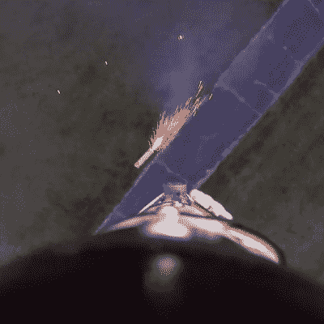

# 如此接近用尾巴着陆模型火箭

> 原文：<https://hackaday.com/2020/11/27/so-close-to-landing-a-model-rocket-on-its-tail/>

我们已经变得如此习惯于看到 SpaceX 的助推器像钟表一样可靠地回到发射台，以至于很容易忘记他们花了很多次尝试才成功。受到 SpaceX 工作的启发，[BPS]的[乔·巴纳德]。五年前，在没有工程教育或经验的情况下，Space]开始着手在模型比例上复制它。在最新一次使用全新推力矢量 Scout E 火箭的尝试中，他已经非常接近使用固体燃料火箭发动机进行[受控推进着陆](https://www.youtube.com/watch?v=YixmPK26upk)。

我们都很兴奋地看到 SpaceX 火箭返回地球，优雅地降落在一个浮动的平台上。但是那些是液体燃料的。固体燃料火箭发动机的诀窍是它不能直接节流，当你需要精确控制着陆时，这是一个挑战。多亏了[Joe]的定制 [AVA 飞行计算机](https://hackaday.com/2020/10/02/advanced-model-rocket-flight-computer-reaching-for-the-stars/)和他使用的 Estes F15 黑火药发动机非常一致的推力曲线，这就变成了在正确的时刻点燃下降发动机以使垂直速度在着陆时为零的问题。然而，[乔]发现发送点火信号和达到峰值推力之间的时间是不一致的，所以他必须解决这个问题。他通过控制垂直方向的推力大小来做到这一点，通过将发动机左右转向以在水平方向上花费一些信任。

View from rocket of the ascent motor falling away immediately after being ejected

在这次尝试中，由于着陆时水平移动过大，火箭在着陆时翻倒。Joe 追踪到了由天线位置和卡尔曼滤波器中可能的错误引起的微弱 GPS 信号引起的原因，卡尔曼滤波器融合了用于位置和速度估计的所有传感器数据。由于飞行计算机完成了非常详细的遥测和记录，每次发射的数据都用于未来的改进。我们期待着几周内的下一次飞行，在此期间，[乔]计划调整和测试控制软件，以及其他一些小的改进。

几乎这枚火箭的每一个部件都是工程独创性的展示。着陆支柱被设计成在不反弹的情况下吸收尽可能多的冲击，同时重量轻且展开迅速。简单地通过移动推力矢量装置到它的一个极限位置来弹出上升发动机，允许下降发动机下降到位。该火箭还配备了一个带降落伞的完整紧急中止系统，可以手动激活，如果飞行计算机计算出着陆不可行，也可以通过飞行计算机激活。我们已经报道了[Joe]的最新[发射台](https://hackaday.com/2020/09/30/the-ultimate-model-rocket-launchpad/)，这本身就是一个非常有趣的项目。

 [https://www.youtube.com/embed/YixmPK26upk?version=3&rel=1&showsearch=0&showinfo=1&iv_load_policy=1&fs=1&hl=en-US&autohide=2&wmode=transparent](https://www.youtube.com/embed/YixmPK26upk?version=3&rel=1&showsearch=0&showinfo=1&iv_load_policy=1&fs=1&hl=en-US&autohide=2&wmode=transparent)

