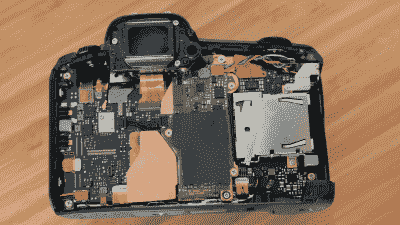

# 水冷佳能 DSLR 导致严重的工程升级

> 原文：<https://hackaday.com/2020/12/01/watercooling-a-canon-dslr-leads-to-serious-engineering-upgrades/>

佳能 EOS R5 是一款高性能的相机，也是一款非常昂贵的相机。它能够在紧凑的帧尺寸中录制 8K 的视频，不幸的是，它受到令人沮丧的过热问题的困扰。总是有人尝试用非常规的方法来解决一个常见的问题，[【Matt】决定迅速找到一个水冷的解决方案](https://www.youtube.com/watch?v=X1u-9YqrIJc)。随之而来的是纯粹的顶级工程。

The watercooling setup is amusing, but the real star of the show is the custom copper heatsink that transforms the camera’s performance without spoiling its practicality.

在最初发布时，佳能在录制 8K 视频时简单地关闭 R5 相机的 20 分钟定时器。当用户抱怨时，发布了一个更新的固件，它使用了一个板载传感器，只有当温度过高时才会关闭。在这些条件下，相机可以在 20°c 的温度下记录大约 25 分钟。[Matt]着手拆卸相机进行调查，发现主处理器是主要的热源。由于与散热器的连接不良，并埋在电源 PCB 下，热量根本没有地方可去，导致相机经常过热，需要几个小时才能冷却下来。

在提出一个有趣但不切实际的水冷解决方案并验证它允许相机无限记录后，[马特]开始着手一些适当的热能工程。相机内部生产了一个定制的铜散热器，用导热膏而不是劣质的导热胶带直接粘合到处理器和 DRAM 上。然后通过相机的塑料背面将热量传导出去。在凉爽的环境中，这足以让相机连续记录。在温暖的环境中，只需在相机背面增加一个小风扇，就足以让一切无限期运行。

[Matt]在结束视频时指出，佳能可以通过在相机的冷却设计上多投入一点时间，让相机对摄像师更有用，同时通过销售用于延长录制的冷却配件来产生更多利润。我们以前也看过一些[马特]的作品，比如这个 DIY 4K 投影仪。休息后的视频。

 [https://www.youtube.com/embed/X1u-9YqrIJc?version=3&rel=1&showsearch=0&showinfo=1&iv_load_policy=1&fs=1&hl=en-US&autohide=2&wmode=transparent](https://www.youtube.com/embed/X1u-9YqrIJc?version=3&rel=1&showsearch=0&showinfo=1&iv_load_policy=1&fs=1&hl=en-US&autohide=2&wmode=transparent)

