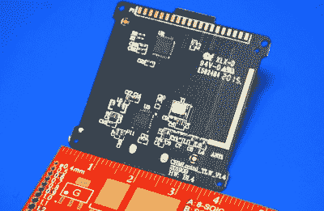
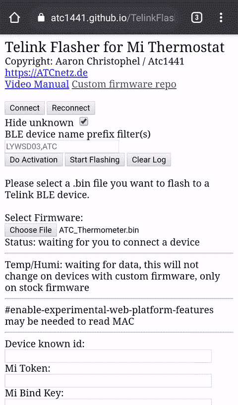
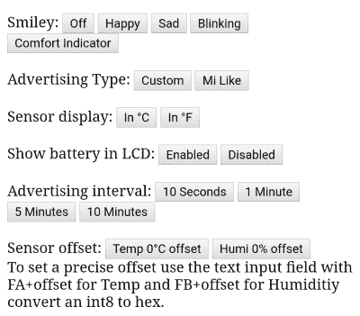
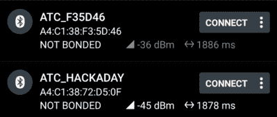

# 小米体温计定制固件探索

> 原文：<https://hackaday.com/2020/12/08/exploring-custom-firmware-on-xiaomi-thermometers/>

如果说这些年来我们学到了什么，那就是黑客喜欢知道温度是多少。说真的。逛逛 Hackaday 的档案馆，你会发现大量定制的小工具，用于记录、展示和传输当前状况。从户外气象站到焊接有 DHT11 的 ESP8266，如果您想开始收集自己的环境数据，现有技术并不短缺。

显然，我们是 DIY 的忠实粉丝，这是整个网站的重点。但不可否认的是，它很难与规模经济竞争，尤其是在处理进口商品时。即使是最有经验的硬件黑客也很难构建像小米 LYWSD03MMC 这样的东西。只需 4 美元，你就可以得到一个光滑的节能传感器，它集成了一个 LCD，可以通过蓝牙低能耗广播当前的温度和湿度。

[](https://hackaday.com/wp-content/uploads/2020/11/atc_pcb.jpg)

You could probably build your own…but why?

这几乎是建立全屋环境监控系统的理想平台，除了一个细节:它旨在作为小米家庭自动化系统的一部分，而不一定是像我们这样的人在家里进行的黑客安装。但那是在 Aaron Christophel 接手这个案子之前。

上个月，我们第一次带来了他雄心勃勃的项目的消息，为这些低成本的传感器创建一个开源固件，不出所料，它引起了相当大的兴趣。毕竟，人们利用现有的硬件，使它们变得更好，并与世界分享他们是如何做到的是这个社区的核心宗旨。

我相信这样一个精心制作的投影值得再看一眼，坦率地说，因为我想以低廉的价格开始监控我自己家里的条件，我决定订购一包小米温度计并开始工作。

## 固件安装

当然，Aaron 的“ATC”固件最吸引人的一点是它安装起来非常容易。你可能会认为像这样的事情需要打开外壳，将 USB 连接到 UART 适配器上，虽然如果你需要的话，实际上*可以*走这条路，但 99%的用户将会使用极其聪明的“网络蓝牙”闪存工具[。](https://atc1441.github.io/TelinkFlasher.html)

[](https://hackaday.com/wp-content/uploads/2020/11/atc_install480.gif) 理论上，你应该能够从任何一台运行足够现代的网络浏览器的计算机上安装 ATC 固件，但你的里程数可能会因这样一个前沿功能而异。我的 Linux 桌面根本无法连接温度计，在 Chromebook 上尝试也只是偶尔管用。你最好的选择可能是智能手机或平板电脑，我使用 Pixel 4a 闪烁几个温度计没有问题。

总的来说，刷新过程不到一分钟就能完成。拉下温度计背面的标签后，点击闪光器上的“连接”,等待它出现在本地蓝牙设备列表中。连接后，您需要点击“激活”按钮，这显然建立了原始固件所需的安全连接，然后才允许空中下载(OTA)升级。

一旦激活过程完成，您选择一个固件二进制文件，点击“开始闪烁”，然后等待进度指示器显示 100%。这需要大约 30 秒的时间来完成，然后温度计应该会立即重新启动进入新的固件。艾伦说，如果在闪烁过程后它没有醒来，你可以拔掉电池，它应该会自己解决。我已经经历过这个过程好几次了，但从来不需要拔掉电池，所以这可能是一个相当不常见的问题。

如果你需要，同样的过程可以用来把股票固件回到设备上。Aaron 在 GitHub 存储库中没有一个库存固件映像(可能是为了避免版权索赔)，但是在文档中他告诉你如何从官方更新文件中提取它的副本。

现在，更有安全意识的读者可能会想，这意味着一些好战的书呆子可以四处兜售人们的小米温度计。不幸的是，确实如此。这个工具可以让蓝牙范围内的任何人向小米 LYWSD03MMC 闪存任何他们想要的东西，不管它是否安装了自定义固件。也就是说，已经有人提到在 ATC 固件中加入某种认证机制来抵御这种攻击；使其明显比普通固件更安全。

## 变得舒适

网络刷新工具不只是安装 ATC 固件，它还提供了一个易于使用的界面来配置它。连接到设备后，您只需向下滚动一点，点击各种选项即可启用或禁用它们。

[](https://hackaday.com/wp-content/uploads/2020/11/atc_config.png) 我做的第一件事就是关掉怪异的 ASCII 艺术笑脸，作为一个美国异教徒，我还把显示屏改成了华氏温度。事实上，您可以输入温度和湿度的偏移值是很方便的，尽管它在未来可能变得不必要，因为 Aaron 说一个更强大的校准例程在待办事项列表中。

在屏幕上显示电池电量是一个有趣的功能，默认情况下是启用的，但我个人关闭了它。问题是电池百分比和相对湿度必须共享 LCD 右下角的较小的一组数字。它们每五秒左右来回切换一次，这在实践中似乎足够快，以至于有时你会分不清自己在看哪一个。此外，当里面的 CR2032 电池预计可以使用一年时，我真的需要经常查看电池电量吗？

我一开始有点被“广告时段”搞糊涂了。我假设这将是温度计发出 BLE 数据包的频率，但实际上，不管您将该设置更改为什么，它都是每隔几秒钟发送一次。这个设置*实际上*改变的是广播的温度数据更新的频率。默认值是一分钟，所以在刷新之前，您应该会收到大约 20 个包含相同温度和湿度值的包。将更新间隔设置为 10 秒会给你更多的粒度数据，但可能是以电池寿命为代价的。

## 自定义版本

虽然 Aaron 在项目页面上没有涉及太多的细节，但为温度计编译自己的固件是相当容易的，然后可以用 web 工具进行刷新。在 Linux 上，我所要做的就是提取小米 Telink TLSR825X tarball 并将目录添加到我的$PATH 环境变量中。从那里，我可以建立 ATC 固件，并开始在代码周围戳。

[](https://hackaday.com/wp-content/uploads/2020/11/atc_names.png)

Custom names are just a few lines of code away.

如果您对低级 C 编程感兴趣，GitHub 库中有许多问题您可能会有所帮助。听起来现在最主要的一个是建立持久的闪存存储，这将为能够在电池更换和本地温度记录等更高级的功能中保留配置铺平道路。

出于我自己的目的，很容易找到更改蓝牙设备名称的代码部分。如果你要在房子里到处点这些，看到类似“ATC_BEDROOM”的东西肯定会比使用 MAC 地址最后几个字符的默认命名方案更有帮助。

## 获取数据

现在澄清一下，你不需要*安装 Aaron 的固件来在你自己的项目中使用这些温度计的数据。[至少有一个工具](https://github.com/JsBergbau/MiTemperature2)可以让你从传感器中提取温度、湿度和电池电量，并且[它们在 ESPHome](https://esphome.io/components/sensor/xiaomi_ble.html#lywsd03mmc) 中也得到支持。但股票固件的问题是，你需要实际连接到每个传感器来读取其数据，这是一个缓慢而耗能的过程。亚伦的固件的一个主要改进是，数据被不断地以 BLE 广告的形式清晰地推出；这意味着附近的任何设备都可以直接从空气中嗅出这些值，而无需建立连接或配对。*

为此，有几个包值得一看。在撰写本文时，有一个 pull 请求，要求[向 aioblescan](https://github.com/frawau/aioblescan) 添加对 ATC 固件的支持，aioblescan 是一个简单的 Python 3 工具，可以将数据从 BLE 数据包转储到终端。一点点脚本就可以让您轻松地解析 aioblescan 的输出，并以您认为合适的方式随意移动信息。

我在 py-bluetooth-utils 上也运气不错，这是一个为处理 BLE 广告而设计的库。基于项目中包含的一些示例，我想出了这个最简单的脚本，应该可以帮助您开始:

```

#!/usr/bin/env python3
import sys
from datetime import datetime
import bluetooth._bluetooth as bluez

from bluetooth_utils import (toggle_device, enable_le_scan,
							 parse_le_advertising_events,
							 disable_le_scan, raw_packet_to_str)

# Use 0 for hci0
dev_id = 0 
toggle_device(dev_id, True)

try:
	sock = bluez.hci_open_dev(dev_id)
except:
	print("Cannot open bluetooth device %i" % dev_id)
	raise

# Set filter to "True" to see only one packet per device
enable_le_scan(sock, filter_duplicates=False)

try:
	def le_advertise_packet_handler(mac, adv_type, data, rssi):
		data_str = raw_packet_to_str(data)
		# Check for ATC preamble
		if data_str[6:10] == '1a18':
			temp = int(data_str[22:26], 16) / 10
			hum = int(data_str[26:28], 16)
			batt = int(data_str[28:30], 16)
			print("%s - Device: %s Temp: %sc Humidity: %s%% Batt: %s%%" % \
			     (datetime.now().strftime("%Y-%m-%d %H:%M:%S"), mac, temp, hum, batt))

	# Called on new LE packet
	parse_le_advertising_events(sock,
								handler=le_advertise_packet_handler,
								debug=False)
# Scan until Ctrl-C
except KeyboardInterrupt:
	disable_le_scan(sock)

```

## 做就是了

如果你不能告诉，我真的很喜欢 Aaron Christophel 为小米 LYWSD03MMC 定制的固件。据我所知，如果你已经有了一些温度计，绝对没有理由不安装它。在目前的状态下，它可以让你更好地控制硬件和你可以用它做什么，目前处于规划阶段的功能有望进一步发展。能够在温度计上本地记录温度数据，并在以后通过 ble 下载，这绝对是值得关注的事情。

尽管这些小温度计很便宜，我还是强烈建议你在下一份零件订单中添加一些。即使你对他们还没有什么想法，如果你花了一个下午的时间破解了他们的固件，我也不会感到惊讶。