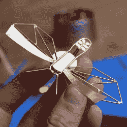

# Remoticon 视频:电路雕塑工作室

> 原文：<https://hackaday.com/2020/12/03/remoticon-video-circuit-sculpture-workshop/>

Circuit Sculpture 是我们最期待的 Hackaday Remoticon 2020 研讨会之一，现在它已经准备好让那些错过它的人欣赏了。一个初学电路雕刻的人很难要求比这个工作室更多的东西，这个工作室[突出了建造萤火虫电路雕塑的三种不同方法](https://www.youtube.com/watch?v=p5GvcxMcR74)，由一些最杰出的人领导，他们将黄铜和部件弯曲到他们的意愿——jiří·普劳斯，莫希特·博伊特，&凯利·希顿。

首先，你会学到他们每个人用来创作雕塑的不同工具和技术。例如，凯利喜欢使用水基粘土来固定特定方向的组件，同时形成雕塑并将它们焊接在一起。另一方面，Jiří和莫希特倾向于使用磁带。重点是，没有正确或错误的方法，而是在你雕刻的时候把所有这些技巧和窍门都掌握在你的腰带下。这也是这次研讨会的真正目的。

 [https://www.youtube.com/embed/p5GvcxMcR74?version=3&rel=1&showsearch=0&showinfo=1&iv_load_policy=1&fs=1&hl=en-US&autohide=2&wmode=transparent](https://www.youtube.com/embed/p5GvcxMcR74?version=3&rel=1&showsearch=0&showinfo=1&iv_load_policy=1&fs=1&hl=en-US&autohide=2&wmode=transparent)

首先是莫希特，他通过光束机器人学进入了电路雕塑领域。莫希特喜欢以颜色变化和其他反应的形式赋予雕塑个性。需要一种简单的方法来拉直一卷电线？莫希特把它夹在一个钻子里，转了几圈后，它变直了。

[Jiri Praus’ take](https://twitter.com/jipraus/status/1324495832914235392) on the dragonfly sculpture.

Jiří倾向于制作对称的雕塑。他经常从草图开始，一旦这个想法在 2D 实现，他就会开始制作 3D 草图。Jiří喜欢使用 3D 打印模板来帮助弯曲黄铜到特定的角度或作为夹具来创建形状。

凯利更像是一个自由形式的艺术家，他倾向于制作看起来像有机体的雕塑。Kelly 经常求助于 [Thévenin 的等效物](https://en.wikipedia.org/wiki/Th%C3%A9venin%27s_theorem)，并使用许多串联电阻来制作一个看起来复杂但电学上简单的电阻元件。

这个工作坊就是将这三种风格混合搭配，以适合你的创意视野，所以来看看吧，玩得开心。[firefly 模板可在研讨会页面](https://hackaday.io/project/175173-remoticon-circuit-sculpture-workshop)上找到。如果你做了什么，[一定要发布在 Hackaday.io](https://hackaday.io/) 上。