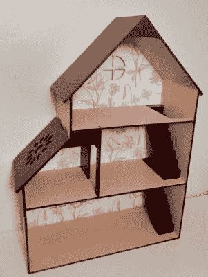

# 激光切割机的 3D 手指关节

> 原文：<https://hackaday.com/2020/12/12/3d-finger-joints-for-your-laser-cutter/>

激光切割机是一个非常有用的工具，它们经常出现在各地的创客空间。他们非常擅长创建大型二维物体，通过切割多个连接在一起的平面形状，您可以组装一个三维物体。这在创建像规则的 90 度角的盒子这样的东西时更容易，但是当你试图构建任何不规则的表面时很快就变得非常棘手。[Tuomas Lukka]开始在他当地的 hackerspace 用激光切割机为他的女儿制作一个玩具屋，手动制作所有关节的想法令人沮丧。

他想到的解决方案是编写一个名为 Plycutter 的 python 脚本，它可以接收一个 STL 文件，并输出一系列切割工具所需的 DXF 文件。它做着艰难的工作，决定如何去除所有那些古怪的关节。

在其核心，该系统只是一个 3D 切片器，就像你在 3D 打印机上看到的那样，但并非所有的切片都是水平的。如果两个以上的碎片相遇，事情就变得棘手了。[Tuomas]在浮点舍入的过程中遇到了一些问题，经过几次重写，他有了一个出色的系统，可靠地产生了很好的结果。玩具屋的建造让他女儿非常高兴。

Plycutter 的所有[代码都在 GitHub](https://github.com/tjltjl/plycutter) 上。我们已经看到一种[类似的技术，在盒子](https://hackaday.com/2016/07/10/add-slots-and-tabs-to-your-boxes-in-freecad/)上增加插槽、指接和 t 型插槽，但是 Plycutter 确实提供了一些独特的功能。