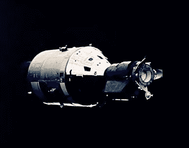
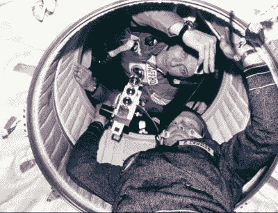
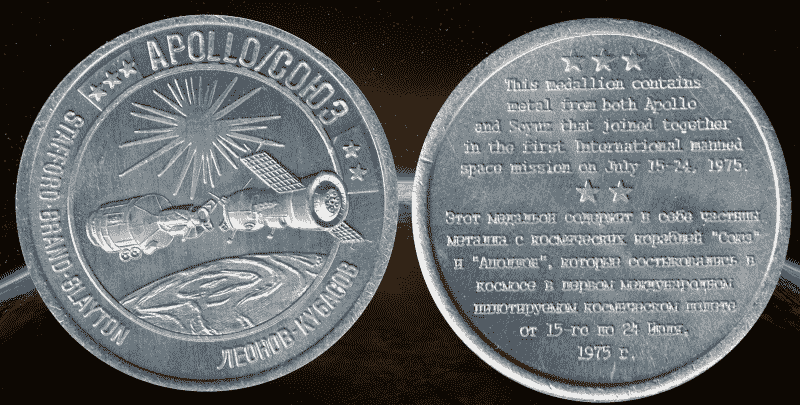

# 那天俄国人和美国人在 135 英里的高空相遇

> 原文：<https://hackaday.com/2021/01/07/the-day-the-russians-and-americans-met-135-miles-up/>

如果你看过原版的《星际迷航》系列，你会认为联邦绝不会与克林贡人合作。尽管文化不同，但最终两人成为了伟大的盟友。曾几何时，美国和俄罗斯似乎永远不会成为朋友——尽管国家之间可以成为朋友。然而今天，这两个大国在许多领域进行合作。

一个值得注意的合作领域是太空飞行，这也是双方能够以合作的方式走到一起的第一个领域之一，在 135 英里高的轨道上第一次见面。这项任务也标志着阿波罗宇宙飞船的最后一次航行，苏联最幸运的宇航员重返太空，以及美国宇航局最老的宇航员的首次飞行。连接美国和苏联太空舱的能力将为国际空间站铺平道路。阿波罗-联盟号任务如果不是历史性的，那就什么都不是，但随着更多的国家成为航天国家，它也比以往任何时候都更有意义。

## 冷战

俄国人和美国人在第二次世界大战中是盟友。然而，这是一种不稳定的友谊，更多的是基于需要和共同的兴趣，而不是别的。当曼哈顿计划给盟军原子弹时，俄罗斯人感到脆弱，并开始制造自己的炸弹。这就是所谓冷战的开始。

1957 年，俄罗斯发射了人造卫星一号，这是人类发射的第一颗卫星。今天，我们会认为这很酷，但在冷战的偏执时代，这让美国人感到恐惧。如果俄国人能在我们头上放些东西，让我们无法防御，他们就能随心所欲地轰炸世界上的任何地方。

美国人决定他们不会在将东西送入轨道的问题上让步，于是太空竞赛开始了。在缓慢的开始和肯尼迪总统著名的宣布“我们将登上月球”之后，事情开始迅速发展。这个故事广为人知，美国在不到十年后登上了月球，这要归功于阿波罗飞船——一个工程奇迹。

## 合作初期

1962 年 10 月，就在格伦第一次轨道飞行后，俄罗斯和美国签署了德莱顿-布拉贡拉沃夫协议，共享气象卫星数据，共同研究地球磁场，并让俄罗斯帮助跟踪回声二号卫星。引用副总统林登·约翰逊(Lyndon Johnson)的话，当时人们以“谨慎乐观的精神”看待这一点，苏联似乎意识到——至少在外层空间——与人类其他部分合作可能会有所收获。

但是 1962 年 10 月也发生了古巴导弹危机，两国像以往一样濒临核战争。不用说，这一度阻碍了国际空间合作。

到 1970 年，苏联科学院院长 Mstislav Keldys 和美国国家航空航天局局长托马斯·潘恩就更多的太空合作交换了信件，双方都认为这是和平的政治行为。苏联领导人列昂尼德·伊里奇·勃列日涅夫说:

> 苏联和美国宇航员将进入外层空间，进行人类历史上第一次重大的联合科学实验。他们知道从外太空看我们的星球会更美丽。它大到足以让我们在上面和平生活，但它太小了，不会受到核战争的威胁”

到 1972 年，一项协议形成了，协议的一部分要求阿波罗-联盟号试验项目或 ASTP 在 1975 年发射。

## 阿波罗-联盟号

不管你在电影中看到什么，在轨道上连接两个航天器的技术挑战是相当大的。当然，有简单的足够接近，甚至尝试它，但这是轨道力学。你还需要非常精确地排成一行，并控制两辆大型高速车辆配合时的力度。

然后还有其他问题。例如，当你打开气闸时，对接适配器通常会非常冷，这将导致水从航天器中温暖潮湿的空气中凝结。所以对接然后立刻打开舱门只是电影里才有的事。在现实生活中，当它们通过两个容器之间的界面时，它们会等待事物变暖，但仍然必须清除液体。

说到温暖潮湿的空气，阿波罗指令舱使用的是大约 5 磅/平方英寸的纯氧。联盟号在 15 磅/平方英寸的舒适海平面压力下使用了氮气和氧气的混合物。ASTP 号的设计是使用一个适配器将两艘船连接在一起。由于大气差异，适配器也必须作为气闸操作。

View of Apollo with ASTP Adapter from Soyuz

美国宇航局和苏联科学院合作开发了雌雄同体的外围连接系统(APAS)。与早期的对接方案不同，比如用于连接登月舱和指令舱的方案，理论上，一艘带有 APAS 的船可以连接到任何其他带有 APAS 的船上。当时的大多数对接系统都不是这样。例如，你不能将两个指令舱或两个登月舱对接在一起。

ASTP 阿波罗飞船实际上没有使用 APAS。适配器的一面看起来像登月舱，另一面是 APAS 接口。联盟号有一个合适的 ASTP 对接环，在紧急情况下可以分离。联盟号还有其他变化。例如，空气压力降低到刚刚超过 10 磅/平方英寸，因此适配器上的压差更小。

俄罗斯人实际上制造了六艘这种改进型联盟号。两枚发射时没有船员。一架用于测试任务。在另外两个太空舱中，一个为后来的任务用相机替换了对接环，另一个是后来被拆开的任务的热备份。

## （轮船、飞机等上面的）全体工作人员

俄罗斯为阿波罗-联盟号任务挑选了两名“幸运”的宇航员。阿列克谢·列昂诺夫和瓦列里·库巴索夫以前都到过太空，列昂诺夫是第一个在太空行走的人。他们是“幸运的”，因为他们被安排乘坐联盟 11 号，最终三名机组人员全部丧生，但库巴索夫被怀疑患有肺结核，他们没有乘坐。有两名宇航员，因为联盟 11 号的悲剧证明了在关键的任务阶段需要在太空舱里穿宇航服，而太空舱里根本没有三个人的空间。

美国机组人员包括汤姆·斯塔福德、万斯·布兰德和之前被禁飞的迪克·斯雷顿。斯塔福德之前已经做了三次飞行，但这是布兰德的第一次。

这是斯莱顿的第一次(也是唯一一次)飞行，但他从第一天起就已经在这里了，所以他几乎不是新手。斯莱顿是最初入选水星计划的七名宇航员之一。在他能够飞行之前，一个相对较小的医疗问题使他靠边站，他接任了宇航员办公室的负责人。在阿波罗-联盟号中，他将成为当时到达轨道的最年长的人，也是从选择到首次飞行时间最长的宇航员，这可能是任何宇航员都不想打破的记录。

## 任务

Passing between spaceships

1975 年 7 月，两艘船都搭载了经验丰富、人数减少且“幸运”的船员下水。当时，俄罗斯人通常在太空任务完成后才会报告。然而，这次任务是电视直播的。船员们一起进行了广泛的训练，所以这不是他们第一次见面，对接三个小时后，列昂诺夫和斯塔福德打开舱门，握了握手。

他们交换礼物，共享膳食，并进行联合实验。他们还再次练习了出坞和入坞。为了简化问题，俄罗斯人说英语，美国人说俄语。这个想法是，比起强迫一方或另一方说一种语言，你更容易发现有人在说你的母语。列昂诺夫后来开玩笑说，这次任务使用了三种语言，因为他把斯塔福德的俄语叫做“Oklahomski”这两个人实际上成了非常好的朋友，而且在他们的余生里都会如此。

这次任务非常成功。在停靠了 44 个小时后，飞船分离了，阿波罗太空舱制造了一次人造日蚀，这样联盟号就可以拍到日冕的照片。他们再次短暂停靠，然后继续花更多的时间单独执行任务。你可以看到一些当代新闻报道的实际对接，下面。

 [https://www.youtube.com/embed/x4_3D1IvsMQ?version=3&rel=1&showsearch=0&showinfo=1&iv_load_policy=1&fs=1&hl=en-US&autohide=2&wmode=transparent](https://www.youtube.com/embed/x4_3D1IvsMQ?version=3&rel=1&showsearch=0&showinfo=1&iv_load_policy=1&fs=1&hl=en-US&autohide=2&wmode=transparent)

在阿波罗太空舱重返之前，一切都很好。一个机组人员的失误让推进剂烟雾进入了太空舱。布兰德昏过去了，斯塔福德解开了紧急呼吸装置。虽然他们活着着陆，但由于事故，这三人将在医院度过几个星期。阿波罗任务结束了。下一批美国宇航员将乘坐航天飞机。

你可以在下面的 NASA 纪录片中看到斯塔福德在回收船的甲板上说话时揉着喉咙。

 [https://www.youtube.com/embed/wHWkeQxKcIc?version=3&rel=1&showsearch=0&showinfo=1&iv_load_policy=1&fs=1&hl=en-US&autohide=2&wmode=transparent](https://www.youtube.com/embed/wHWkeQxKcIc?version=3&rel=1&showsearch=0&showinfo=1&iv_load_policy=1&fs=1&hl=en-US&autohide=2&wmode=transparent)

既然《ASTP》的整体理念是这是一项联合任务，那么我们也放映苏联纪录片似乎才是公平的。这确实是一部有趣的电影，一定要点击链接观看第二部分。

 [https://www.youtube.com/embed/FpRBfLtnfSg?version=3&rel=1&showsearch=0&showinfo=1&iv_load_policy=1&fs=1&hl=en-US&autohide=2&wmode=transparent](https://www.youtube.com/embed/FpRBfLtnfSg?version=3&rel=1&showsearch=0&showinfo=1&iv_load_policy=1&fs=1&hl=en-US&autohide=2&wmode=transparent)

## 硬件怎么了？

一些航天器在洛杉矶的加州科学中心和莫斯科的 RKK 能源博物馆展出。史密森尼国家航空航天博物馆、肯尼迪航天中心和其他几个地方也有一些测试文章和复制品。

飞船上的一些金属被用来制作一些纪念章，我很幸运地拥有一枚——见下图——来自我在更现代的对接系统工作期间。

## 遗产

说到更现代的对接系统，APAS 号最终变成了搭载和平号和航天飞机的 APAS-89 号。国际空间站有一个修改版的 APAS-95，它不是雌雄同体的。所有这些导致了 IDSS 或[国际对接系统标准](https://www.internationaldockingstandard.com)，这是连接两个航天器的当前标准。即使在今天，国际空间站对接端口连接到国际对接适配器(IDA)，以将旧端口转换为 IDSS 标准。它不仅仅是一个机械联动装置。脐带缆可以在两个运载工具之间提供电力和数据，最终甚至可以传输一些消耗品。

 

史密森尼展览([Toytoy] CC By 2.5)

至于政治遗产，ASTP 为俄美计划与和平号和国际空间站合作做了铺垫。ASTP 指挥官成为了一生的朋友。总的来说，除了最后的小插曲，这的确是一次非常成功的任务。

## 合作与竞争

如今，美国对火星的关注超过了月球。中国正积极地重返月球，但由于复杂的政治原因，他们不是国际空间站的成员，他们大多走自己的路。

一方面，我想到如果你把所有的太空资金都放在一个钱包里——比如说放在联合国名下——你可以在单个太空任务上花更多的钱。当然，把所有鸡蛋放在一个篮子里是有风险的，如果人们没有民族自豪感，他们可能更不愿意在太空上花费。

那么友谊赛呢？开始太空奥运会，作为国家队参赛。毕竟，太空竞赛促使我们首次登月。也许人们不愿意为科学投资，他们会愿意花在体育比赛上。对职业体育场馆征税证实了这一理论。

不管怎样，现状是某种程度的合作，即使是心照不宣。ASTP 是一个非常明显的提醒，两个伟大的国家在太空中可以做的比他们任何一个单独做的都多。当我们在未来制定全球空间政策时，时间会证明我们是否记得这一点。