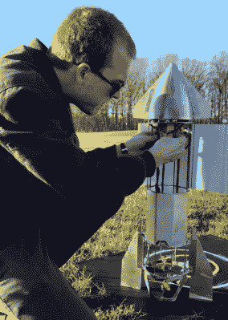

# 遥控星际飞船完善其跳伞动作

> 原文：<https://hackaday.com/2020/12/13/rc-starship-perfects-its-skydiving-routine/>

你很有可能已经看到了 SpaceX 高耸的星际飞船原型进行了令人印象深刻的 12 公里试飞。虽然这一尝试以一个壮观的火球结束，但它仍然是一个非凡的成功，因为它展示了一些迄今为止从未在现实世界中尝试过的概念。最重要的是，这种“腹部翻转”机动可以看到 50 米(160 英尺)长的火箭从垂直飞行过渡到使用电动飞行表面的水平半滑翔。

发现自己受到这种未来宇宙飞船的启发， [[Nicholas Rehm]设计了自己的无线电控制星际飞船](https://hackaday.io/project/175745-radio-controlled-starship-program)，它能够像真的一样做所有相同的特技飞行。它将火箭发动机换成了一对电动无刷电机，但除此之外，它是 SpaceX 当前测试计划车辆的一个相当准确的再造。正如你在休息后的视频中看到的，它甚至能够坚持着陆。嗯，反正有时候。

 就像真正的星际飞船一样，矢量推力用于在垂直上升过程中稳定飞行器，并帮助其转入和转出水平飞行。当然，周围没有[火箭喷嘴，所以【尼古拉斯】使用火箭底部的伺服控制叶片来转移发动机的气流。伺服系统也用于控制外部控制表面，当车辆下落时，外部控制表面提供稳定性和一点控制权。](https://hackaday.com/2020/12/03/crossed-wires-crash-rockets/)

有趣的是，浏览星舰残骸照片的互联网侦探注意到，SpaceX 似乎是用特斯拉汽车公司(Tesla motors)驱动的变速箱来驱动襟翼的。据报道，该车也使用特斯拉电池组。因此，虽然用电池供电的伺服系统移动模型飞机上的控制表面在历史上可能是一种最小化内部复杂性的妥协，但在这里，它实际上非常接近真实情况。

不幸的是，RC 星际飞船在最近的一次测试飞行中自己硬着陆了，所以[Nicholas]目前必须在继续进一步开发之前重建飞船。我们相信他会让它回到空中，尽管在 SpaceX 发射他们的下一个原型之前，看看他是否会飞行会很有趣。

 [https://www.youtube.com/embed/5lwH7xJnB4I?version=3&rel=1&showsearch=0&showinfo=1&iv_load_policy=1&fs=1&hl=en-US&autohide=2&wmode=transparent](https://www.youtube.com/embed/5lwH7xJnB4I?version=3&rel=1&showsearch=0&showinfo=1&iv_load_policy=1&fs=1&hl=en-US&autohide=2&wmode=transparent)

