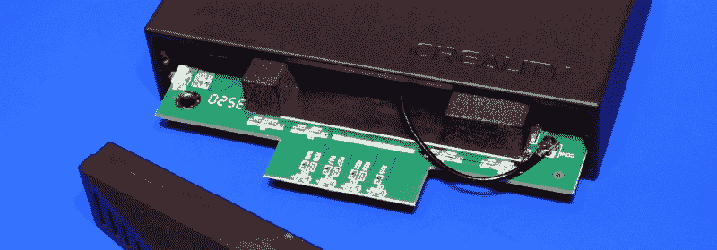
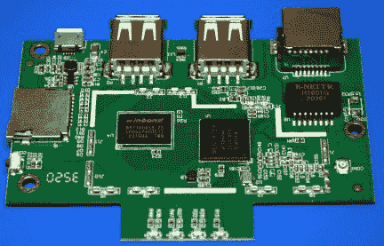
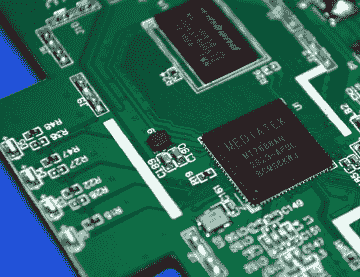
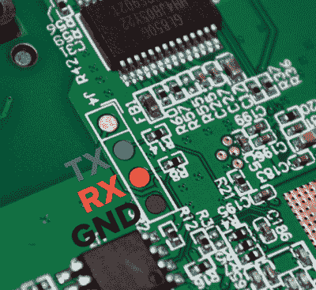
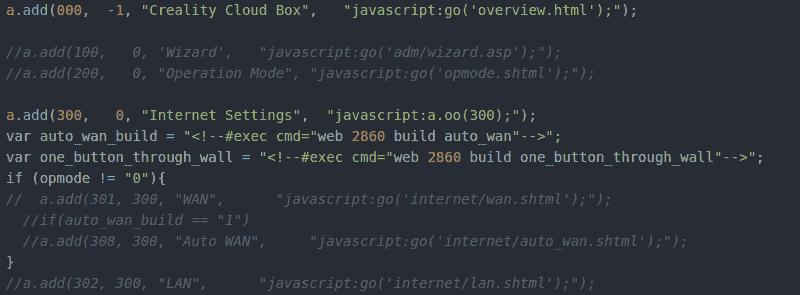

# 拆卸:Creality Wi-Fi 盒

> 原文：<https://hackaday.com/2020/12/28/teardown-creality-wifi-box/>

3D 打印机 Ender 系列的制造商 Creality 发布了一款名为 Wi-Fi Box 的产品，旨在以低廉的价格为你的打印机添加网络控制。自然，我必须订购一个，这样我们就可以一窥究竟，但这肯定不是一个产品评论。如果你想通过网络控制你的 3D 打印机，给自己买一个树莓派，然后[在上面安装吉娜·霍格非凡的 OctoPrint](https://octoprint.org/) 。不管 Creality 想让你相信什么，他们的产品只不过是这个不可思议的开源项目的拙劣模仿。

即使你设法让它与你的打印机一起工作，根据早期迹象判断，这是一个相当大的假设，它也不会给你同样的体验。与 DIY 路线相比，它最多能为您节省几美元，但代价是错过了插件开发人员的活跃社区，他们帮助 OctoPrint 建立了事实上的远程 3D 打印解决方案。

也就是说，硬件本身似乎很有趣。只需 20 美元，你就能得到一台手掌大小的 Linux 电脑，配有 WiFi、以太网、一个微型 SD 插槽和一对 USB 端口；都被包裹在一个相当坚固的外壳里。没有视频输出，但这几乎不会吓跑经验丰富的企鹅牧马人。藏在一个角落里，只喝几瓦特的水，人们可以想象这个小玩意将非常适合许多任务。也许它可以充当所有智能家居设备的小型 MQTT 代理，或者低功耗的远程气象站。可能性几乎是无限的，假设我们无论如何都能进入这个东西。

那么 Creality Wi-Fi 盒子里有什么，按照我们的意愿弯曲它会有多难呢？让我们拆开一个看看。

## 出奇的优雅

鉴于低廉的购买价格，这可能不会令人感到惊讶，但 Wi-Fi 盒子并没有太多东西。Creality 希望尽可能便宜地生产这种产品，事实也证明了这一点。该包装甚至不包括电源或所需的微型 SD 卡，尽管奇怪的是，他们确实包装在两条 USB 电缆中。很明显，该公司不想对最终成为实验产品的东西进行不必要的投资。一些用户甚至报告说，在从 Creality 购买 3D 打印机时，可以免费获得一个 Wi-Fi 盒子；在这种商业模式下，降低成本当然是最重要的。

[](https://hackaday.com/wp-content/uploads/2020/12/wifibox_open.jpg)

The WiFi antenna is glued to the case, and must be disconnected to remove the PCB.

即便如此，设备本身也不觉得便宜。事实上，恰恰相反。塑料外壳出奇的厚和坚硬，感觉更像是电动工具的注塑外壳。对于一个将在 3D 打印机旁边轻松生活的闪烁小盒子来说，这可能有点过分了，但我当然不会抱怨。有趣的是，它的外壳是一块坚固的塑料，而不是翻盖。要移除 PCB，您必须撬开前面板并将其滑出。

 [](https://i0.wp.com/hackaday.com/wp-content/uploads/2020/12/wifibox_pcb1.jpg?ssl=1)  [](https://i0.wp.com/hackaday.com/wp-content/uploads/2020/12/wifibox_soc.jpg?ssl=1) Note traces connecting the LEDs to the SoC GPIO pins.

随着电路板从机箱中取出，金属射频屏蔽被移除，我们可以看到让 Creality Wi-Fi 盒子运行所需的时间有多短。[联发科 MT7688AN SoC](https://labs.mediatek.com/en/chipset/MT7688) 采用 580 MHz MIPS CPU 以及用于 USB、SD、以太网和 WiFi 的集成控制器，而华邦 W971GG6SB 提供 128 MB DDR 2 SDRAM。SoC 还有几个 GPIO 引脚，我们可以清楚地看到，这些引脚已经连接到电路板正面的四个状态 led。添加以太网端口的磁性元件和 micro USB 电源上的一些过滤功能，您就可以在一个紧凑、高能效、低成本的平台上获得一个相当强大的 Linux 系统。

当然，它不完全是速度恶魔。就连树莓派 Zero 也能绕着这个小盒子转圈。这最终是我们的第一个线索，为什么 Creality 没有为这个产品使用定制版本的 OctoPrint。能有效运行它的硬件简直太贵了；为了达到他们想要的价位，他们必须想出自己的简化概念。

## 深入研究

至此，我们知道它是一台 580 MHz 的 Linux 机器，内存为 128 MB。2020 年不太令人兴奋，但也不完全是镇纸。当然，如果我们不能访问操作系统，硬件再强大也没用。下一步是弄清楚 Creality 有多想把我们挡在外面。

[](https://hackaday.com/wp-content/uploads/2020/12/wifibox_serialport.png) 我们的第一个突破来自 PCB 底部相当显眼的串口头。在连接了 USB 转串行适配器并偶然发现 57，600 波特的正确速度后，我们可以看到 U-Boot 和 Linux 内核消息经过，最终我们发现自己处于登录提示符下。不幸的是，我们不知道密码。

现在，任何熟悉嵌入式 Linux 黑客的人都知道，这是您拿出修改后的 U-boot 环境变量以单用户模式启动系统的地方。但是尽管我尽了最大努力，我还是无法进入 U-Boot 命令行。在连续 30 或 40 次尝试在引导加载程序加载内核之前中断它之后，我得出结论，要么是我的时间安排特别糟糕，要么是对 U-Boot 的访问被禁用了。

这给我们留下了什么？就在串行端口旁边，您会发现 16 MB Boyamicro 25Q128 SPI 闪存芯片，其中包含固件。你可以取出芯片，读取它的内容，修改文件系统，然后闪回。如果你打算做大量的固件修改，[你甚至可以为芯片](https://hackaday.com/2020/05/20/poking-around-inside-of-a-linux-security-camera/)安装一个插座来保持美好时光。

幸运的是，有一个更简单的方法。从 Creality 的官方固件更新文件中可以看出，这个小工具会在 micro SD 卡上寻找一个`install.sh` Bash 脚本，并在启动时运行它。我们放入该文件中的任何命令都将以 root 用户身份执行，这使我们可以轻松地更改密码，而无需打开烙铁:

```

#!/bin/sh
echo 'root:hacked' > /tmp/pass
cat /tmp/pass | chpasswd

```

有了 SD 卡上的这个文件，我们现在可以通过串行端口登录到 root 帐户并开始探索。

## 这是个路由器，吉姆

当我第一次听说这个设备时，我对它可能真的运行 OpenWRT 寄予厚望。不幸的是，我们实际拥有的是一个非常小的 BusyBox 环境，它显然是为无线路由器设计的。我知道这一点，因为它似乎所有的路由器功能仍然完好无损，它只是在必要时被注释掉，以防止它在 web 界面上可见或自动启动。

[](https://hackaday.com/wp-content/uploads/2020/12/wifibox_router.png)

The commented out pages are still available, they just don’t show in the menu.

同样，系统中有许多程序和脚本对于控制 3D 打印机来说是完全不必要的。从模拟 iTunes 服务器和流媒体 MP3 到与 3G 调制解调器谈判，Creality Wi-Fi 盒子有许多隐藏的功能，这些功能被锁定在有意限制的网络界面后面。

## 软件自由

总之，我们已经有了一个相当完善的 SoC，一个正常工作的串行端口，一个需要研究的官方固件更新文件，以及一个获得 root 访问权限的简单方法。OpenWRT 甚至有一个现有的 MT7688 子目标。所有的部分都在这里，他们只需要把它们放在一起。

幸运的是，我们不是必须这样做的人。一个名叫乔治·布鲁克的开发者，又名[figgyc]，已经为我们做了这项工作。甚至在我能够写完这篇关于硬件的文章之前，他已经发现并修复了一些阻止 OpenWRT 在该板上引导的问题(例如添加对 Boyamicro 25Q128 闪存芯片的支持)。利用现有的固件更新机制，[你可以在 Creality Wi-Fi 盒上安装他的流行嵌入式 Linux 发行版的分支，而无需对硬件做任何修改。他还没想好怎么回股票固件，但坦白说，谁在乎呢？](https://github.com/figgyc/openwrt/commit/ea41ccf3f0032dffce48e3ed103f393afd15c446)

安装了 OpenWRT，Creality Wi-Fi 盒子就变成了真正的通用电脑。由于大量的软件包和活跃的开发社区，这个简单的固件交换将 20 美元的噱头变成了一个有用的工具。

## 逃离围墙花园

在用 Creality Wi-Fi 盒子度过了一些美好时光后，我不禁想起了几个月前我们看过的[侦察哨兵](https://hackaday.com/2020/11/16/teardown-recon-sentinel/)。这两款基于 Linux 的设备都为我们提供了一个易于重用的硬件平台，因为很少或根本没有试图限制用户在其上安装更强大软件的能力。即使这更可能归因于偶然事件，而不是开发者的任何真正无私的目标，我们也应该非常幸运地拥有更多可以被最终用户轻松修改的商业设备。

但我想知道相似之处最终是否会更深一层。Sentinel 旨在将消费者锁定在一份昂贵的服务合同中，从而产生远高于设备本身标价的收入。Creality 会在 Wi-Fi 盒子上做类似的计划吗？诚然，我们还没有看到这方面的任何迹象，但显而易见的是，除非你有计划在未来赚回这笔钱，否则你不会以成本价或低于成本价的价格赠送硬件。

在 Wi-Fi 盒子的产品公告中可能会找到线索。它描述了“Creality Cloud”，一种“提供一个充满活力和创造力的社区，用户可以免费下载无限的 STL 文件，分享他们的模型，以及最重要的功能，在线切片和打印”的服务。虽然这项服务提供的模型现在是免费的，但不难想象付费模型可能会被引入。通过使用 Wi-Fi 盒子，Creality 可能希望客户能够依赖他们独特的软件生态系统。这可以让该公司创建一个货币化的 3D 模型库，这是他们在市场上的竞争对手迄今为止尚未完成的事情。只有时间能证明一切。

与此同时，任何寻找新项目的黑客或制造商都会选择这些廉价设备中的一种。只要确保立即用开源替代方案替换其专有固件，让您重新控制您购买的硬件。