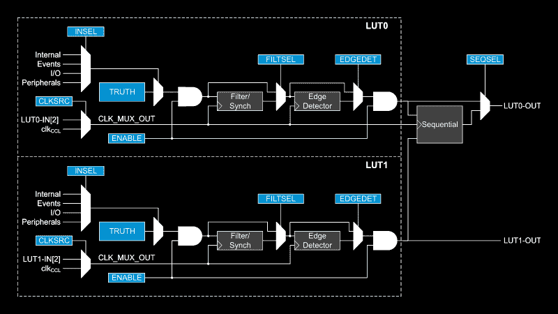
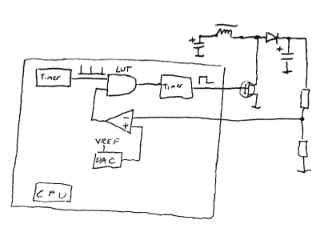

# AVR 微控制器兼作开关调节器

> 原文：<https://hackaday.com/2021/01/09/avr-microcontroller-doubles-up-as-a-switching-regulator/>

[SM6VFZ]使用 ATtiny214 微控制器的核心独立外设(CIP)作为概念验证，设计、构建并测试了[一个开关模式 DC-DC 升压调节器](https://sm6vfz.wordpress.com/2020/12/11/boost-regulator-with-attiny/)，它看起来非常有前途！

降压、升压或降压-升压开关调节器拓扑结构通常由电源路径中的一个二极管、一个开关元件(MOSFET)和一个储能器件(电感/电容)以及一个控制器组成，该控制器可以测量输出电压、控制开关元件并添加限流和温度关断等安全特性。搜索开关调节器或控制器会出现成千上万个器件，可以选择一个特别适合任何所需应用的器件。即便如此，使用微控制器本身作为调节器的能力可以有几个用例。这种实现允许软件可配置的开关模式调节器和容易的拓扑变化(升压、降压、回扫等)。).

应用笔记“[AVR 上的内核独立外设入门](http://ww1.microchip.com/downloads/en/AppNotes/DS00002451B.pdf)”是了解 CIP 功能工作原理的好地方。可配置定制逻辑(CCL)是功能强大的 CIP 外设之一。可以把 CCL 想象成一个基本的 CPLD——一个可编程逻辑外设，可以连接到各种内部和外部输入，如器件引脚、事件或其它内部外设。CCL 可以作为设备外设和外部设备之间的“粘合逻辑”。CCL 外设提供两个查找表(LUT)。每个 LUT 由三个输入、真值表、同步器、滤波器和边沿检测器组成。每个 LUT 可以产生一个输出，作为具有三个输入的用户可编程逻辑表达式，任何具有 CCL 外设的器件都至少有两个可用的 lut。

这张 napkinCAD 草图显示了[SM6VFZ]如何在 ATtiny214 中实现升压调节器。使用一个 CCL LUT 形成与门。左边的第一个“定时器 1”连接到与门的一个输入端，自由运行，设置为 33 kHz。模拟比较器将升压后的输出电压与 DAC 内部产生的基准电压进行比较。然后，比较器的输出“门控”定时器 1 信号，以触发第二个“定时器 2”，这是一个单次触发定时器，最大输出设置为 15 us。这确保了在下一个周期开始之前，电感器有足够的时间来完全释放其能量。您可以查看[SM6VFZ]用来构建这个原型的代码，他大量的评论使您很容易理解它是如何工作的。

基于这种设计，他建造的原型可以在大约 200 mA 的电流下提供 12 V 的电压，效率为 85%，与常规开关调节器相比相当不错。请记住，这更多的是一个概念验证(实际上是可行的)，在噪声、效率和其他参数方面还有很大的改进空间，所以欢迎大家的评论。

在之前的一篇博客文章中，我们看到了带可编程逻辑的 ATmegas 如何实现 PIC 微控制器中常见的功能，这要归功于几年前 Microchip 对 Atmel 的收购。但到目前为止，我们还没有在 Atmel 芯片中看到任何 CCL 外设的实际例子。