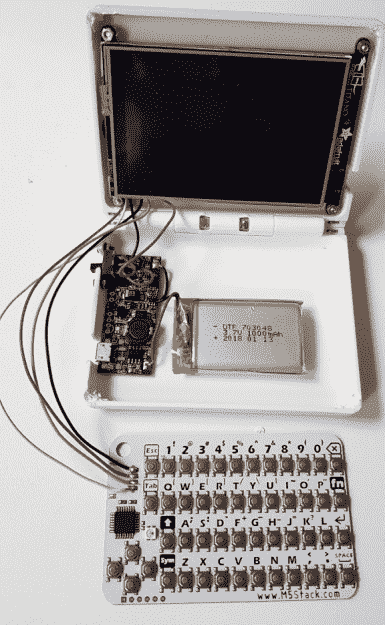

# 建造一个口袋大小的蟒蛇游乐场

> 原文：<https://hackaday.com/2021/01/07/building-a-pocket-sized-python-playground/>

像我们许多人一样，[拉明·阿萨多拉希]对昔日的电脑有某种喜爱。发现他对几乎即时启动时间和裸机编程的渴望无法被他的任何现代设备充分满足，他决定建造 PortablePy:一个[口袋大小的设备，可以随时随地将他直接放入 Python 提示符](https://assadollahi.de/portablepy-the-clamshell-micropython-computer/)中。

 该设备由 Adafruit PyPortal Titano 提供支持，它将 ATSAMD51J20、ESP32、传感器阵列和 3.5 英寸对角线 320 x 480 彩色 TFT 结合到一个交钥匙单元中。PyPortal 是为运行 CircuitPython 而设计的，但是脚本通常通过 USB 放在设备上。这对于大多数应用程序来说没问题，但是[Ramin]希望他的便携设备不需要主机就可以使用。

为了获得真正的移动体验，他必须想办法在设备上编写一些 Python 代码。答案最终是 M5Stack CardKB，这是一种通过 I2C 进行通信的微型 QWERTY 板。一旦他验证了这个概念是合理的，他就编写了一个简单的文件管理应用程序和最小的 Python 编辑器，可以直接在 PyPortal 上运行。

最后一步是把整个事情包装成他可以从板凳上拿下来的东西。他设计了一个受经典游戏 Boy Advance SP 启发的 3D 打印翻盖外壳，确保在下半部分留有足够的空间来装充电板和 LiPo pouch 电池。他确实不得不从 PyPortal 的背面移除一些连接器，以便将所有东西都放入机箱，但是紧凑的最终结果似乎值得付出努力。

虽然总体上是成功的，但[Ramin]指出还有一些挥之不去的问题。首先，从字面上来看，键盘打字很痛苦。他正在考虑打造一款按键更柔软的定制键盘，但这是一个长期目标。更直接的是，他专注于改进软件方面的东西，这样更容易编写代码和管理多个文件。

听起来[Ramin]并不打算在让 PortablePy 完全独立的目标上妥协，但如果你的信念不那么坚定，你总是可以将这样的设备连接到你的手机上，让事情变得更容易一些。

 [https://www.youtube.com/embed/8W6p8-zu-yc?version=3&rel=1&showsearch=0&showinfo=1&iv_load_policy=1&fs=1&hl=en-US&autohide=2&wmode=transparent](https://www.youtube.com/embed/8W6p8-zu-yc?version=3&rel=1&showsearch=0&showinfo=1&iv_load_policy=1&fs=1&hl=en-US&autohide=2&wmode=transparent)

