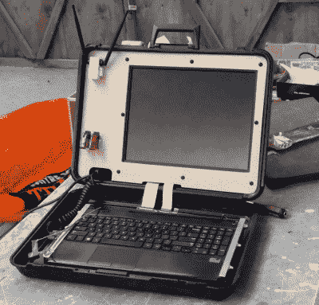

# 赛博朋克马自达 MX-5 包机载赛博甲板

> 原文：<https://hackaday.com/2021/01/10/cyberpunk-mazda-mx-5-packs-onboard-cyberdeck/>

回到 2019 年 4 月，受《银翼杀手》和*阿基拉*等标志性电影的启发，【克里斯·沃森】踏上了从 1991 年的马自达 MX-5 开始创造自己的赛博朋克跑车的旅程。在这个项目中倾注了令人难以置信的大量血液、汗水和玻璃纤维后，他现在有了一辆不会看起来不合适的车，在新东京的街道上行驶。即使你通常不喜欢汽车改装，[他无可挑剔的拍摄建造日志绝对是一次迷人的旅程](https://www.driftworks.com/forum/threads/cyberpunk-mx-5-build.273250/)。

 尽管汽车本身令人印象深刻，但真正吸引我们注意力的是仪表盘上的电脑。从一开始，[克里斯]就希望飞行器有一个配套的网络平台，用于控制各种车载系统。在这一点上，它只是为了展示，但他说最终它将与他计划安装的电动马达集成在一起，取代 MX-5 的原始动力装置。我们等不及要看了。

当然，缺乏实际的应用程序并没有阻止我们去欣赏到目前为止我们已经讨论过的其他网络平台。这款笔记本电脑最初是一台屏幕破碎的笔记本电脑，克里斯将其斩首，并将其连接到安装在重型机箱顶部的 15 英寸外部显示器上。使用新的 SSD 和 Linux Mint 的新副本来验证所有硬件仍然正常工作，他为显示器组装了一个 MDF 挡板，其中包括一些人造天线和覆盖的飞机风格开关。

当这款未来跑车在车展或竞赛中亮相时，[Chris]会确保在显示屏上加载一些合适的高科技外观图像。它甚至显示了一些从《速度与激情的 T2》中提取的闪烁的技术错误信息。

传统上，我们没有涵盖许多定制汽车项目，尽管公平地说，我们传统上也没有看到许多看起来像这样的项目。但是在技术越来越先进的车辆和由我们自己的【勒温日】主持的有见地的汽车改装专栏之间，我们期望精心设计的乘坐可能会成为这些页面上越来越常见的景象。