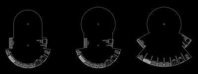
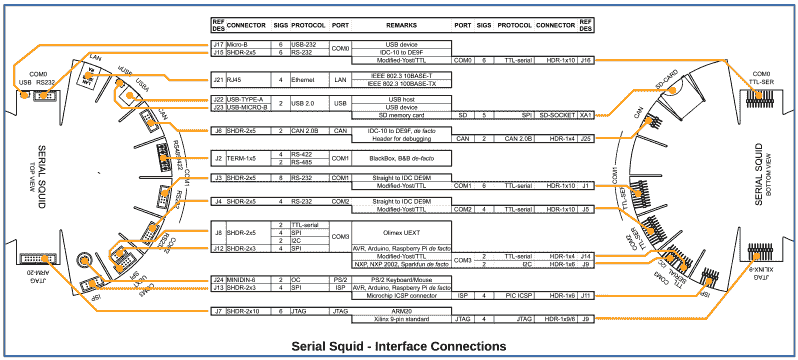

# 连环乌贼之死:何时放弃？

> 原文：<https://hackaday.com/2021/01/12/death-of-the-serial-squid-when-do-you-give-up/>

最近在寻找一个连接器时，我重温了我的一个老项目，叫做串行 Squid。这是我的第一个开源硬件设计。在完成了整个设计、PCB、BOM，并为众筹活动做准备后，我最终放弃了，原因如下所述，我一直认为这是一个失败，但进一步思考后，我认为这是一个新的想法。在放弃的道路上，我们学到了一些很好的教训。

你什么时候放手？你应该什么时候推进？

## 一个想法形成了

串行 Squid 本质上是一个以太网连接的总线盗版。这个项目的动机有很多。事实上，太多了，也许这应该是一个预警信号。起初，我只是想要一个远程串行 UART，这是出于懒惰。把笔记本电脑从我的办公桌搬到实验室工作台进行调试，或者把项目搬到我的办公桌上，这让我很恼火。肯定有某种方法可以通过网络将我办公室计算机的 I/O 物理地扩展到整个房间或大楼的实验室。所以我只关注串行 UART 解决方案，事实上，我使用`socat`共享了第二台计算机的串行端口，并取得了一定的成功。但是我逐渐扩展了我的概念部件的范围，以包括嵌入式开发人员感兴趣的其他串行接口。

大约在这个时候，我偶然发现了一个来自中国的叫做 Eagle Comm 的小型手持 flash 编程器，它是为 PIC、Cortex、AVR 等各种 MCU 设计的。，而且超级容易操作。它非常适合在工厂进行小批量生产，或者发送给客户来升级原型板。我用得越多，就越喜欢它的外形，并想知道我是否可以改变它的用途。但是制造商不愿意分享代码，而且硬件也不是很适合我的应用程序来保证逆向工程。但是，也许我还未命名的小部件可以从 Eagle Comm 单元的包装和布局中学到一两件事。

说到向客户端发送闪存芯片的东西，我可以向我的一些客户端发送一些东西用于数据记录，这也是有帮助的，特别是当系统安装在没有网络访问的远程位置时。我的小工具可以用电池供电并方便地用作记录器吗？

最后，多年来，我一直对将电子产品封装在一个完全由多层印刷电路板构成的扁平“外壳”中很感兴趣。适当薄的 SMT 板可以通过添加一些玻璃纤维 PCB 制成扁平封装，其中一些带有用于元件的切口。连接和帮助可以直接丝网印刷在外层上，并且组装将像将层拧在一起一样简单。

## 规格固化

渐渐地，这个产品开始在我的脑海中形成。理想情况下，我想要一个带键盘和显示器的小型手持设备，并提供对应于每种接口的几个 I/O 模块。例如，如果你曾经拥有一台旧的 HP-41C 计算器，想象一下插件模块是 I/O 模块。唉，这种方法让我困惑了一段时间。这些模块没有完美的中间总线。我想要的东西不仅在技术上合适，而且成本低，无需许可，而且不会在明年消失。我正在考虑以太网或 SPI，突然想到了解决方案:将模块化设计推迟到版本 2，并为版本 1 提供一组固定的端口。

Rejected Squid Shapes

我在外形方面遇到了困难。制作一个像样的键盘并不容易。我在考虑众包，如果我想获得任何吸引力，一个简单的类似计算器的布局就太无聊了。我希望我的小部件有一个吸引人的外观。我用实体模型和 CAD 追求了几个候选设计，但没有一个是完全正确的。

后来有一天，我突然想到了一种类似韩国常见食物的东西——我的小玩意是一条鱿鱼。squid 的每条手臂都是一个接口端口，头部自然就是大脑。十条腿就够了。现在我可以提供几乎所有已知的串行协议。我新命名的系列乌贼会非常多才多艺。

在探索了几个类似乌贼的形状后，我选定了下面的设计。我做了详尽的练习，为每个接口寻找最佳的连接器和引脚。

## 做你的研究

这部分设计花了很长时间。许多串行协议没有标准连接器。有时，我们认为那些日常使用的东西是理所当然的，比如 TTL 级串行连接器引脚排列，或者 RS-485 接口应该有什么连接器和引脚排列。(没有标准，但事实上有一个被广泛采用的标准。)了解相关的规格、历史和常见用法会很有帮助。

The Variety of I/O Connectors

我尽可能多地研究了其他项目和产品的不同实现。最终，我为每个接口选择了最合适的连接器和引脚。

一直以来，我都在努力记住“扁平 PCB”的构造技术。由于许多连接器的物理限制，需要一些折衷。这不会是一个光滑、纤细的 PCB 夹层，但我仍然觉得这个结果对于预期的应用是可以接受的。我也倾向于 3D 打印的外壳，而不是 PCB 夹层，因为所需的 PCB 堆叠变得非常复杂，我怀疑比 3D 打印更昂贵。

## 一只乌贼的死亡

差不多一年后我放弃了这个项目。我差一点就成功了。我已经准备好了 Gerbers，PCB 是从中国报价的，零件在我的购物车里准备订购。原因有很多，但我想到了三个主要原因。

### 黑仔排名第一:软件

正当我兴致勃勃地做硬件设计的时候，固件开发的乌云却若隐若现。为了让该板按照我的设想运行，我需要能够通过以太网(可能还有 USB)将其各种串行端口呈现给远程计算机的固件。当我想到 UART 时，这看起来并不令人畏惧，但当你想到十几个其他接口时，就有问题了。最大的问题是没有标准的 xxxx-over-LAN 协议存在于这些端口上，甚至计算机本身也没有这些端口。固件任务的艰巨性慢慢被理解，更不用说可能的桌面设备驱动程序开发，我的热情开始消退。

### 黑仔#2:没有明确的目标

许多和我讨论过这个项目的人都承认它很吸引人，很新颖，但是很难解释它的作用。“它可以做任何事情”是一个不切实际的答案，一个诚实的评估让我得出结论，它试图做得太多了。

### 黑仔#3:被 Rev 2 分散了注意力

我对十条腿有固定的 I/O 端口一直不太满意。理想情况下，我希望用户能够混合和匹配的腿。通过这种方式，我可以让身体变得更小，或许可以摆脱基于 10 条腿生物的外形。四五条腿就够了。我一直在和自己辩论，我是应该先把鱿鱼包起来，然后继续到 Rev 2，还是放下鱿鱼，直接跳到一个新的设计。我也没有。

## 经验教训:功能蔓延

作为一名工程师，这些年来，当一个项目结束或被取消时，我经历了精神上的失望。但有趣的是，在放弃这个项目时，我并没有这种感觉。我在设计中度过了一段美好的时光，学到或重新学到了很多东西，同时也学到了一些新技能。

小心宽泛的范围和特性蔓延。这是社区里大家都知道的。但是尽管我是一个花白胡子，我还是被绊倒了。试着识别膨胀的规范的警告信号。如果你看到它发生了，在你陷得太深之前，试着修复它或者退出。没有人能理解这个目的的事实是一个大红旗——我看到了它，但无论如何都忽略了它。此外，要灵活，知道何时放弃或抛弃某个功能。规格不要太死板，尤其是爱好项目。

我很快放弃了让 Squid 作为端口扩展出现在桌面上的想法。如果我坚持的话，我会用 Linux SBC 替换 micro，或者在 Squid 上运行 Python 或 Forth 之类的脚本语言。如果您发现自己不得不从头开始重新发明或构建新的协议，请仔细看看。这样做可能有正当的理由，但通常情况下，采用现有的接口和标准会更好。

不要低估实体模型的价值，无论是实物模型还是 CAD 模拟模型。我利用这个项目作为学习 OpenSCAD 的机会，我发现这是一项非常有用的技能。我还决定为这个项目更新 KiCad。这些年来，我使用了一些专业的 PCB 设计工具，这可能会有所帮助，但我可以看到 KiCad 正在走向成功，我需要精通它。

对自己诚实——非常诚实。虽然系列乌贼很吸引眼球，但我必须承认，我不确定在现实生活中使用它会有多舒服。也要仔细审视你试图解决的问题。事后看来，我正在考虑解决的 99%的用例都可以用一个 Raspberry Pi 和一两个自定义屏蔽来完成。

虽然严格来说这个项目是失败的，但我从中获得了很多乐趣。我认识了新的人和公司，学到了五年来一直在使用的新技能。如果你心中有一个新项目，运用一些常识。从同事和黑客伙伴那里获得你的想法。然后跳进去开始。不要害怕失败——即使失败也是有价值的。