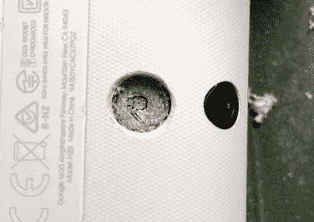

# 小心的钻孔可以防止 Stadia 监听

> 原文：<https://hackaday.com/2021/01/10/careful-drilling-keeps-stadia-from-listening-in/>

谷歌羽翼未丰的 Stadia 服务利用 Chrome 生态系统在移动设备、网络浏览器和电视上提供流媒体 PC 游戏。虽然没有严格要求，但该公司甚至提供了一个专用的 Stadia 控制器，通过自己的 WiFi 连接直接连接到流媒体服务器，以减少整体系统延迟。当然，作为谷歌的产品，控制器有一个微型麦克风~~，它总是监听~~，以便与语音助手进行交互。

[Heikki Juva]不喜欢这种隐私暗示，但不幸的是，似乎没有办法在软件中关闭这一“功能”。他决定[最便捷的解决方案是简单地从控制器](http://heikki.juva.lu/hardware/2020/01/03/stadia_microphone_removal.html)上取下麦克风，但结果出现了问题。通过研究以前的拆卸，他发现不损坏控制器几乎是不可能的。

Getting close to the target.

所以[海基]想出了一个大胆的想法。大致了解麦克风的位置后，他只需钻透控制器的外壳，露出并最终移除设备。从他看到的拆卸视频中，他知道他还必须钻透 PCB 才能接触到安装在对面的麦克风，这使得操作变得复杂。唯一的亮点是麦克风在它自己独立的 PCB 上，所以物理上破坏它*可能*不会带走整个控制器。

现在，我们不必解释为什么钻进一个由内部锂离子电池供电的小工具是危险的，我们也不一定为这里使用的技术[Heikki]担保。但是当面对这样一个密封的单元时，我们承认没有太多好的选择。事实上，用户不得不去如此荒谬的长度来禁用游戏控制器中的麦克风，这是一个完美的例子，说明为什么我们应该尽量避免这些敌对设计的设备，但这是另一个时间的讨论。

最终，凭借稳定且越来越大的钻头，[Heikki]能够在 Stadia 控制器的背面开一个 7 毫米的孔，使他能够完整地取出麦克风。移除麦克风似乎对设备没有负面影响，因为令人惊讶的是，事实证明游戏控制器实际上不需要听玩家说话。谁知道呢？

随着我们的设备变得越来越智能，[隐藏的麦克风和摄像头不幸变得越来越常见](https://hackaday.com/2019/03/11/what-hardware-lies-beneath-companies-swear-they-never-meant-to-violate-your-privacy/)。值得庆幸的是，一些制造商已经明白了这一点，并为这些侵入性功能提供了硬件切断开关，但在这成为常态之前，[黑客将不得不拿出自己的解决方案](https://hackaday.com/2019/01/17/win-back-some-privacy-with-a-cone-of-silence-for-your-smart-speaker/)。

**21 年 1 月 10 日更新:**本文原注明麦克风一直在监听。虽然没有硬件开关来禁用麦克风，[但有一个按钮必须按下才能触发语音助手功能](https://support.google.com/stadia/answer/9338851?hl=en)。我们在上面使用了删除线来表示对最初发布内容的更改。

 [https://www.youtube.com/embed/JnWptHrhj9I?version=3&rel=1&showsearch=0&showinfo=1&iv_load_policy=1&fs=1&hl=en-US&autohide=2&wmode=transparent](https://www.youtube.com/embed/JnWptHrhj9I?version=3&rel=1&showsearch=0&showinfo=1&iv_load_policy=1&fs=1&hl=en-US&autohide=2&wmode=transparent)

