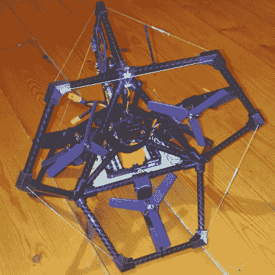

# 带 Ardupilot 的六自由度直升机

> 原文：<https://hackaday.com/2021/01/09/six-degrees-of-freedom-omnicopter-with-ardupilot/>

现代多旋翼飞机机动性很强，但大多局限于在单一方向悬停。[彼得·霍尔]已经通过建造一架 [omnicopter 无人机](https://www.youtube.com/watch?v=CXIlZ8mCfGM)解决了这个问题，它在一个折叠的四面体框架上以不同的方向安装了六个马达。

 这个框架的形状由六个四面体在一个点连接在一起组成。通过在每个框架中安装一个马达，无人机可以在任何方向上产生一个推力矢量，以实现六个自由度。控制系统是这个项目中具有挑战性的部分，但幸运的是[Peter]是 Ardupilot 的开发者之一。与标准的多旋翼不同，它不需要倾斜来横向移动，但可以保持其方向不变。其中一个限制因素是电机需要停止和反向旋转来改变方向，这需要时间。在低机动速度下，这不是一个大问题，但在较高速度下，旋转明显不太平稳。

因为无人机周围是对称的，所以保持方向对于人类飞行员来说是一个挑战，但对于像 Ardupilot 这样的自动驾驶系统来说是完美的。在休息后的视频中，[Peter]通过在自动驾驶仪随机旋转无人机的同时飞行无人机来演示这一点。6DoF 控制系统是开源的，一个[拉请求](https://github.com/ArduPilot/ardupilot/pull/16105)正在运行，以将其集成到 Ardupilot 的正式版本中。这种无人机的明显应用是用于建筑物内部和周围的检查。

这架 omnicopter 是名人[泰伦斯·霍华德]参加的[Lynch pin 无人机竞赛](https://www.terryslynchpins.com/contest)的参赛作品。我们不太明白他关于这种形状的科学意义的说法，他将这种形状命名为“关键点”，但它适用于无人机。

今年早些时候[Peter]用 SteamVR 硬件演示了无人机的室内运动跟踪[。这不是我们见过的第一架 6 自由度全直升机，但它是最简单的。苏黎世联邦理工学院的另一个](https://hackaday.com/2020/06/30/aggressive-indoor-flying-thanks-to-steamvr/)[版本需要八个马达](https://hackaday.com/2017/05/28/a-flying-fetching-helping-hand-omnicopter/)

 [https://www.youtube.com/embed/0p9jmrf1eFM?version=3&rel=1&showsearch=0&showinfo=1&iv_load_policy=1&fs=1&hl=en-US&autohide=2&wmode=transparent](https://www.youtube.com/embed/0p9jmrf1eFM?version=3&rel=1&showsearch=0&showinfo=1&iv_load_policy=1&fs=1&hl=en-US&autohide=2&wmode=transparent)

感谢提示[马特凯尔]！