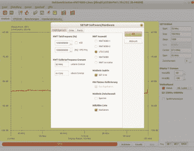
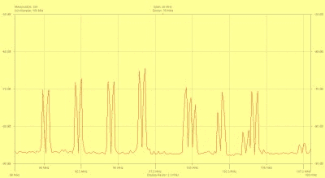
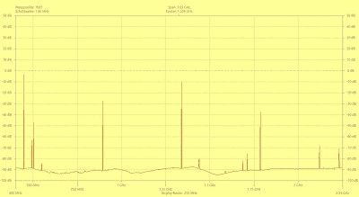

# 30 美元的 USB 频谱分析仪能为我做什么？

> 原文：<https://hackaday.com/2021/03/08/what-can-a-30-usb-spectrum-analyser-do-for-me/>

随着轻度奇异的硅变得越来越便宜，硬件黑客的聪明才智被释放出来，一些曾经高不可攀的昂贵仪器将不可避免地以来自中国的廉价模块出现。目前，工作台上的 LTDZ 频谱分析仪覆盖 35 MHz 至 4.4 GHz，并具有 USB 接口和跟踪源。现在，它已经在所有常见的插座上销售了一段时间，要么是裸 PCB，要么是装在大约一包卡片大小的金属盒中。

我们已经看过了 50 美元的 VNA ，这一次轮到了 30 美元的频谱分析仪，这是一个我在浏览 Banggood 时屈服的小设备。

我订购了一个，以及用于 SWR 测量的衰减器和 RF 桥，在通常的邮资等待之后，我的匿名灰色包裹到达了，是时候看看它并考虑它的用处了。这是一个源自德国 funk 业余(“业余无线电”)杂志在过去十年早期发表的一个设计，拧开端板，将板从其挤压外壳中滑出，我们可以看到是什么使它滴答作响。

## 30 美元能买到多少射频测试设备硬件？

它的操作非常简单，实际上是一个非常宽带的无线电接收器和信号源，可以在微型计算机的控制下顺序检查其范围内的信号电平。板上有一个 STM32F103 微控制器，它驱动一对 [ADF4351](https://www.analog.com/en/products/adf4351.html#) PLL 频率合成器，分别用于跟踪和接收本振；一个 [IAM-81008](https://www.digchip.com/datasheets/parts/datasheet/021/IAM-81008-TR1.php) 接收混频器；一个 [AD8307](https://www.analog.com/en/products/ad8307.html) 对数放大器，用于测量接收电平。据报道，它的接收带宽在 150 kHz 左右，但我没有仪器来测量。电路板的后边缘是一个微型 USB 插座、几个 led 和一个“钥匙”开关，用于启用跟踪振荡器，前面是一对 SMA 插座，用于 RF 输入和输出。

 

这个产品已经引起了【DL4JAL】的一些头痛，我们想请你不要添加到如果你使用它。硬件方面似乎一切正常，但软件方面却是另一番景象。[【VMA 的卫星博客】](https://vma-satellite.blogspot.com/2016/12/history-of-sma-simple-spectrum-analyser.html)讲述了这段历史，这是一个有益的故事，讲述了克隆硬件是如何廉价地导致不幸的后果。最初的 funk 业余设计使用的 WinNWT 和 LinNWT 软件来自[Andreas Lindenau，DL4JAL]，可以从他的网站上获得。funk 业余无线电爱好者的设计被世界各地的其他业余无线电爱好者改进，包括一位中国业余无线电爱好者[BG7TBL]，他设计了我现在放在长凳上的这个设计。当制造商采用这种方式并大量销售时，[DL4JAL]发现自己面对的支持查询水平难以为继。因此，他从自己的网站上撤下了最初的 NWT4 软件。

如果你买了其中的一个，你几乎肯定会从供应商那里得到一个下载。在我的情况下，我找不到 Linux 版本，并尝试了 NWT4000 软件，该软件与我的频谱分析仪一起工作，尽管有相反的说法。为了尊重他的意愿，我们不会在这里放他的网站链接，但是如果你在这些设备上使用他的任何版本的软件，我们希望你不要麻烦他提供支持。幸运的是，[DL4JAL]软件不是唯一的游戏，VMA 简单频谱分析仪和 T2 SNA Sharp 都是现成的替代品。然而，它们都是 Windows 专用的，前者需要付费激活密钥才能长期使用。

## 有了频谱分析仪，一切都是射频源

The not-very-crowded FM broadcast spectrum of rural Central England.

一旦我的设备插上电源并被软件检测到，就该校准它了。这一过程只是生成设备性能的记录，同时直接读取其跟踪发生器，允许软件创建一个平坦的基线。校准包括首先用通过衰减器连接到输入端的跟踪源进行扫描，然后直接进行扫描。一旦完成，就可以在不连接任何测试设备的情况下读取频率范围内的扁平线。令我羞愧的是，我花了一段时间才意识到按下“键”按钮是启动跟踪发生器所必需的。

我的工作台上有一个频谱分析仪，接下来呢？当然，第一件事是插上天线，看看停播的频谱。我可以在调频波段上看到你在一个英国小镇上看到的所有当地电台，我可以看到电视多路传输，家庭 WiFi，以及我打电话时的手机。拥有一个新玩具会让你在房子里跑来跑去寻找无线电源，所以我可以确认不同的超高频遥控器，DECT 手机和我的宝丰手持收音机都在图上产生令人满意的尖峰信号。

Only one of these spikes is supposed to be there in any quantity.

有一个频谱分析仪来观察漂亮的尖峰信号当然很好，但是是时候做一些有用的事情了。最显而易见的尝试是使用 RF 电桥来表征天线，但遗憾的是，由于我的大部分无线电设备都在仓库中，我没有合适的窄带天线来测量。

相反，我可以检查我的宝丰收发器的频谱纯度，为此我只需要衰减器。程序很简单，通过衰减器将宝丰天线输出连接到频谱分析仪输入，并读取频谱。我的粗略估算告诉我，当发射功率处于 100 mW“低”设置时，20dB 衰减器应足以降低电平，以免损害分析仪，其输入电阻应能在短时间内接受 100 mW 的功率。以这种方式设置并按下发射按钮，我可以立即看到为什么这些廉价收音机的滤波有一些问题。在 435 MHz 基波和一次谐波之间的空间中有相当多的杂散尖峰，随后是特别强的后续谐波。你在发射机里得到你所支付的。

因此，花 30 美元，我似乎买到了一个有用的小工具，它不仅仅是一个玩具，而且可以在我的工作台上完成一些有用的 RF 任务。30 美元的价格标签让人们感觉到它远没有更昂贵的同类产品的灵敏度和选择性，而且它的 35 MHz 下限对于研究噪声发射来说太高了。与此同时，该软件有一些可用性问题，我们同情其作者，我们不禁希望它有一个开源选项可用。为了 30 美元，它是值得的，但是为了更多，我不得不问我自己我是否也会这样想。也许对于低频来说，[tiny sa](https://hackaday.com/2020/09/01/tinysa-is-a-49-spectrum-analyzer/)可能是更好的选择。