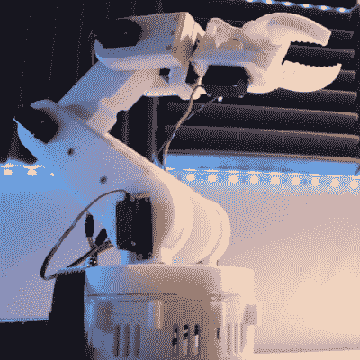

# 3D 打印的手势控制机器人手臂是一大堆教程

> 原文：<https://hackaday.com/2021/01/20/3d-printed-gesture-controlled-robot-arm-is-a-ton-of-tutorials/>

曾经想要一个自己的手势控制的机器人手臂吗？[【EbenKouao】的 DIY Arduino 机械臂项目](https://smartbuilds.io/diy-robot-arm-arduino-hand-gestures/)涵盖了所有相关的基础，但即使一个机械臂不是你的最爱，他的项目也有很多值得学习的地方。每一部分都有详细的解释，包括源代码和所需硬件的列表。这种记录项目的方法很棒，因为它不仅使复制结果变得容易，而且使重新混合、修改和重用单独的部分作为其他工作的参考变得简单。

【EbenKouao】使用 3D 可打印的机器人[手爪](https://www.thingiverse.com/thing:1748596)、[底座](https://www.thingiverse.com/thing:1750025)和[手臂](https://www.thingiverse.com/thing:1838120)设计作为他建造的基础。爱好伺服和一个单一的 NEMA 17 步进照顾移动，布线和电机驱动都仔细解释。手势控制是通过佩戴一个铰接手套来完成的，手套上安装了 flex 传感器和 MPU6050 加速度计。这些传感器检测佩戴者的运动，并将它们转化为运动命令，这些命令又通过 HC-05 蓝牙模块从手套无线发送到机器人手臂。我们真的很喜欢[EbenKouao]的想法，将手套传感器安装到这个光滑的 3D 打印铰接手套框架上，但是使用普通手套也可以。Arduino 代码的最新版本可以在项目的 GitHub 库中找到。

大多数部件都可以 3D 打印，每个部件如何协同工作都得到了仔细的解释，所有的硬件都很容易从网上获得，这使得这个项目非常容易实现。查看下面嵌入的完整教程视频和演示。

 [https://www.youtube.com/embed/F0ZvF-FbCr0?version=3&rel=1&showsearch=0&showinfo=1&iv_load_policy=1&fs=1&hl=en-US&autohide=2&wmode=transparent](https://www.youtube.com/embed/F0ZvF-FbCr0?version=3&rel=1&showsearch=0&showinfo=1&iv_load_policy=1&fs=1&hl=en-US&autohide=2&wmode=transparent)

3D 打印已经为许多项目带来了好处，尤其是那些涉及机械臂的项目。各种机械臂项目都受益于 3D 打印的优势，从注重实用性和功能的[设计](https://hackaday.com/2020/09/15/open-source-robotic-arm-for-all-purposes/)，到以意想不到的方式减少零件数量的[巧妙的机械设计](https://hackaday.com/2020/02/09/simple-3d-printed-robotic-arm-uses-compliant-mechanism/)。