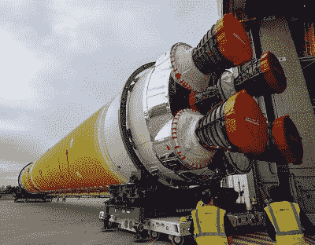
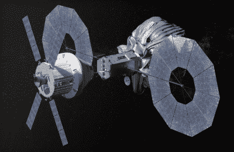
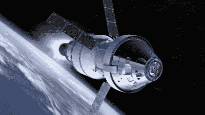

# 失败的测试可能会进一步推迟美国宇航局陷入困境的 SLS 火箭

> 原文：<https://hackaday.com/2021/01/25/failed-test-could-further-delay-nasas-troubled-sls-rocket/>

1 月 16 日美国宇航局太空发射系统(SLS)的“绿色运行”测试旨在成为超级重型助推器在 2021 年 11 月首次 Artemis I 任务之前被转移到卡纳维拉尔角之前的最后一个里程碑。全程静态点火测试旨在模拟典型的发射，火箭的主发动机以最大功率燃烧大约 8 分钟。尽管启动如雷鸣般，但仅仅 67 秒后[车辆的车载系统就触发了自动中止；这是围绕这一有争议的助推器的一长串失望中最新的一个。](https://spacenews.com/green-run-hotfire-test-ends-early/)

当补充劳工计划在 2011 年提出时，它看起来非常简单。超重型助推器将基于航天飞机部件的轻微修改版本，而不是花费时间和金钱来开发一种全新的火箭。工程师们所要做的只是将四个轨道飞行器的 RS-25 引擎连接到一个扩大的外部油箱底部，并绑上一对类似的细长固体火箭助推器。代替复杂的有翼轨道飞行器，船员和货物将乘坐在火箭顶部，使用一个上面级和太空舱，这与阿波罗计划中使用的没有什么不同。

The SLS core stage is rolled out for testing.

当谈到航天飞行时，很少有什么可以被称为“容易”的，但 SLS 肯定是为了走阻力最小的道路而设计的。通过使用在现有生产设施中组装的经过飞行验证的组件，NASA 估计第一架 SLS 可以在 2016 年进行试飞。

如果一切按计划进行，该机构预计将在 21 世纪 20 年代初准备好将宇航员送到近地轨道以外。正好赶上实现奥巴马总统 2010 年在肯尼迪航天中心的演讲中提出的宏伟目标，包括 2025 年载人探索附近的小行星，以及 21 世纪 30 年代可能的火星任务。

但是当然，这些都没有发生。预计 SLS 将于 2016 年进行首飞，该计划已经花费了近 100 亿美元，但实际上只有少数结构测试文章被组装起来。随着该项目在 2017 年、2018 年、2019 年和 2020 年超过最后期限，美国宇航局每年都推迟助推器首次试运行的日期。在最近的发动机测试结束后，工程师们还没有能够收集到必要的数据来确保车辆能够安全地进行全程燃烧，即将离任的美国宇航局局长吉姆·布里登斯汀说，现在判断助推器今年是否还会飞行还为时过早。

哪里出了问题？随着 SpaceX 和蓝色起源这样的商业实体突飞猛进，美国宇航局似乎停滞在过去。这样一个相对简单的项目是如何远远落后于计划并且超出预算的？

## 不知去向的火箭

可以说，补充劳工计划最紧迫的问题是它没有明确的目标。作为一个国会授权的项目，NASA 必须继续它的发展，不管他们是否真的需要它。批评者经常将该计划称为“参议院发射系统”，因为他们认为航天飞机衍生的概念主要是为了确保用于建造航天飞机的发动机、推进剂罐和固体火箭助推器的制造设施即使在该计划退役后也能继续运行。

The deep space asteroid mission was canceled in 2017.

没有 SLS 的明确任务，NASA 工程师很难制定任何长期发展计划。助推器需要携带什么样的有效载荷，以及运送到哪里，这些都是需要回答的关键问题。美国国家航空和宇宙航行局不再追求回收近地小行星的任务，人类的火星任务仍然是几十年后的事情。SLS 计划在 2025 年发射*欧罗巴快船*前往木星，尽管猎鹰重型已经被认为是一个备份，如果它不能及时准备好的话。

虽然其最终的有效性仍有争议，但航天飞机的设计是由一个非常具体的目标驱动的:在其货舱内运输大型物体往返于低地球轨道。在程序的生命周期中，每一个决策都围绕着这个核心原则。没有类似的指导，太空发射系统发现自己迷失了方向。

简而言之，SLS 的唯一定义特征是[它能够放入太空的绝对质量](https://www.nasa.gov/sites/default/files/atoms/files/sls_core_stage_fact_sheet_01072016.pdf)。该火箭的基础 Block I 配置设计为将 95，000 千克(209，000 磅)送入低地球轨道，后来的 Block II 版本为 130，000 千克(290，000 磅)。虽然这些数字令人印象深刻，但目前还不清楚什么类型的任务架构需要一次性发射如此巨大的模块。自阿波罗时代以来 50 年的经验告诉我们，模块化系统，在具有竞争力的价格助推器上发射并在轨道上组装，[是创建可持续空间基础设施的关键](https://hackaday.com/2020/05/05/nasas-plan-for-sustained-lunar-exploration/)。

## 浪费的可重用性

从一开始，航天飞机就被设计成一种几乎完全可重复使用的结构。除了外部油箱，该系统的每个部件都可以回收、翻新和再次飞行。其想法是，重复使用同一辆车比每次任务都造一辆新车更便宜、更快。

不幸的是[翻新过程的复杂性和成本被大大低估了](https://hackaday.com/2020/07/27/falcon-9-beats-shuttles-reflight-record-but-still-has-a-long-way-to-go/)，部分原因是当时的技术和材料限制。最终，航天飞机从未像其设计者希望的那样以可承受的成本和速度发射，但在该计划中吸取的经验教训有助于塑造现代可重复使用的航天器，如内华达山脉公司的追梦人和波音 X-37B。

但是，尽管目前的趋势是可重复使用的火箭和航天器，美国宇航局在 SLS 上后退了一步，使用了为翻新而设计的组件，并在每次飞行结束时将其丢弃。安装在第一枚 SLS 火箭上的 RS-25 发动机不是新制造的，它们实际上是当它们被放入博物馆时从航天飞机轨道器中取出的相同的发动机。固体火箭助推器也是如此；新的细长助推器使用的是航天飞机原始 SRB 的片段，但它们不会降落在降落伞上被回收，而是会坠入海洋并沉没。

SLS 的每一次飞行都会摧毁四个航天飞机时代的 RS-25 发动机和两个 SRB，仅仅因为它们占据了美国宇航局仓库的空间。从历史的角度来看，这是令人憎恶的。但更实际地说，将这些几十年前的组件集成到一个现代发射器中被证明比预期的要困难得多。虽然自从航天飞机退役以来，他们已经看到了一些升级，但毫不夸张地说，今天在 SLS 上工作的一些人在发动机制造时还没有出生。

截至目前，美国宇航局只有足够的航天飞机项目剩余的 RS-25 发动机来支持四次 SLS 飞行。为了解决这个问题，该机构已经[与 Aerojet Rocketdyne 签订合同，生产一种被称为 RS-25E 的新型发动机](https://www.nasa.gov/press-release/nasa-commits-to-future-artemis-missions-with-more-sls-rocket-engines),这种发动机被设计成一次性的。不幸的是，这些设计上的改变代价很高。每架 RS-25E 将花费美国宇航局近 1.5 亿美元，这比 SpaceX 公司在猎鹰重型飞机上飞行的费用还要高。每次发射的价格将很容易超过臭名昭著的昂贵的航天飞机，很难想象 SLS 如何能够与将在当前十年内开始运营的可重复使用的商业车辆保持竞争力，如 SpaceX 的 Starship 和蓝色起源的 New Glenn。

## 预计的风险

在检查数据后，美国宇航局表示，1 月 16 日发动机测试期间的自动中止是由于[有意保守测试限制，旨在避免助推器](https://spacenews.com/sls-green-run-static-fire-cut-short-by-intentionally-conservative-test-limits/)受到不必要的压力。在新闻发布会上，管理员 Bridenstine 说，如果这是一次真正的飞行，发动机将在到达轨道所需的整个时间内保持燃烧。他继续解释说，如果美国国家航空航天局或主承包商波音公司决定重新进行整个持续时间的试验点火，会有内在的风险，因为推进剂罐只能填充和排空有限的次数。

Orion heading to the Moon during Artemis I

虽然还没有确定任何事情，但这些声明似乎表明，美国宇航局可能决定不再重复试射，并继续推进 Artemis I 任务，以确保他们在当前的 2021 年 11 月发射日期。传统智慧会说这是不明智的，但由于第一次飞行不会有任何人类居住者，通常规避风险的航天局可能愿意掷骰子，如果这意味着他们可以避免另一个已经面临激烈批评的项目的昂贵延迟。

另一方面，向全世界数百万观众直播他们的第一枚太空发射系统火箭的爆炸几乎不会改善情况。阿耳忒弥斯一号期间的灾难性失败也很可能导致载人阿耳忒弥斯二号的推迟，该计划暂定于 2023 年 8 月。由此产生的多米诺骨牌效应可能会使美国国家航空航天局(NASA)几乎不可能在 2024 年前将第一位女性和第二位男性送上月球表面的雄心勃勃的最后期限到来。