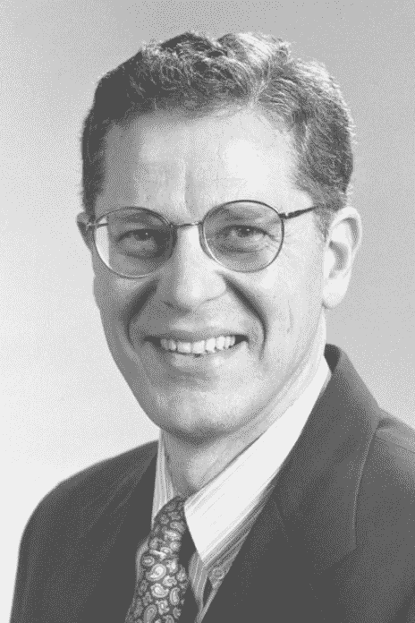
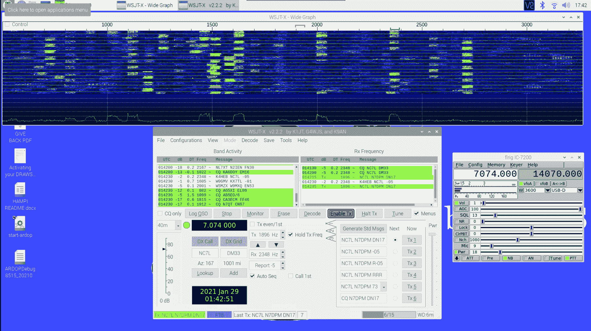

# 50 美元的火腿:WSJT-X 的数字模式

> 原文：<https://hackaday.com/2021/02/10/the-50-ham-digital-modes-with-wsjt-x/>

按照通常的做法，业余无线电有点像去杂货店，和你在过道里遇到的每个人攀谈。只不过杂货店是星球大小，每个人都自带购物车，有些是高度改装的，真的很贵。几乎所有的对话都是关于购物车，或者杂货店本身。

考虑到这个公认的不确定的类比，如果你不是那种通常会在购物时与人搭讪的人，你可能会认为你不适合业余无线电。但仅仅因为这是大多数人行使业余无线电特权的方式，并不意味着这是唯一的方式。探索一些更受欢迎的利用高频(HF)波段的方法，看看在有限的预算下，在设备成本和用电量方面可以做些什么，是这期 50 美元 Ham 的重点。欢迎来到可选麦克风的业余无线电世界:弱信号数字模式。

## 只是一个普通的乔

首先，我要说明的是，业余无线电服务持牌人可以使用大量模式，而不需要对着麦克风说话，这可以追溯到连续波(CW)模式的无线电时代。如果我们将这个术语的含义从当前使用计算机传输和接收编码信息的现代内涵稍微延伸一下，用一个直键敲出 dits 和 dahs 可能是原始的数字模式，无论是内置在收音机中还是作为一个独立的组件。在本文中，我将把它作为我对“数字模式”的定义。

但即使有了更严格的定义，在业余无线电的历史上仍然出现了一个巨大的数字模式生态系统；似乎，不需要成为健谈者就能进行交流的愿望可以追溯到很久以前。但在本文中，我将重点关注“弱信号”模式家族中的几种模式，主要是因为我发现它们非常有趣且非常有用，并且我非常喜欢看到哪些类型的接触可能使用比点亮 LED 灯泡更少的功率。

当你进入弱信号空间时，一个名字不断出现:乔·泰勒(K1JT)。Joe 是新泽西州的一名业余爱好者，当你第一次听说他时，你会认为他只是一个普通的 Joe，一个老派的业余爱好者，他发明了一些聪明的软件，使低功率信号更容易从高噪声环境中提取出来。虽然这肯定是真的，但很快就变得很明显，乔不仅仅是这样。小约瑟夫·霍顿·泰勒于 1968 年获得哈佛大学天文学博士学位。他于 1980 年加入普林斯顿大学物理系，几乎赢得了物理学和数学领域的所有重要奖项，包括德雷珀奖章、沃尔夫奖，以及 1993 年的诺贝尔物理学奖。

## WSJT-X 的魔力

尽管取得了这些崇高的成就，但在许多方面，Joe 在很大程度上是一个“火腿中的火腿”，自 2006 年退休以来，他将自己在数字信号处理方面的丰富经验转向了一个名为“ [WSJT](https://www.physics.princeton.edu/pulsar/k1jt/wsjt.html) ”的全方位弱信号软件包，意为“弱信号，Joe Taylor”实际上，该程序最早是在 2001 年编写的，Joe 和一批数字模式爱好者几乎一直在修改和更新该程序，最新的版本是 [WSJT-X](https://www.physics.princeton.edu/pulsar/k1jt/wsjtx.html) ，它实现了 10 种不同的弱信号数字模式。

Joseph H. Taylor, Jr. (K1JT), 1993 Nobel Prize in Physics. Source: [Nobel.org](https://www.nobelprize.org/prizes/physics/1993/taylor/facts/).

我们将跳过对支撑 WSJT-X 的 DSP 技术的深入探讨，尽管这是一个很有趣的东西，可能值得单独写一篇文章，只需说该包实现了各种多频移键控(MFSK)调制方法，每种方法都针对不同的传播条件进行了优化。目前实现的 10 种模式涵盖了从高噪声电离层传播到对流层散射的所有内容，其中一些模式支持从流星电离轨迹反弹信号，甚至可以收听从月球反弹的信号。

尽管 WSJT-X 模式被分为“快”和“慢”两大类，但根据现代网络标准，它们都相当慢。典型的比特率范围从每秒十几个字符到 400 波特左右。这些模式的低吞吐量本质完全是由设计决定的；WSJT-X 没有试图达到超快的速度，而是非常有效地利用了频谱。一些模式只需要几赫兹的带宽，代价是即使非常短的消息也可能需要几分钟才能传输。

我最近一直在玩的模式 FT8 是 WSJT-X 套件中相对较新的一个。FT8 是由 Joe Taylor 和 Steve Franke (K9AN)编写的，因此得名“FT”。“8”是指“8-FSK”，这意味着调制方案使用间隔 6.25 Hz 的八个不同音调。因此，每个 FT8 信号占用 50 Hz，与其他弱信号模式相比，这是一个巨大的带宽，但仍然非常紧凑。所有这些额外的带宽意味着 FT8 传输可以比 JT9 上 30 分钟的传输短得多。这使得 FT8 适合快速 qso 和竞赛，这是一种业余无线电的接触运动。

## 火腿速配

虽然 FT8 很快，但代价是消息长度。每次 FT8 传输仅编码 75 位，带有 12 位循环冗余校验(CRC)。这一点和快速的周转时间意味着大多数运营商依赖 WSJT-X 内置的自动化以及标准化的消息来进行 FT8 联系。

 [https://www.youtube.com/embed/cq85aVi-8UE?version=3&rel=1&showsearch=0&showinfo=1&iv_load_policy=1&fs=1&hl=en-US&autohide=2&wmode=transparent](https://www.youtube.com/embed/cq85aVi-8UE?version=3&rel=1&showsearch=0&showinfo=1&iv_load_policy=1&fs=1&hl=en-US&autohide=2&wmode=transparent)

设置 WSJT-X 并为 FT8 准备好收发器在很大程度上依赖于您的计算机和无线电。在我的例子中，我构建了一个专用的 Raspberry Pi 4 来运行我的 ham radio 操作，使用了 Dave sloter(W3DJS)的出色的 Ham Pi 图像。我还试图使用 [KM4ACK 同样出色的 Build-a-Pi 镜像](https://github.com/km4ack/pi-build)，但我很难让我的 Icom IC-7200 收发器与 WSJT-X 对话，与其花大量时间进行故障排除，我只是尝试了 Ham Pi 构建。这两个图片都有优秀的社区，可以帮助你快速上手，就像 WSJT-X 一样，它有一个论坛，你可以经常看到乔·泰勒出现在那里回答问题。一个经常有诺贝尔奖得主贡献的社区确实是一个强大的社区。

上面的视频显示了我为什么称 FT8 为“火腿收音机的快速约会”顶部的瀑布图显示了大约 2500Hz 的通带，收发器必须设置为允许尽可能宽的频带通过 WSJT-X(向 [Josh KI6NAZ](https://hackaday.io/event/169574-keeping-ham-radio-relevant-hack-chat) 脱帽致敬，以获得正确的帮助)。)FT8 算法一次解码通带中的每个 50hz 宽的 FT8 信号；再加上每次传输时间为 15 秒，然后是 15 秒的空闲时间，这导致瀑布式显示器上出现典型的棋盘状外观。

The characteristic FT8 checkerboard pattern develops on the WSJT-X waterfall. The 40-meter band was pretty good tonight, but I couldn’t make any QSOs.

解码后的信息显示在 WSJT-X 的左侧窗口，操作员通常寻找呼叫 CQ 的电台。点击波段活动窗口中的一个条目会启动一系列自动消息，WSJT-X 启动发射机并发送一个最小的 QSO——基本上只有两个呼号、一个方格定位器和接收信号强度。需要注意的是，对话的双方不必，事实上也不应该在同一个频率上——另一个运营商的 WSJT-X 副本将解码整个通带，如果可以的话。一旦另一个站收到 CQ 的确认，消息的交换完全是自动的，直到最后的 73 被发送，WSJT-X 给双方一个机会来记录 QSO。

自从我为高频波段设置了我的端馈半波天线并安装了 WSJT-X，我已经联系了不少人。他们中的大多数人都去过美国大陆和加拿大，但我上周在 30 米比赛中设法超过了日本，这是一种享受。事实上，我可以做到这一切，而不用拿起麦克风，努力想说些什么，这对我来说是天赐之物，WSJT-X 能够解码低至噪底的信号，这是一项令人陶醉的技术壮举。在晚餐前坐下来半个小时左右，敲几个低强度的 qso，而不需要在这个过程中投入太多，这也是非常好的。

如上所述，FT8 并不是 Joe Taylor 和他的合作者在 WSJT-X 中内置的唯一弱信号模式。下一次在 50 美元的 Ham 中，我们将看看同样令人上瘾的 WSPR 模式，并看看如何以远低于 50 美元的价格(包括发射机)在高频波段工作。