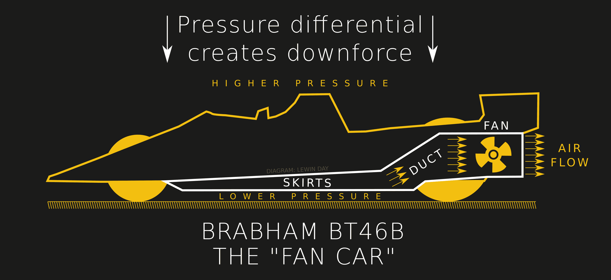
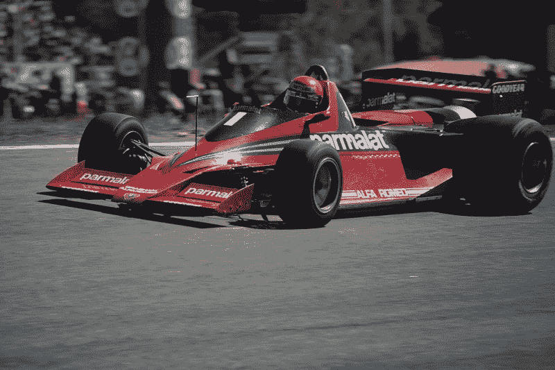
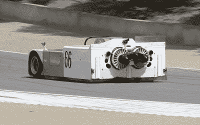
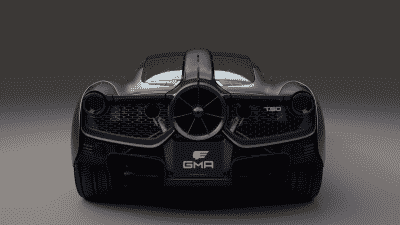

# 粉丝车的兴衰

> 原文：<https://hackaday.com/2021/03/05/the-rise-and-fall-of-the-fan-car/>

赛车运动中空气动力学机翼的出现是 20 世纪中期最引人注目的变化之一。突然间，除了改变悬挂系统和安装防滑轮胎之外，在高速行驶中获得更大的抓地力成为可能。然而，这只是一个开始，工程师们开始寻找更先进的方法来产生下压力，而不会像赛车那样受到阻力的影响。

也许这一点的最终表现是风扇车。这项技术机械上很复杂，也可能很危险，但却以最小的阻力提供了巨大的下压力。然而，尽管这一想法有着内在的承诺，但粉丝车在聚光灯下的时间非常短暂。让我们来看看风扇车背后的基本理论，它们在实践中是如何工作的，以及为什么我们今天在赛道上看不到它们。

## 该理论

The equation for dynamic friction states that the friction force generated, or grip in our case, is equal to the dynamic coefficient of friction, determined by the materials involved, and the normal force. For a regular object, this is simply the object’s weight times gravitational acceleration, but a fan car adds downforce to this as well, massively increasing the grip available.

风扇汽车背后的理论与地面效应汽车类似，因为它涉及到在汽车下方产生一个低压区，导致上方较高的大气压力将汽车向下压向道路。这增加了轮胎和路面之间的法向力，从而增加了抓地力。然而，与地面效应汽车不同，地面效应汽车依靠汽车的前进速度来产生低压区，风扇汽车积极地这样做，正如你所料，一个巨大的风扇。

通过在车辆后部安装一个带有适当管道的风扇，它可以从车下吸出空气，在车下产生所需的低压区域，从而产生下压力。在实践中，为了最大限度地发挥效果，汽车下方的区域应该密封在地面上，就像一个反向气垫船一样。当风扇运转时，这限制了可以冲到汽车下面的外部空气量，确保下面的压力下降到尽可能低。赛车下方的压力越低，赛车被上方的大气压力压入赛道表面的程度就越大。

With only a small gap between the skirts and the track surface, the suction of the fan is able to generate a low pressure region under the car. This sucks the car down on to the track. Pictured is the setup of the Brabham BT46B from 1978; not shown is the engine, which took advantage of the rear-mounted fan for cooling purposes.

这种产生下压力的方法需要动力来运转风扇，但产生的阻力远不及机翼。此外，风扇车相对于地面效应文氏管和机翼等静态空气动力学表面的优势在于，无论车辆行驶速度有多快，风扇都可以降低车下的压力。Wings 和 venturis 直到汽车超过 100 公里/小时左右才开始真正工作，但风扇可以从完全停止一直到汽车的最高速度产生巨大的下压力。这在低速弯道中是一个巨大的好处，允许风扇车比常规竞争对手更快地将更多的动力放到地面上，常规竞争对手需要在他们的翅膀产生足够的额外抓地力之前逐渐达到速度。

## 实际问题

The Brabham BT46B featured a pitot tube on the front to measure the pressure difference between the atmosphere and beneath the car. Connected to a modified altimeter in the cockpit, if the pressure gauge was in the red zone, the driver knew a skirt had failed and downforce would be significantly lowered, and slow down to avoid a crash.

仅仅敲打现有汽车后面的风扇并宣布完成是不够的；像所有的空气动力学修改一样，仔细的设计和测试是确保成功的关键。也许制造一辆能工作的风扇车最困难的地方是生产能可靠地密封车底的侧裙。这些裙板需要能够在整个赛道周围保持相对良好的密封，达到一致的程度，不管颠簸、卵石或其他干扰。如果裙部密封不可靠，当汽车遇到颠簸时，汽车可能会面临突然失去下压力的情况，因为外部空气会冲到汽车下面，消除了下面的低压区。

如果这种情况发生在弯道中部，赛车可能会突然失控，因为它不再有足够的抓地力来保持在赛道上。在这种情况下，对于驾驶员来说，后果可能是灾难性的，因此设计者努力设计能够在大多数情况下保持良好密封的裙部。各种各样的想法包括滑动裙，或弹簧加载裙，在不同的表面上保持与轨道的接触，并可以解释比赛距离上的磨损。一些风扇车，如 Brabham BT46B，配备了皮托管和经过改装的高度计，可以向司机显示车下的压力，让他们知道裙子是否失效，并允许他们相应地改变驾驶风格。

The Chaparrel 2J featured sliding skirts made of Lexan, a cutting-edge material at the time. Connected to the suspension to maintain a consistent seal to the track, they were key to making good downforce with the system.

另一个考虑是如何驱动风扇。风扇可以由它自己的发动机或马达驱动；这样做的好处是，只要风扇的速度保持不变，就能提供稳定的下压力。或者，风扇可以由汽车的主发动机驱动，但要注意风扇速度会随着发动机速度而变化。然而，只要这是可预测的，它就不会是一个问题。在实践中，这种类型的风扇车的司机指出，他们可以通过加速通过一个弯道来将车粘在赛道上，因为下压力会随着引擎速度的增加而增加。

## 历史

第一辆为比赛制造的赛车是 Chaparral 2J，它参加了基本上无拘无束的 Can Am 系列。它是吉姆·霍尔的发明，于 1970 年首次亮相，背部有两个 M109 榴弹炮冷却系统的巨大风扇。它没有任何机翼的平板设计在当时令人惊讶，但它的竞争对手很快意识到这款车构成的威胁。

由于风扇系统由两缸雪地摩托发动机提供动力，汽车在休息时的声音是持续刺耳的呜呜声，当雪佛兰 V8 发动机轰鸣着启动时，声音甚至更大。当风扇打开时，赛车蹲下两英寸，使用连接到悬架的滑动裙板来保持与赛道始终保持一英寸的间隙，保持良好的下压力，而不会太快破坏裙板。这辆车拥有令人难以置信的抓地力，给了它巨大的弯道速度和出色的刹车能力。然而，可靠性被证明是一个问题。尽管排位赛比赛场快了整整两秒，但赛车从未赢得比赛，通常是因为风扇发动机在终点线前出现故障。在其他竞争对手的一致抗议下，该车在接下来的赛季中被宣布为非法，他们认为风扇设计是一种不公平的优势，构成了“可移动的空气动力学装置”，根据国际汽联的规定，这已经是非法的。还有指控称，该系统会向其他参赛者吹起灰尘和石块，这是赛道上的一个潜在危险。

The Brabham BT46B only competed once, but it did bring home the trophy in its single outing with Niki Lauda behind the wheel.

八年后，Brabham BT46B 在一级方程式赛车中经历了类似的故事。作为现有 BT46 的发展，当车队意识到他们不能像占主导地位的莲花赛车一样使用地面效应文丘里管隧道时，他们选择了风扇赛车设计，因为他们的平板 12 引擎。相反，[戈登·默里设计的 BT46B 带有一个大风扇来产生下压力](https://www.motorsportmagazine.com/articles/single-seaters/f1/gordon-murray-looks-back-notorious-brabham-fan-car)。当时的规则规定，任何主要功能与空气动力学相关的设备都不能移动；因此，超过 50%的风扇气流被设计用于冷却发动机，从而使其*主要*功能成为冷却装置。监票人裁定它在 1978 年赛季是合法的，但可惜的是，这辆车的职业生涯很短暂。在瑞典大奖赛的第一次亮相中，尼基·劳达在 BT46B 中赢得了胜利，此前他在排位赛中进行了大量努力，试图安抚那些反对新设计的人。不管怎样，其他车队提出了抗议，最著名的是莲花车队的科林·查普曼，他的车本来是可以拿到冠军的。最初，有人试图争辩说，该装置正在危险地向其他汽车投掷碎片，但当该团队指出风扇的出口速度仅为 55 英里/小时时，这种说法被平息了。由于不愿让步，对立的车队威胁要退出一级方程式制造商协会，这是一个由时任布拉哈姆车队负责人伯尼·埃克莱斯顿领导的强大机构。埃克莱斯顿同意在一场比赛后退出比赛，以保住自己的位置。虽然 BT46 的设计因没有派对作品而未能获胜，但这笔交易为埃克莱斯顿带来了回报，他最终利用自己在 FOCA 的地位领导了几十年的一级方程式赛车。

The T.50 is designed by the same hand that penned the Brabham fan car, though it works somewhat differently.

从那时起，风扇车就从赛车世界中消失了，因为国际汽联的规定强烈反对任何形式的可移动空气动力学装置。然而，车迷的概念还有最后一口气，[戈登·默里这一次用这项技术设计了一辆公路车，名为 T.50](https://www.thedrive.com/tech/35407/heres-how-the-giant-rear-fan-works-on-gordon-murrays-t-50-supercar) 。然而，设计略有不同，智能控制的电风扇更多地用于保持流向汽车陡峭的车身底部扩散器，而不是通过自身的吸力直接产生下压力。风扇用于各种模式，以减少阻力和保持下压力，挡板用于根据气流状态改变车下的气流。它由 48V 电机驱动，从后面看很像 BT46B，尽管它的工作方式有些不同。

## 展望未来

最终，我们不会屏住呼吸等待车迷们再次出现在赛道上。在世界范围内，针对可移动空气动力装置的法规仍然存在，并且随着团队以各种方式突破界限，这些法规变得更加严格。对碎片的抱怨仍将存在，就像地面效应时代一样，这种设备可能会导致弯道速度变得足够高，以测试人类的耐力极限。无论如何，这项技术仍然是一个非常有趣的技术，因为它承诺的纯粹性能和它在如此短的时间内如此明亮地燃烧的方式。