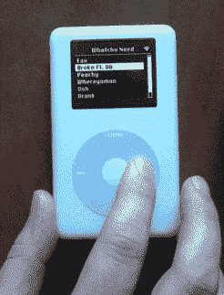

# 树莓 Pi 零功耗 Spotify 流媒体 IPod

> 原文：<https://hackaday.com/2021/01/27/raspberry-pi-zero-powers-spotify-streaming-ipod/>

即使是那些对苹果公司持批评态度的人也不得不承认，他们确实在 iPod 上做了一些事情。点拨轮是一个出色的输入设备，这个小工具的用户界面非常简单，只需轻轻一跳就能轻松找到你想要的音乐。不幸的是，这是专有软件和数字版权管理的先驱，但最终还是有一些开源库允许你在上面放歌曲，而不用把灵魂卖给库比提诺。

当然，现代用户期望比旧硬件所能提供的多一点。这就是为什么[Guy Dupont] [把他的 iPod Classic 换成了树莓派 Zero W](https://hackaday.io/project/177034-spot-spotify-in-a-4th-gen-ipod-2004) 。这款新的 Linux 驱动的数字音频播放器不仅能够播放几乎任何音频格式，还可以接入 Spotify 等流媒体服务。但是这样的伟大来之不易；为了实现这一点，他不得不更换播放器内部的几乎所有组件，除了点拨轮本身。好在经典一开始就很厚重。

 除了运行节目的 Pi Zero，他还必须安装一个 1000 毫安的电池，其相关的充电和升压模块，一个用于力反馈的振动电机，以及一个来自 Adafruit 的 2 英寸液晶显示器。该显示器最终几乎达到了取代 iPod 原始屏幕的完美尺寸，而且由于它使用复合视频，只需要两根电线就可以从 Pi 驱动。为了与最初的点拨轮交互，[盖伊]引用了他从十年前的黑客帖子中提取的[信息。](https://hackaday.com/2010/02/05/repurposing-a-click-wheel/)

当然，像这样的项目，硬件只是故事的一半。将所有必要的组件塞进最初的 iPod 外壳是一回事，但通过用 Python 创建其标志性 UI 的如此精确的克隆，[Guy]真的将事情带到了一个新的水平。特别是因为他能够如此无缝地集成对 Spotify 的支持，这是苹果开发人员在世纪之交难以想象的功能。当他把源代码推送到目前空着的 GitHub 库时，我们对看到源代码非常感兴趣，如果这引发了 DIY iPod 克隆的复兴，我们也不会感到惊讶。

我们已经看到[现代硬件被移植到最初的 iPod 主板上](https://hackaday.com/2021/01/18/retrofitting-usb-c-to-an-ipod-nano/)，多年来，一些黑客试图[开发他们自己的基于 Pi 的便携式音乐播放器](https://hackaday.com/2018/08/28/pipod-a-raspberry-pi-zero-portable-music-player/)。但是这个项目如此巧妙地结合了这两个概念，真的提高了标准。

 [https://www.youtube.com/embed/ZxdhG1OhVng?version=3&rel=1&showsearch=0&showinfo=1&iv_load_policy=1&fs=1&hl=en-US&autohide=2&wmode=transparent](https://www.youtube.com/embed/ZxdhG1OhVng?version=3&rel=1&showsearch=0&showinfo=1&iv_load_policy=1&fs=1&hl=en-US&autohide=2&wmode=transparent)

