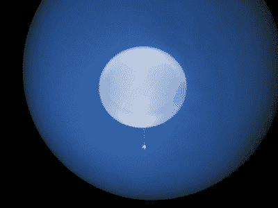
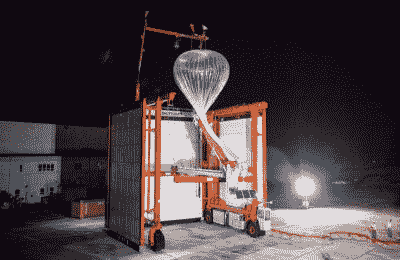
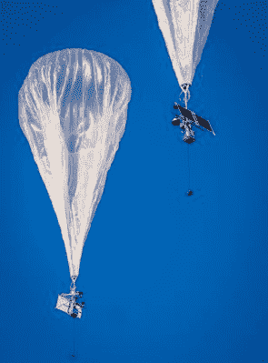
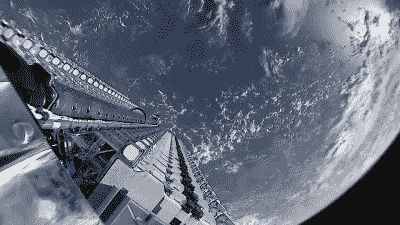

# 谷歌潜航器的互联网气球在平流层飞行十年后返回地球

> 原文：<https://hackaday.com/2021/01/28/google-loons-internet-balloons-come-back-to-earth-after-a-decade-in-the-stratosphere/>

在经历了十年的旅程后，谷歌的 Loon 项目已经不复存在。作为一种将通信带到地球上最偏远地区的方式，它使用配备有通信硬件的巨大高空气球进行空对地通信，以及单个气球之间的空对空通信。基于 LTE 技术，它将为偏远地区和灾区带来每秒数兆比特的数据链路。

在其发展的七年中，Loon 成为了自己的公司(Loon LLC)，并将为肯尼亚的一些地区提供通信，此外还将在 2015 年为斯里兰卡提供通信，并在 2017 年为飓风玛丽亚后的波多黎各提供通信。三年后，2021 年 1 月，Loon LLC 宣布将停止运营。到那时，很明显，这种技术在商业上是不可行的，包括有线互联网接入在内的替代方案已经缩小了目标市场。

虽然 Loon 背后的想法在理论上听起来很简单，但事实证明，它比仅仅漂浮一些绑有 LTE 基站的气象气球更复杂。

## (巴)鲁尼的部分

A NASA super pressure balloon at altitude.

Loon 使用的气球是由 [Raven Aerostar](https://en.wikipedia.org/wiki/Raven_Industries) 制造的，来自他们的[超级压力气球](https://ravenaerostar.com/products/balloons-airships/super-pressure-balloons)系列。这些是 Raven 推荐的任务剖面，如科学数据收集、侦察、远程通信和监视。这种[超压气球](https://en.wikipedia.org/wiki/Superpressure_balloon) (SPB)就是[空气静力](https://en.wikipedia.org/wiki/Aerostat)气球，即使外界(环境)压力变化，它也能保持气球体积不变。这一功能允许气球在一个固定的高度停留较长的时间，这对于 loon 在平流层的任务剖面来说是理想的。

每个气球由 0.076 毫米薄的聚乙烯制成，当两个内部部分分别充入氦气和空气时，直径为 15 米，高 12 米。这个气球上附有一个 10 公斤的有效载荷箱，其中包含 LTE 天线，控制系统和其余的通信系统，这[似乎是](https://community.ui.com/questions/Internet-for-all/509ce9b0-cd95-43c9-aa10-8d22afecac75#answer/06203c9f-850d-4d8e-8175-f9fb6bd2c232)无处不在的[火箭 M2](https://store.ui.com/collections/operator-airmax-and-ltu/products/rocket-m2) 。地面站使用[火箭 M5](https://store.ui.com/collections/operator-airmax-devices/products/rocket-m5) ，地面站和气球都使用定制的[贴片天线](https://en.wikipedia.org/wiki/Patch_antenna)以方便远距离通信。

这个包由电池和太阳能电池阵列组成，只要气球保持其高度，该系统就可以日夜运行。这往往是 100 到 150 天的最长时间，之后，气球要么在合适的着陆区上方优雅地放气，要么在更快、非计划下降的情况下，由连接到气球的降落伞系统捕获。Loon 的目标是重复使用或回收尽可能多的气球和硬件。

## 任务简介

The Project Loon autolauncher system in action.

虽然最初 Loon 气球是手动发射的，但这一过程最终由一个自动发射系统自动完成。当气球充气升空后，它面临着移动到需要它的地方的挑战。虽然 Project Loon 本可以使用包含推进方法的[飞艇](https://en.wikipedia.org/wiki/Airship)(“软式飞艇”)，但他们选择了利用大气中的气流，而不是与它们对抗。

为此，Loon 使用了 NOAA 为 T2 平流层 T3 提供的风数据。每个气球都会被导向一个气流方向正确的层。随着时间的推移，这将允许气球到达其大致位置。由于没有推进方法，气球停留在该区域的唯一方法是通过将空气泵入或泵出空气舱来改变其整体浮力，从而在风层之间不断变化。

Loon balloons during laser-based communication testing in 2016\. (Credit: Google)

每个气球将与地面站通信，既用于控制，也用于地面用户可以通过 LTE 链接访问的互联网链接。每次到达范围内的气球之间的通信也是一个常见的特征，用户的互联网链接在到达地面站之前跳跃几个气球链接。这种气球间的通信是使用射频链路进行的，尽管在过去几年里[基于激光的光通信](https://www.wired.com/2016/02/google-shot-laser-60-miles-just-send-copy-real-genius/)也被尝试过。

在任务结束后，或者在气球寿命结束时，气球将被引导到一个容易到达的区域，在那里它的氦气将被释放到大气中，在此期间，气球下降进行回收。然而，在许多情况下，[气球已经坠毁](https://en.wikipedia.org/wiki/Loon_LLC#Incidents)。即使有了基于降落伞的应急系统，10 公斤的有效载荷加上气球从天上掉下来的情况仍然会发生。

然而，即使没有这些安全问题，还有一些东西比氦气泄漏的气球更有可能让 Loon LLC 沉没:他们的财务资产负债表和越来越绝望的融资尝试。作为一个商业实体，他们必须实施一个可行的商业计划，使他们能够以某种方式赚钱，即使只是为了维护和进一步发展。

## 谁需要浮动 LTE 塔？

事实证明，大型、脆弱的漂浮结构不断受到地球平流层恶劣条件的影响，维护起来相当昂贵。正如 Slate 的将来时在 Loon 去世时指出的那样，每个气球大约每五个月就需要[更换一次，费用高达数万美元。由于目标地区主要是该国收入水平较低的潜在客户，订阅该服务将无法支付费用。](https://www.reuters.com/article/us-alphabet-loon-focus/google-internet-balloon-spinoff-loon-still-looking-for-its-wings-idUSKCN1TW1GN)

还有一个问题是，由于是太阳能供电，地球上的一些地方是禁区，减少了潜在的市场。最后，由于依赖平流层中正确的气流来导航，任何错误或不正确的预测都可能导致气球被带到离预定位置数公里远的地方，从而切断该地区人们的服务。

尽管到 2019 年有多个正在进行的试验项目，但 Loon 作为一个独立的实体仍然依赖于它的创始公司 [Alphabet](https://en.wikipedia.org/wiki/Alphabet_Inc.) (以前是谷歌，现在是谷歌的母公司)。Loon 已经花光了外部投资者的钱，当时他正试图承受每年 1 亿美元的损失。

在越来越多地区的地面 4G 和 5G 塔的出现和有线互联网的入侵之间，Loon 的潜在市场正在迅速萎缩。此外，虽然天基互联网接入在 Loon 项目存在之初就是一种选择，但在那之前，它一直是一种遥远的威胁，特别是由于主要来自地球同步卫星的高成本和延迟。当 SpaceX 在 2015 年宣布 [Starlink](https://en.wikipedia.org/wiki/Starlink) 并在 2018 年发射第一批 Starlink 卫星时，Loon 的前景开始看起来相当可怕。

## 太空激光

Dozens of new StarLink satellites ready to be deployed in 2019.

与 Loon 的气球不同，Starlink 卫星可以被导航到低地球轨道(LEO)的精确轨道位置，不受天气和大气的影响。由于它们靠近地球，往返延迟最小，使用其 K [u] 和 K [a] 波段收发器，带宽预计将达到几十到几百兆。SpaceX 还拥有 Starlink 卫星开发和发射能力的完全垂直整合，目前使用猎鹰 9 号火箭，可以想象数百颗卫星由[星际飞船](https://en.wikipedia.org/wiki/SpaceX_Starship)同时发射。

不难想象，Starlink 将能够在未来几年内以越来越低的成本为地球表面的每一平方米提供服务。根据我们目前所知，单颗卫星的寿命大约为 3-5 年，因此可以合理地假设，在此期间，它们将比 Loon 的气球更便宜。

截至发稿时，StarLink 主要由美国北部的测试人员使用，为居住在现有有线和无线(LTE)互联网服务较差的地区的人们突然提供了适当的宽带互联网连接。今年年初，SpaceX 的 Transporter-1 任务还将首批 10 颗 StarLink 卫星发射到极地轨道，这些卫星包含基于激光的主动卫星间通信，允许在到达地面站之前在卫星之间多次跳跃。

## 这是商业计划，傻瓜

也许比成本更重要的是 Loon 的利他主义角度:通过专注于首先向贫困地区提供 LTE 服务，它似乎完全忽略了企业需要收入来为自己融资的问题。他们的方法是将服务承包给现有的电信公司，这些电信公司再将服务卖给用户，但这从未变成一个稳固可靠的模式。Starlink 订阅将如何运作还不得而知，但 SpaceX 决定专注于首先为联系不紧密的北美公民提供服务，押注他们将能够在这个市场产生足够的订阅费。

至于 Loon 的逐渐减少，这个项目的一些资产将会被另一个 [Google X](https://en.wikipedia.org/wiki/X_(company)) 项目 [Taara](https://x.company/projects/taara/) 吸收。Taara 没有涉及 Loon 的气球或其他华而不实的部分，而是主要采用了 Loon 正在研究的最新技术:可以增加单个气球之间带宽的光学数据链路。通过使用视线收发器，这在理论上应该能够使偏远地区与互联网连接，而不必挖沟放入光纤。

虽然 Loon 的故事已经结束，但看起来 Taara 的项目精神将继续存在。在这里，一个主要的至今尚未回答的问题仍然存在，即当 Starlink 存在时，Taara 项目是否有意义。不过，我很确定，几年之内，我们会在这里找到答案。