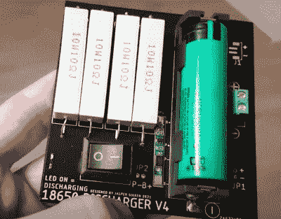

# 方便的工具消耗 18650 个细胞，所以你不必

> 原文：<https://hackaday.com/2021/02/01/handy-tool-drains-18650-cells-so-you-dont-have-to/>

耗尽电池很容易。只要在终端上加一个负载，也许是一个白炽灯泡或者一个大功率电阻，然后等待。更棘手的是如何安全地做到这一点。如果负荷过大，或者连接时间过长，最终会对电池造成损害。[【贾斯珀·西肯】不相信他会永远记得在适当的时候把电池从他的应急放电器中拔出来，他决定想出一个简单的工具，可以用硅的冰冷和计算精度自动处理这个过程](https://hackaday.io/project/171829-18650-discharger)。

V4 used the protection module from a pouch battery.

一眼我们就可以看到你所期望的放电器的主要组件:一个相当简单的 PCB，四个陶瓷功率电阻器，一个单个 18650 电池的支架，以及一个将它们连接在一起的摇臂开关。但是等等，那个 TP4056 充电模块在里面做什么？

虽然它的存在从技术上来说使这个设备成为了一个电池充电器，但 Jasper 实际上是把它用于板上保护 IC。电池和电源电阻之间有充电模块，当电压降至 2.4 V 时，它会切断连接。哦，对了，如果你连接 USB 电缆，它可以给电池充电。

[Jasper]说他的小工具非常好用，电阻阵列给电池加了足够的负载，可以快速地把它拉下来，而不会太热，暴露在外会有危险。他估计这个小工具的 BOM 大约 2 美元，并考虑在不久的将来在 Tindie 上提供它。

如果你在寻找更高级的东西，[【Jasper】几年前建造了一个可编程负载](https://hackaday.com/2017/11/12/smart-dc-tester-better-than-a-dummy-load/)，它可以给电池放电并测试电源，同时将数据记录到你的计算机中供以后分析。

 [https://www.youtube.com/embed/LII3S3KuAW0?version=3&rel=1&showsearch=0&showinfo=1&iv_load_policy=1&fs=1&hl=en-US&autohide=2&wmode=transparent](https://www.youtube.com/embed/LII3S3KuAW0?version=3&rel=1&showsearch=0&showinfo=1&iv_load_policy=1&fs=1&hl=en-US&autohide=2&wmode=transparent)

