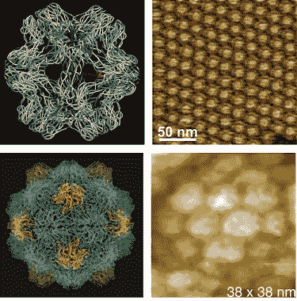
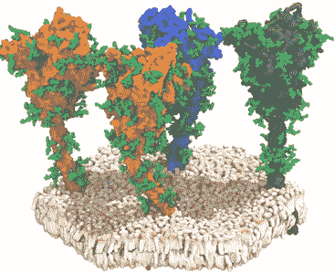

# 病毒简史

> 原文：<https://hackaday.com/2021/02/22/a-brief-history-of-viruses/>

大约在 1590 年，人类发现了如何使用光学透镜将肉眼看不到的小东西显现出来。随着显微镜的发明，人们发现了一个新的、未经探索的世界。读者可能会感到非常惊讶，当时的科学家不相信在这个新的微观领域内存在疾病的根源。大多数人仍然坚持一种被称为瘴气理论的信仰，这种理论可以追溯到罗马帝国时期。这一理论认为疾病的源头是通过分解有机物质而被污染的空气。直到 19 世纪 50 年代，一个名叫路易斯·巴斯德的人，我们从他那里得到了“巴氏杀菌法”，将 T2 的细菌理论推到了科学的聚光灯下。

Louis Pasteur. [Source](https://en.wikipedia.org/wiki/Louis_Pasteur)

巴斯德被许多人认为是微生物学之父，他将继续协助生物学家查尔斯·钱伯兰德发明名副其实的巴斯德·钱伯兰德过滤器——一种孔径在 100 到 1000 纳米之间的陶瓷过滤器。这小到足以从液体悬浮液中过滤出当时已知的微小细菌和细胞，留下未被污染的水。但就像许多其他早期科学仪器发明一样，它会导致一些意想不到的发现。在这种情况下，一个远小于 100 纳米的世界……并为不断缩小的微观世界增加了另一个维度。

这是我们开始了解病毒的时候。

## 病毒和疫苗的发现

“病毒”一词源于拉丁语短语“*黏糊糊的液体*”。1898 年，一个名叫马丁纳斯·贝杰林克的人通过巴斯德·钱伯兰过滤器传递了一种含有未知传染因子的溶液，这种传染因子针对烟草植物。净化后的溶液被用于一棵健康的烟草植物，令他非常惊讶的是，这种植物被感染了。他得出结论，感染因子是不可过滤的，并进一步将感染因子描述为“活的液体”。

The Brome Mosaic virus easily passed through filters. [Source](https://www.ncbi.nlm.nih.gov/pmc/articles/PMC3122623/)

同年，两位德国科学家弗里德里希·雷夫勒和保罗·弗罗施进行了同样的实验，对我们现在所知的牲畜口蹄疫(FMDV)得出了同样的结果。然而，他们不同意贝杰林克的结论传染媒介是一种有生命的液体。而是认为它是小于陶瓷过滤器孔径的颗粒。他们推进了他们的信念，通过加热过滤元件来“破坏媒介的传染性”，尽管他们不清楚热是如何破坏它的。然而，他们成功地从通过加热过滤器的传染性溶液中为牛和羊制造了 FMDV 疫苗，这使得人们更加重视将病毒理解为一种超声活体颗粒，而不是活体液体。

应该指出的是，当时天花疫苗被广泛使用，尽管没有人知道它是如何工作的，甚至没有人知道它是什么。事实上，疫苗一词来源于拉丁语 *vacca* ，直接翻译成*奶牛*。这种奇怪的关系的历史要归功于一个偶然的发现，即经常感染一种叫做牛痘的非常轻微的疾病的挤奶女工没有感染严重得多的天花。1796 年，一个名叫爱德华·詹纳的人做了一个残酷的实验。他从牛痘疱中取出一只猫，故意传染给一个小男孩。男孩康复后，他用天花重复了这一过程，发现男孩并没有得病。詹纳的疫苗接种技术不仅拯救了数百万天花患者的生命；它将被用于为人们接种其他几种疾病的疫苗，包括脊髓灰质炎和黄热病。

## 分子生物学的诞生

A molecular view of the COVID-19 protein “spikes”. [Source](https://www.nytimes.com/interactive/2020/health/coronavirus-unveiled.html)

接下来的几十年将会鉴定出数百种各种形状和大小的病毒，以及各种类型的疫苗。但是，正是对这些病毒是什么以及疫苗实际上是如何工作的研究，将产生一门革命性的新科学——分子生物学。

电子显微镜等新技术，以及科学认识的其他进步将表明，病毒是地球上最小的生命形式之一。甚至可以说它们根本就没有活着……这一争论一直持续到今天。我们自己的【丹·马洛尼】[已经写了几篇文章](https://hackaday.com/2020/03/24/coronavirus-testing-just-the-facts/)详细介绍[病毒和我们的免疫系统如何在分子水平上工作](https://hackaday.com/2020/03/30/coronavirus-testing-follow-up-rapid-immunologic-testing/)。以及[我们试图阻止病毒的聪明方法](https://hackaday.com/2020/05/04/the-vaccine-factory-inside-you-rna-vaccine-basics/)。然而，仍有许多东西需要学习。

在分子水平上理解病毒是一个非常现实的现代挑战。尽管我们的现代文明拥有强大的力量、财富和知识，但包裹在脂肪滴中的一小包 RNA 仍在继续肆虐我们的世界。新冠肺炎病毒以某种形式影响了地球上的每一个人。那些我们曾经看不见的病毒现在就在我们的眼前，而我们却因此遭受了巨大的损失。我们最好的工具是[一项不到 30 年的突破](https://en.wikipedia.org/wiki/RNA_vaccine#History)——我们有能力针对特定目的定制信使 RNA(mRNA)——很快就产生了可行的疫苗。在我看来，毫无疑问，这种病毒最终将屈服于人类智慧的力量，这种智慧是由一个多世纪以来积累的科学知识解开的。