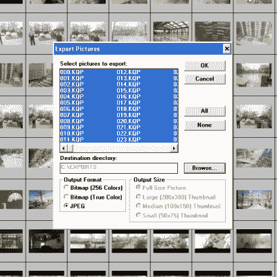

# 传统数码照片，墨菲定律的一面

> 原文：<https://hackaday.com/2021/02/14/accessing-legacy-digital-photos-turns-out-tougher-than-expected/>

[Dave Madison]发现了一些旧的数码照片，在他寻找这些照片的过程中，他遇到了很多挑战。这个故事让人想起墨菲定律，虽然[戴夫]最终获胜，但它需要的步骤比人们预期的多得多。

The one smooth part of the process was that Konica’s proprietary software had a handy JPEG export feature.

场景是这样的:在 90 年代末，柯尼卡与照相馆合作提供照片扫描服务，在 3.5 英寸软盘上提供胶片照片的数字扫描，这正是[戴夫]必须要做的事情。这些磁盘状况良好，由于现代台式电脑仍然支持软盘驱动器和 FAT 文件系统，理论上，人们需要做的只是将磁盘一次一个地插入阅读器中，以便访问照片。

可悲的是，问题很早就出现了。与任何现代存储设备相比，软驱都慢得令人作呕，所以[Dave]的第一步是在处理文件之前，将所有文件复制到他机器的本地存储器中。这需要一些争论来处理 8.3 格式文件名，避免磁盘间的命名冲突，同时仍然保留一些元数据，如原始创建日期。没有什么是快速 python 脚本不能处理的，但这很快导致了下一个障碍。

这些有问题的照片是过时的专有柯尼卡格式。[戴夫]经历了许多照片浏览程序，*声称要得到*的支持。KQP，但他们中没有人真正认识这些图像。

幸运的是，每个磁盘都包含一份 Konica 专有的“PC PictureShow”查看器，但尽管有 1997 年至 2001 年的各种版本(从 Windows 98 和 Windows ME 时代开始)[Dave]无法在 Windows 10 中运行任何版本的程序，即使启用了传统程序的兼容模式。解决方案是使用 Oracle 的 [Virtualbox](https://www.virtualbox.org/) 建立一个 Windows XP 虚拟机，并使用它最终运行 PC PictureShow 并最终访问照片。在所有这些工作之后，[戴夫]终于有了好运:柯尼卡的软件有一个方便的功能，可以导出 JPEG 格式的图像，而且非常好用。

最终，[戴夫]在旧软盘上保存了 483 张图片中的 479 张，并提醒人们专有格式是一种痛苦。磁盘和图像可能已经有 20 多年的历史了，但数字成像的根源要远不止于此。每天花几分钟时间阅读一些关于拉塞尔·基尔希和第一张数字化图像的内容，那是他三个月大的儿子在 1957 年的照片。