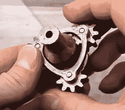
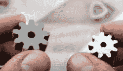

# 3D 打印:打印不锈钢，你做了一半的工作

> 原文：<https://hackaday.com/2021/02/25/3d-printering-makerbot-prints-stainless-you-do-half-the-work/>

每个人都想用金属打印。这是可能的，但是做这项工作的机器通常很贵。因此，当 MakerBot 宣布一台配备了实验性挤压机的打印机可以打印不锈钢零件时，它引起了我们的注意。然后我们读了一点，意识到它只能做一些工作。它需要很多帮助。通过一些合理的，如果不是微不足道的修改，你的打印机可能也能打印金属。

该系统的关键部分是巴斯夫 Ultrafuse 316L 不锈钢细丝，这种东西已经存在几年了。这是一种掺有金属的聚合物。这解释了特殊的挤出机，因为金属轴承细丝是典型的 3D 打印机喷嘴的地狱。然而，出来的并不是真正的钢——还不是。为此，你必须将零件送到后处理设施，在那里使用特殊设备在 1380°C 的纯氢气氛中烘烤。该公司声称，这种脱脂和烧结生产的零件可以达到 96%的纯金属。

听起来似乎可能有一个以上的后处理设施，但现在一切都可以从[matter hacker](https://www.matterhackers.com/store/l/basf-ultrafuse-316l-metal-composite-3d-printing-filament-175mm/sk/MRDKJRRS)获得。然而，金属印刷仍然不便宜。一卷细丝——看起来像 1 公斤重的一卷——要 465 美元。这是一张后处理一批重达 1 公斤的零件的“票”。附加票 50 美元。他们还建议你使用一种特殊的笔来获得床粘合，这种笔只需 18 美元，但在我们写这篇文章时已经脱销了。

 另一方面，如果你需要不锈钢的零件，这并不贵。[根据 Matterhackers](https://www.matterhackers.com/support/how-to-succeed-with-3d-printing-metal-on-a-desktop-3d-printer) 的说法，你可以通过大多数 3D 打印机运行这种细丝，尽管我们打赌你会想要一个相当结实的挤出机和喷嘴。你还需要一个至少能达到 100 摄氏度的加热床。许多床都达不到那么高的温度，或者涂层不能承受那么高的温度。MakerBot 的 METHOD X 打印机可以做到这一点，但是你也可以升级你的打印机来做到这一点。

那么这怎么会比让人给你做金属印花好呢？我们可以打印 PLA 模型以获得正确的设计，然后用高价金属打印机发送给服务提供商。听起来你自己做可能会得到更快的周转，但是我们不清楚为什么会这样。我们拿了一个 40 mm x 40 mm x 4 mm 的支架设计，向一家服务公司要了一个价格。在 316L 钢中，零件运输成本为 70 美元。你可以以同样的价格买到铝制的，或者 112 美元买到钛制的。黄金也是一个选择，但在 6400 美元，我们会通过。PLA 中的相同部件大约是 10 美元，在这个价格下，我们会说在家里打印是有意义的。但对于金属，我们将 50 美元的门票和其他材料及磨损成本与 70 美元的交付成本进行比较。

下面的视频展示了一些设计技巧，其中一些是习惯 3D 打印的设计师的常识。然而，有些似乎与烧结过程有关，我们想知道烧结过程后零件的尺寸会有多大变化。视频声称你应该在 X 和 Y 维度上缩放你的部件 120%，在高度上缩放 126%。视频提到了零件的 100 立方毫米限制，但如果你仔细阅读，你会发现它们实际上是指每边 100 毫米的立方体，也就是 100 万立方毫米，而且明显更大。

 那么你会尝试这个吗？除非你有一台相当强大的机器，否则你需要先进行一些升级。然后，你仍然需要等待你的金属部件在邮件中返回。虽然用不锈钢打印会很酷，但我们会等到我们能够在没有外界帮助的情况下生产出金属部件。

如果我们打算尝试一下，我们可能会想到一个红宝石喷嘴。也许我们会等待[40 万美元的打印机](https://hackaday.com/2018/09/14/hp-rolls-out-metal-3d-printers/)出现在剩余市场上。

 [https://www.youtube.com/embed/xy9VrkW9k4k?version=3&rel=1&showsearch=0&showinfo=1&iv_load_policy=1&fs=1&hl=en-US&autohide=2&wmode=transparent](https://www.youtube.com/embed/xy9VrkW9k4k?version=3&rel=1&showsearch=0&showinfo=1&iv_load_policy=1&fs=1&hl=en-US&autohide=2&wmode=transparent)

