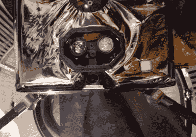

# 美国宇航局火星直升机上的“危险”技术一览

> 原文：<https://hackaday.com/2021/02/20/a-look-at-the-risky-tech-in-nasas-martian-helicopter/>

2 月 18 日，坚忍号火星车安全降落在火星表面。在未来的几天和几周内，塞在机器人探测器上的各种仪器和科学有效载荷将焕发生机；让我们对这颗红色星球了解更多。如果运气好的话，它甚至可能让我们更接近于确定火星是否曾经有过我们所知道的生命。

在火星车上的所有设备中，最吸引人的肯定是*独创性*。这种小型直升机将成为第一架真正在另一个星球[起飞和飞行的飞机，在最近接受 IEEE Spectrum](https://spectrum.ieee.org/automaton/aerospace/robotic-exploration/nasa-designed-perseverance-helicopter-rover-fly-autonomously-mars) 采访时，运营负责人【Tim Canham】分享了一些关于该车辆的有趣细节以及设计中的一些非正统决定。

*Ingenuity’s* downward facing sensors.

[Tim]解释说，作为一名技术演示者，该团队被允许在开发*独创性*方面承担比其他方式多得多的风险。他们不再拘泥于传统的硬件和软件，而是自由探索更新的、不太成熟的技术。

这包括现成的消费组件，如从 SparkFun 购买的激光高度计。这也意味着融入*独创性*的计算能力远远超过*毅力*本身，尽管直升机的智能手机级骁龙 801 处理器将如何处理恶劣的火星环境还有待观察。

在软件方面，我们也了解到*独创性*正在广泛使用开源代码。不仅机载计算机运行 Linux，而且该车辆由美国宇航局喷气推进实验室为立方体卫星和其他小型航天器开发的 Apache 2.0 许可框架控制。[该项目在 GitHub 上对任何想要它的人都可用](https://github.com/nasa/fprime)，根据变更日志，“火星直升机项目”所需的修复和改进在几个版本之前就已经合并了。

事实上，目前在火星表面滴答作响的代码可以下载并实现到你自己的 DIY 项目中，这是一个启示，不会在[Tim]上丢失。“这是一种开源的胜利，因为我们正在运行开源操作系统和开源飞行软件框架，并且运行商业部件，如果你有一天想自己做这件事，你可以从货架上购买。”

当然，从 SparkFun 的一些 Python 库和几个传感器到[设计和建造第一架太空直升机](https://hackaday.com/2020/09/02/an-up-close-look-at-the-first-martian-helicopter/)，花费了大量的时间。但是事实上，即使是像*独创性*这样的项目中的一小部分技术现在也能为普通黑客和制造商所用，这是地球上朝着科学研究民主化迈出的一大步。

 [https://www.youtube.com/embed/vnH4yD0s8QM?version=3&rel=1&showsearch=0&showinfo=1&iv_load_policy=1&fs=1&hl=en-US&autohide=2&wmode=transparent](https://www.youtube.com/embed/vnH4yD0s8QM?version=3&rel=1&showsearch=0&showinfo=1&iv_load_policy=1&fs=1&hl=en-US&autohide=2&wmode=transparent)

【感谢 MnS 的提示。]