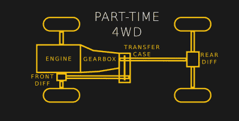
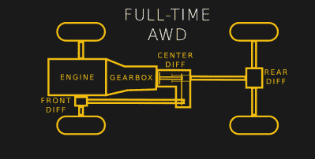
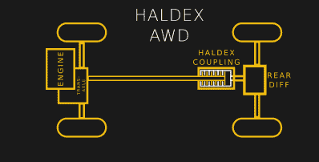

# 四轮驱动和 AWD 的区别

> 原文：<https://hackaday.com/2021/03/31/the-difference-between-4wd-and-awd/>

汽车制造商通常会吹捧一辆车的特点以吸引市场，这往往导致广告中出现刺耳的首字母缩写词和流行语，以迷惑潜在的买家。这在观察传动系时尤其明显。四轮驱动、全轮驱动、全职和兼职这些术语流传甚广，但它们实际上是什么意思呢？它们都是一样的吗，是说所有的轮子都是被驱动的，还是有更多的原因？让我们深入这项技术并找出答案。

## 兼职四轮驱动

部分时间四轮驱动是最简单的系统，最常见于 20 世纪 90 年代早期的吉普车、越野车和路虎，以及皮卡和其他重型应用。在这些车辆中，发动机将其动力传递给分动箱，分动箱将等量的扭矩传递给前后差速器，并基本上将它们的输入轴连接在一起。这对于湿滑的越野情况很好，因为始终有一些扭矩提供给两个轴。但这套系统有个缺点，就是不能一直以四驱模式驱动。随着前后差速器一起转动，前轮和后轮之间的任何转速差异(如转弯或轮胎磨损不均)都会导致问题。通向一个差速器的驱动轴会比另一个想转得更远，这个问题被称为*发条。*

Part-time 4WD systems are often found in older off-road vehicles and trucks, such as the Suzuki Samurai, early Land Crusiers, and Jeeps.

卷紧会导致分动箱部件折断或断裂。因此，这些系统只能在松软的路面上以四轮驱动模式行驶，在这种路面上，轮胎可能会有些打滑，以避免在传动系统中产生缠绕。因此，它们被称为*兼职四轮驱动*系统，因为分动箱可以转换到 2WD 模式，将动力传输到一个轴上，以便在封闭的道路上行驶。这避免了风力问题，但意味着这些系统只有在泥土、沙子或雪地上越野时才真正增加牵引力。

这些系统通常还在分动箱中安装了一个“低档”齿轮，用于降低车轮的传动比，从而使轮胎产生更大的扭矩，使车辆行驶速度更慢。这在低牵引力情况下和试图缓慢通过充满障碍和车辙的复杂路径时非常有用。

## 全轮驱动，或全时四轮驱动

显然，在某些情况下，即使在高牵引力的密封路面上，也需要驱动车辆的所有四个车轮。因此，解决传动系缠绕问题的方法是在车辆的前轴和后轴之间安装第三个差速器，代替分动箱。这种中央差速器可以允许前后桥之间的转速差，因此即使在铺砌路面上也可以驱动所有四个车轮。

AWD is more typically found in more car-like vehicles, as well as more modern off-road vehicles. In the latter application, center differential locks or limited-slip differentials are used to ensure good off-road performance.

然而，这样做的缺点是，由于差速器的工作方式，该系统只能向一个轴传递与另一个轴相同的扭矩。因此，例如，如果前轮打滑，后轮轴将仅接收与前轮一样多的扭矩，因此车辆将不能获得牵引力。

各种各样的解决方案被用来解决这个问题。现代陆地巡洋舰和揽胜等越野车将在中央差速器中安装一个可切换的锁，允许在必要时向两端发送相等的扭矩。或者，各种限滑差速器中的任何一种都可以安装在中央差速器位置，允许根据条件进行可变的扭矩分配。这些系统越野能力较弱，但在典型驾驶条件下不那么麻烦。它们通常安装在公路上使用的汽车上，但有时也安装在湿滑的路面上，如冰雪路面。它们也用于驱动所有四个车轮的高性能汽车，以尽可能有效地降低功率，实现更快的加速和更好的抓地力。

## 基于前轮驱动系统

另一种流行的全轮驱动系统是基于前轮驱动的系统，最著名的是在许多小型汽车中使用的 Haldex 类型。这些通常安装在大众、奥迪和奔驰等品牌的高性能掀背车上。该系统的工作原理是[具有典型的前轮驱动发动机和变速器布局，带有一个额外的传动轴](https://www.awdwiki.com/en/haldex/)，该传动轴连接到一个特殊的联轴器，然后连接到后差速器。在正常情况下，包含离合器组件的联轴器保持打开，不向后轮传递扭矩。然而，在前轮开始打滑并且比后轮转得更快的情况下，离合器组件逐渐接合，将高达 50%的扭矩传递给后轮。离合器组件设计用于在各种滑动水平下运行，允许可变的扭矩量被发送到后部，通常从 100:0 的前部到后部到完全 50:50 的分离。Haldex 系统经常被嘲笑和称为“假轮驱动”，因为它只在这种情况下工作。[然而，使用被黑的控制器手动启动系统是可能的。](https://www.shopdap.com/haldex-controller-mk7-mqb-gen5.html)

Haldex AWD is most commonly found on performance hatchbacks, though the technology is also used on mid-engined supercars, too.

这些系统也用于基于后轮驱动的应用，如布加迪威龙和兰博基尼 Aventador。概念是相同的，但由于这些车辆是中置发动机，联轴器安装在前轴上，后轮轴在大多数情况下获得大部分扭矩。

## 结论

汽车营销将永远依赖于流行语，因为在 30 秒的广告中解释特定车辆传动系统的机械细节是不切实际的。然而，有了这些知识，你现在应该有信心根据车架下的东西，而不仅仅是徽章上的华丽文字，来购买满足你需求的汽车。要特别警惕那些扭曲广泛接受的命名惯例来欺骗不知情的客户的制造商，并查看安装在车辆上的组件，而不是营销术语，以全面了解特定汽车的性能。一旦你知道你在寻找什么，你就会更容易做出正确的决定！