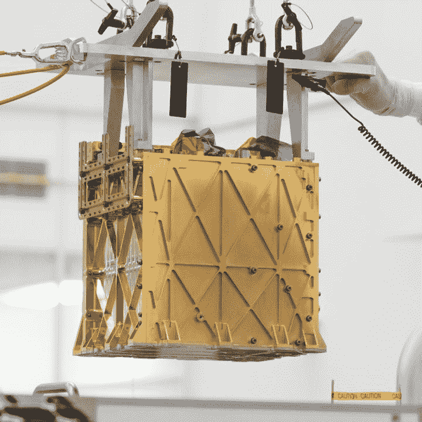
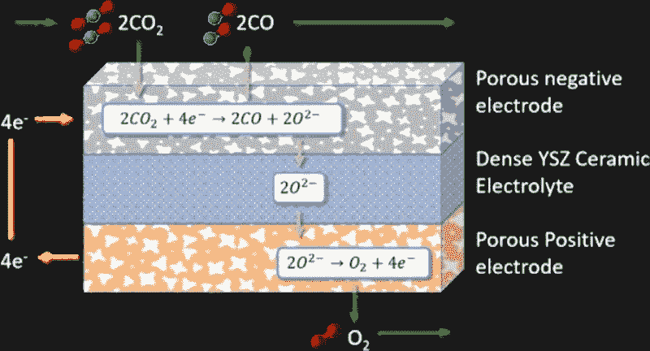
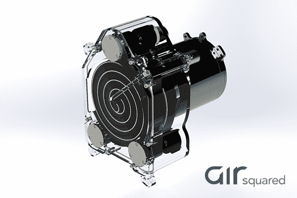

# 有氧气吗？未来的火星任务依赖于坚持不懈的莫邪

> 原文：<https://hackaday.com/2021/03/09/got-oxygen-future-mars-missions-are-relying-on-the-moxie-of-perseverance/>

迄今为止，行星探索的经验法则是，“上升的东西，保持不变。”除了月球和一些珍贵的小行星和彗星样本返回任务，一旦航天器出发，就再也看不到它了，要么永远在星际或星际空间的虚空中飞行，要么永远生活在某个星球的表面，要么作为成功任务的纪念碑，要么作为一次良好尝试的扭曲残骸。

冒着失败的风险，所有迹象都指向我们将火星之旅付诸实践，这使得载人火星任务开始从梦想变成计划。但是，尽管一些铁杆火星崇拜者说，几乎每个去火星的人都希望至少有返回的选择，并且后勤问题很多。其中最主要的将是回程需要推进剂。至少可以说，将它们从地球上拖出来是很困难的，但是如果一个汽车电池大小的仪器搭乘*毅力号*号前往火星，那么未来的宇航员可能只是在制造他们自己的推进剂，实际上是从稀薄的空气中提取它们。

## 靠土地生活

MOXIE being installed in *Perseverance*. Source: NASA/JPL

尽管为该任务计划的全套科学实验对毅力号火星车的设计施加了资源限制——仅样本缓存系统就需要两个专用机器人，并且几乎占据了这个野兽的所有腹部——JPL 的设计师和科学家仍然找到了一种方法，将两项技术演示压缩到火星车中。这并非没有先例；包含在 1997 年火星探路者任务中的*旅居者*火星车是一个概念验证设计，它直接导致了非常成功的*精神*和*机遇*火星车，并最终导致了*好奇号*和*毅力*。探路者还展示了使用安全气囊在火星上降落有效载荷的可行性；虽然对大的有效载荷没有用，但我们期望在将来看到着陆再次使用这种方法。

虽然[*别出心裁*直升机](https://hackaday.com/2020/09/02/an-up-close-look-at-the-first-martian-helicopter/)似乎吸引了公众的大部分注意力，但我们发现最有趣的火星 2020 技术演示是火星氧气 ISRU 实验，或称莫邪。您并不经常遇到嵌套的首字母缩写词，但这只是为了说明实验的复杂性。ISRU 代表“原位资源利用”，指的是提取和利用在太空或行星环境中发现的材料。ISRU 没有将原材料从地球一路运送到太空，而是寻求开发已经存在的资源。除了将定义延伸到用光伏发电收集太阳能，我们在 ISRU 的方式上做得很少；美国国家航空航天局认识到改变这种模式的必要性，莫邪号在这个方向上迈出了很大一步。

## 秘密就在陶瓷里

如果一个外星太空探测器来到地球，它不会面临从环境中提取氧气的挑战。我们的大气层大约有 21%的氧气，这使得它很容易从空气中分离出来。它在覆盖我们星球的水中也很丰富，从水中分离氧和氢很容易通过电解来完成。

然而，火星远不如地球有水。我们尚未在那里发现大量的液态水储备，尽管那里可能有足够的水来创造一个可以覆盖整个地球的海洋，但大部分水被锁在北极冰盖和其他遥不可及的冰冻储备中。回收足够的水用于电解在能量上是困难的。然而，火星上有一个基本上无限的氧气来源:它的大气层。虽然只有微量的氧气，但稀薄的空气中 95%是二氧化碳。莫邪的设计目的是利用固体氧化物电解法从当地丰富的资源中提取氧气。

SOXE schematic, showing where each reaction occurs. Note that the solid dielectric was originally planned to be yttrium-doped zirconium (YSZ), but was switched to scandium-doped (ScSZ) for the flown experiment. Source: Meyen, F. E., Hecht, M. H., & Hoffman, J. A. (2016). *Thermodynamic model of Mars Oxygen ISRU Experiment (MOXIE). Acta Astronautica, 129, 82–87.* [doi:10.1016/j.actaastro.2016.06.005](https://doi.org/10.1016/j.actaastro.2016.06.005)

像液态水的电解一样，固体氧化物电解依靠电力将分子分解成其组成元素。但还有更多，这一切都围绕着作为机器核心的陶瓷材料的特殊特性。某些陶瓷——在莫邪的固体氧化物电解器(SOXE)电池中，这种材料是用少量钪稳定的氧化锆，被称为 ScSZ——表现得像氧化物离子的电导体，氧化物离子基本上是氧分子，带有几个被剥离的电子。这种特性(以及陶瓷的其他一般特性，如耐热性、高强度、轻质和可加工性)使 ScSZ 成为固体氧化物电解的理想材料。

Cutaway view of a scroll compressor tested for MOXIE. Another model by the same company was eventually chosen. Source: [AirSquared, Inc.](https://airsquared.com/news/scroll-compressor-jpl-mars-2020/)

莫邪的制氧循环从一台简单的空气压缩机和一些滤尘器开始。不同于更传统的活塞式压缩机或隔膜泵，莫邪包括涡旋式压缩机，其中两个涡旋状元件嵌套在一起。一个是定子，保持固定，而转子元件在定子内的紧密轨道上旋转，而不绕其轴线旋转。这在两个元件之间形成了一个狭窄的空间，迫使气体从压缩机本体的周边流向中心。涡旋压缩机在这种应用中有很多优点，其中最主要的是无油运行。莫邪的涡旋压缩机(以及为其提供动力的 BLDC 发动机)是其唯一的移动部件，能够将稀薄的火星大气的压力提高到与地球大气相同的压力——大约增加 100 倍。

由于固体氧化物电解需要高温——大约 800°C——压缩的工艺气体接下来通过一系列 3D 打印的热交换器。莫邪电力预算的很大一部分用于加热天然气；莫邪是如此的耗电，以至于一个 2 到 4 小时的循环需要的能量比漫游者的放射性同位素热电发电机(RTG)在一个太阳能电池中产生的能量还要多。这意味着莫邪的使用必须仔细安排，因为漫游者上的其他任何东西都不能消耗大量的能量。

## 像一棵树一样行动

被加热的过程气体，其中大约 98%是二氧化碳，然后进入 SOXE 电池堆。每个电池是多孔金属电极的夹层，位于充当固相电解质的 ScSZ 薄片的两侧。当气体渗入阴极时，在电池上施加电流；在那里，热分解和金属的催化作用的结合导致以下还原反应:

氧化物离子(2 *O ^(2-)* )被离子吸引到 ScSZ 电解液中。它们从留在多孔阴极中的一氧化碳废产物和未反应的工艺气体中脱离出来，进入电解质中，然后在电解质中撞击与阳极的边界。多孔阳极的正电荷导致氧化物离子被氧化:

传感器将监控电解过程，并测试 SOXE 堆产生的氧气的纯度和流速，预计在最大电流为 4 安培的情况下，氧气的纯度和流速可达 12 克/小时。一旦分析完成，所有的气体都被排放到大气中——拯救它是没有意义的，至少现在还没有，因为莫邪只是一个概念验证。然而，放大约 200 倍后，一个巨型莫邪可能会产生和储存约 30 公吨的氧气，这些氧气是将火星登月舱送入轨道返回地球所需的。从地球上运送这么多的液态氧将意味着提升至少 10 倍的质量，这意味着莫邪有一天可能会节省四五次向火星发射的重型运载火箭。

莫邪的化学性质非常简单，但一如既往地存在复杂性和实际问题，特别是不必要的反应会用金属氧化物甚至固体碳堵塞多孔阴极。但也许最大的实际考虑是，就像该任务的进入下降和着陆(EDL)阶段以及“坚忍号”火星车将完成的大部分地形导航一样，莫邪将不得不自主运行其实验。如果出了问题，没有人去按按钮或清理线路。就像有一天宇航员将依靠莫邪的老大哥带他们回家一样，这项实验是独立的，无论火星扔给它什么，它都必须完成任务。