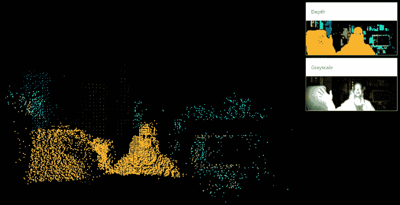
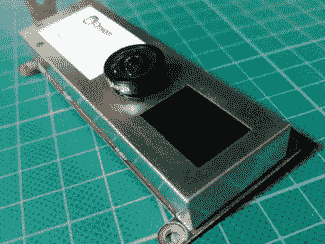
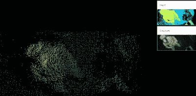

# 新零件日:洋葱 Tau 激光雷达相机

> 原文：<https://hackaday.com/2021/03/18/new-part-day-onion-tau-lidar-camera/>

洋葱 Tau 激光雷达相机是一款基于飞行时间(ToF)的小型深度传感相机，其外观和工作方式有点像 USB 网络摄像头，但有一个很大的不同:Tau 的帧包括 160 x 60“像素”的深度信息和灰度。通过 Python API 可以很容易地访问这些数据，示例脚本可以很容易地快速启动和运行。我们的目标是为受益于深度感测的项目提供一个负担得起且易于使用的选择。

当 Tau 在 Crowd Supply 上宣布时，我立即预订了大约 180 美元。从那以后，洋葱公司的人好心地给了我一个预生产单元，我一直在摆弄这个设备，以了解它的工作原理，并了解它适合什么样的项目。这是我到目前为止学到的东西。

## 它是做什么的？

形象化摄像机工作的最简单方法是使用示例应用程序，从 [Tau Studio](https://api.onioniot.com/util/url/tau-studio-get-started) 开始。它是一个在本地运行的 web 应用程序，可以在任何浏览器中查看，并显示由连接的相机生成的实时深度图和 3D 点云。

Tau Studio screenshot showing 3D point cloud, depth map (top right) and greyscale (bottom right).

Tau Studio(尤其是点云生成)最适合房间规模的应用。如果物体离相机太近，点云会变得很奇怪，但稍后会有更多的内容。

## 这是干什么用的？

Tau 相机生成的 3D 深度数据使项目能够基于现实空间中的距离测量做出决策。其工作方式是来自相机的每个深度帧可以被认为是代表相机视图的 160 x 60 深度测量的阵列，但它也可以提供额外的数据。

只需要一点 Python 就可以请求深度信息、彩色深度图或灰度图像。将帧转换成 OpenCV Mat 对象也几乎是微不足道的，这意味着它们可以很容易地传递给 OpenCV 操作，如斑点检测、边缘检测等等。硬件和 API 甚至支持同时插入和使用多台摄像机的能力，并配置为互不干扰。

## 设备和设置

Leave this window uncovered, or the camera won’t work right. (Actually, I do recommend covering it with a bit of paper and watching how badly the output changes, just for the heck of it.)

Onion Tau 相当小，有四个 M3 大小的安装孔和平坦的侧面，便于安装或封装，还有一个 USB-C 连接器。它只有一个镜头，镜头旁边是一个黑色的矩形窗口，当相机工作时，红外发射器通过它闪烁。务必不要盖住那个区域，否则它将无法正常工作。

电源和数据都通过 USB-C 连接器处理，相机附带一根短电缆。我发现在使用硬件的早期阶段，较长的电缆非常有用。我使用了一根高质量的 5 米长的 USB 3.0 有源延长线，看起来效果不错。在早期的使用中，我以各种方式移动相机，同时在我的台式机上运行示例代码并观察结果。这是一个救命稻草，因为它允许我在实验时自由移动相机。

有一个很好的[入门指南](https://github.com/OnionIoT/tau-LiDAR-server/blob/master/GET-STARTED.md)介绍了启动和运行所需的一切，但要获得相机擅长(和不擅长)的良好工作知识，有必要比该指南更进一步。

## 测试和建立熟悉度

如果我有一个建议给玩 Tau 的人，看看它做得好和不好，那就是:**使用 Tau Studio 后不要停下来。Tau Studio 是一个很好的互动演示，但它没有给出相机能做什么的完整想法。**

这里有一个例子来说明我的意思:如果有东西离相机太近，下图中的点云就会变成红色的沙漏形的一团。但这并不意味着摄像头的数据就是垃圾。如果观察深度窗口(点云的右上方)，很明显相机拾取的数据远远好于扭曲的点云所暗示的。

Getting too close to the camera saturates the subject with IR (represented by purple in the depth map). The point cloud also freaks out into a pinched mess, but the depth map shows that the camera can still see better than the point cloud render implies.

这就是为什么不局限于看点云来决定相机能做什么和不能做什么是很重要的。3D 点云肯定是整洁的，但是深度视图给出了相机能够真正感知的更好的想法。

为了充分了解相机的功能，请确保运行其他示例并使用其中的配置设置。我发现 [distance.py](https://github.com/OnionIoT/tau-lidar-camera/blob/master/examples/distance.py) 和 [distancePlusAmplitude.py](https://github.com/OnionIoT/tau-lidar-camera/blob/master/examples/distancePlusAmplitude.py) 的例子特别有用，改变`setIntegrationTime3d`(有点像曝光设置)、`setMinimalAmplitude`(较高的值过滤掉反射较少光线的东西)和`setRange`(调整深度图中的颜色范围)的值是最有启发性的。 [GitHub 库](https://github.com/OnionIoT/tau-lidar-camera)有示例代码，API 的[文档可以在这里](https://taulidarcamera.readthedocs.io/en/latest/api.html#)找到。

一般来说，积分时间越长，相机对深度的感知越好，处理不太合作的物体也越好。但是如果物体被红外饱和(在深度图中用紫色表示)，减少积分时间可能是个好主意。振幅视图是传感器拾取多少反射光的直观表示，是快速评估场景的便捷方式。较高的最小振幅设置倾向于过滤较小和较远的对象。

## Tau 最擅长什么

Tau 似乎在我称之为“一臂之长，房间尺度”的操作中工作得最好，我的意思是最佳点是房间大小的区域和范围，没有任何东西太靠近相机本身。对于这种操作，相机的默认设置非常好。

如果不调整设置，相机不会在近距离处理非常小的物体，即使这样，追逐结果也有点像将方形钉放入圆孔中。例如，我无法让 Tau 可靠地检测桌面上的棋盘游戏棋子之类的东西，但它在感知我的工作间的布局方面做得很好。

Tau’s view from my workshop ceiling.

例如，将 Tau 安装到天花板上并向下看房间，可以获得出色的结果，并可以轻松可靠地检测房间内的人、物体和活动。

反射物体(在我的测试中是金属罐和光滑的印刷纸板)可能有点不可预测，但只是在近距离。总的来说，只要东西不离相机太近，深度感应就不容易混淆。为了获得最佳效果，最好让相机与所拍摄的物体保持一臂距离(或更远)。

## 一款经济实惠的深度相机，带有 Python API

Tau 很小，容易安装，可以被认为是一个灰度相机，它也提供由 160 x 60 深度测量组成的帧。从相机获取简单的帧数据只需要一点 Python 代码，这些帧转换成 OpenCV Mat 对象以用于视觉处理功能几乎是微不足道的。它在手臂长度和房间规模的应用中工作得最好，但在一些边缘情况下，可以调整设置以获得不错的结果。

Python 示例应用程序简单而有效，我想重申使用它们中的每一个来更全面地了解相机做什么和不做什么的重要性。Tau Studio 拥有丰富多彩的 3D 渲染点云，是一个很好的工具，但在某些方面它的功能非常有限。观看点云并不能最完整地描绘出相机的功能，以及如何配置它，所以在评估时一定要尝试所有的示例。