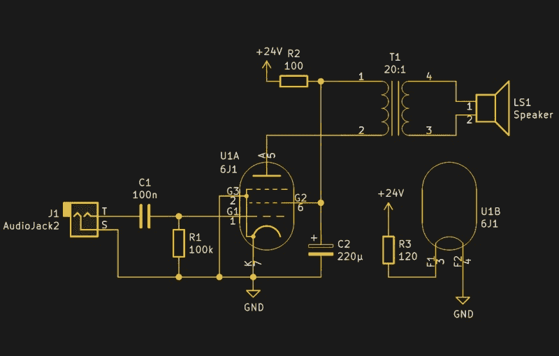

# 一个小小的电子管放大器，价格不贵

> 原文：<https://hackaday.com/2021/03/07/a-tiny-tube-amp-for-not-a-lot/>

在电子管音频的极端预算端是单管放大器，通常使用非常便宜的小信号五极管。他们以前以各种各样的形式在这里出现过，对那些以前的项目的一个合适的补充来自[克里斯·斯莱卡]。[这是一个带有变压器输出](https://hackaday.io/project/177987-the-milli-amp)的经典电路，它提供了足够的放大来驱动一对耳机，甚至是低电平的扬声器。

The fairly conventional circuit of the tube amplifier.

大多数电子管发烧友会立即认出阳极跟随器电路，在阳极馈电中有一个变压器，通过它输出。电子管工作在 A 级，这意味着它处于效率最低的模式，但失真最小。变压器本身不是一个音频部分，而是一个小电源变压器，取自一个废弃的壁式电源插座。它不仅用于隔离，还将电子管的高阻抗输出转换为适合驱动耳机或扬声器的低阻抗。

HT 电压相对较低，为 24 V，但仍能驱动耳机。扬声器电平需要一个前置放大器，但即使这样，这个电路也可能会使电子管超出扬声器的能力。它越接近其性能包络的边缘，产生的失真就越多，产生的声音就越差。在吉他应用程序中，这不是一个像这里这样的问题，但高保真爱好者可能会发现这太多了。将它作为耳机放大器进行一系列音频测试，以评估电源变压器对专用音频变压器的影响，这将是一件有趣的事情。

去年，我们对中国常见的前置放大器套件进行了非常深入的研究，该套件使用类似的阳极跟随器电路，但没有变压器。我们还看到了类似的放大器[，它使用运算放大器作为阻抗转换器](https://hackaday.com/2021/02/27/a-very-modern-tube-headphone-amplifier/)，以及一个新颖的想法[，其不寻常的偏置允许它仅从 3.3 伏运行](https://hackaday.com/2020/02/08/a-3-3-v-tube-preamp-without-an-inverter/)。这些电路非常便宜，我们建议任何人都可以尝试一下。