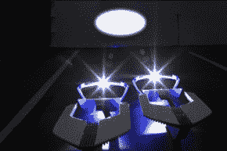
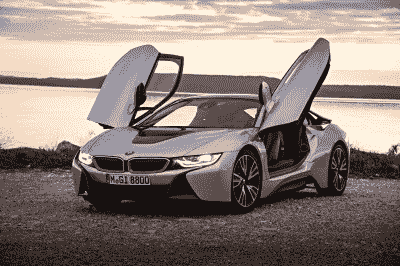
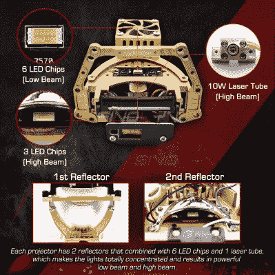
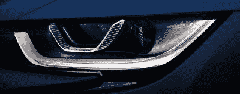

# 激光头灯如何工作

> 原文：<https://hackaday.com/2021/03/22/how-laser-headlights-work/>

当我们想到汽车技术的进步时，车灯通常不是首先想到的东西。发动机、燃油效率和电力转换都是更优先考虑的问题。然而，这并不意味着世界上没有成千上万的工程师日复一日地致力于提高汽车照明的艺术水平。

一旦法规放松，密封光束头灯就让位于更现代的设计，而灯泡从简单的卤素灯泡发展到氙气高强度气体放电灯，最近又发展到 led。现在，一项新技术出现了，那就是激光！

## 激光大灯？！

BWM’s prototype laser headlight assemblies undergoing testing.

“激光车头灯”这个词给人的第一印象是从汽车前部射出的激光束。显然，单色光的相干光束会使相当一段距离以外的非常特定的点的照明变差。对我们的眼睛来说，值得庆幸的是，激光头灯根本不是这样工作的。

相反，激光头灯由安装在头灯内部的一个或多个固态激光二极管组成。这些蓝色激光射向黄色磷光体，类似于白色 led 中使用的磷光体。这产生了一个强大的，充满活力的白光，然后可以被反射器反射，从前灯射向路面。以这种方式制造的激光大灯有几个好处。它们比发出相同光量的 led 更节能，同时也更节省空间。

BWM’s futuristic i8 was one of the first vehicles to ship with laser headlight technology.

激光头灯仍然是一项新兴技术，迄今为止只出现在少数宝马、奥迪和其他精选车辆上。宝马的技术是与照明专家欧司朗合作开发的。在实践中，使用常规的 LED 近光灯，用激光产生难以置信的明亮和聚焦点，用于远光灯。这可以提供车辆前方 600 米的照明，是传统 LED 远光灯的两倍。这些灯使用最初用于投影仪的铟镓氮二极管激光器，功率水平在 1 瓦以上。在汽车环境中实施这种技术的挑战之一是需要在极端温度下运行。虽然研究激光器和激光笔可能主要用于典型的室温，但汽车前灯必须能够承受从零下 40 度到 50 度的一切。幸运的是，激光器的高效率意味着它本身没有巨大的热量输出，从而使事情变得更加复杂。其他工程挑战包括为汽车应用中的混乱、高振动环境定制光学组件。与任何此类设备一样，确保最终用户在发生事故或故障时不会暴露在有害的激光辐射下也很重要。

## 拆下激光大灯

A marketing image showing the construction of an aftermarket LED/laser headlight. We’d take the laser power with a grain of salt — it’s difficult to imagine a 10 W laser shining directly on some small LEDs without melting a hole through the board in short order.

一个售后市场也涌现出来，有着令人愉快的创新设计。激光/LED 组合大灯在阿里巴巴上随处可见，[旨在替代现有车辆上的投射灯。](https://www.aliexpress.com/item/1005001889968976.html?spm=a2g0o.search0302.0.0.5bebc1d45ruE7k&algo_pvid=b016ca5c-d0fe-4309-ab5f-e39ea8770c80&algo_expid=b016ca5c-d0fe-4309-ab5f-e39ea8770c80-0&btsid=0b0a556516155071180373533e897a&ws_ab_test=searchweb0_0,searchweb201602_,searchweb201603_)这些通常使用 LED 近光灯和 LED/激光组合远光灯，其中激光二极管直接射向 LED 磷光体以进一步激发它，而不是使用它自己的。这些装置通常还配有风扇冷却，以保持激光器和 led 低于其最高工作温度。这种发展令人兴奋，但重要的是要警惕未知的售后头灯的性能。[许多售后 LED 大灯“升级”未能通过现实世界性能的检验](https://jalopnik.com/why-most-led-headlight-upgrades-dont-really-work-an-ex-1843070472)，没有理由相信混合 LED/激光设计会有任何不同。我们很想通过[一个完整的 IIHS 测试协议](http://www.vdrsyd.com/ancap_datasheets/xprotocol_archive/IIHS/headlight_test_rating_protocol.pdf)来选择这些部件，但遗憾的是这超出了范围(和预算！)的这篇文章。

然而，[mikeselectricsuff]碰巧找到了宝马和售后零件，在他的车间里把它们都拆了，看看是什么让它们运转起来。摊在板凳上，差异是多方面的。全球速卖通部分相对简单，与普通的前灯没有什么不同。不过有意思的是，激光远光灯电路在这些部位无时无刻不在运行。为了防止其他道路使用者失明，一个快门被放置在适当的位置来阻挡光线，当司机打开远光灯开关时，快门通过螺线管移动到一边。

在售后部分有点脱离左场的地方，宝马的设计完全是另一回事。尖端的头灯由多个连接器和 30 多个导体连接，大部分驱动电子设备位于外部控制器中。其中大部分是驱动各种 led 和步进电机，以便在转向时转动前灯。然而，激光组件带来了自身的复杂性。内部装有两个光传感器来监控激光束，一个特殊的金属阻挡臂位于二极管的正前方，大概是为了在荧光涂层烧穿的情况下阻止激光离开大灯。看到现代豪华车的前灯内部，看看我们已经从过去简单的密封光束走了多远，这真的很疯狂。

## 成本与性能

尽管效率有所提高，但这项技术仍然很昂贵。毕竟，强大的激光二极管并不便宜。然而，随着技术逐渐渗透到低端型号，我们很可能会看到规模经济向好的方向转变。事实上，如果国家当局开始要求更高性能的头灯作为标准，我们可以看到激光头灯成为规范，而不是一个昂贵的奢侈品。这项技术自然也可以应用于家庭和商业照明——尽管我们怀疑潜在的收益有限，LED 照明在未来一段时间内仍将是常态。

The high light output of laser headlights in a compact package allows engineers greater freedom when designing the front-end of a car.

就目前而言，这项新技术的吸引力主要在于包装方面的好处，这让汽车设计师在前灯领域有了更大的自由。当谈到家庭或办公室的灯具，或者更低端的汽车时，这种担心就不那么重要了。不管怎样，这是激光的一个令人兴奋的新应用，我们肯定会在未来看到更多。