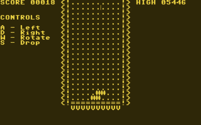

# 最小 UART 计算机

> 原文：<https://hackaday.com/2021/03/17/minimal-uart-computer/>

【Carsten】花了一年多的时间开发了一个[小型 CPU 系统](https://github.com/slu4coder/Minimal-UART-CPU-FLASH-Edition)，完全用 TTL 逻辑实现了自己的极简指令集。该系统对所有 I/O 使用串行终端接口，因此标题中有术语 UART。[Carsten]开始在多个试验板上构建这台计算机，这很快就失控了。

他把设计转移到了 PCB 上，但他仍然坐立不安。这个最新版本用更便宜、更容易使用的 CMOS 闪存芯片取代了 EEPROM，操作系统增加了一个小文件系统管理器。正如他在视频中所说，他的敌人是特征蠕变。

Tetris on the UART Computer

除了设计这个 CPU 项目，【Carsten】还搭建了一个汇编器，编写了一个实质性的操作系统和各种演示程序和游戏。他不仅学会了 KiCAD 制作这块板，还自学了使用自动路由器。KiCAD 设计、Gerbers 和 BOM 都在上面的知识库中提供。提供了 ROM 映像和源代码，以及一个 Windows 交叉汇编程序。但是等等——还有更多。他还写了一个 CPU 的 [cycle exact 仿真器](https://github.com/slu4coder/Minimal-UART-Emulator),正如他正确地吹嘘的那样，它只有不到 250 行 C++代码。这整个项目是一个惊人的事业，代表了许多良好的工作。我们希望他最终也会发布 assembler 项目，以防其他人想要接受构建它以在 Linux 或 MacOS 下运行的挑战。尽管如此，最小 UART 计算机的文档是优秀的。

[Carsten]声称项目终于通过了他设计要求的终点线，但是我们想知道，他真的会就此止步吗？请务必查看他的 YouTube 频道以获取更多信息视频。感谢[布鲁斯]送来的提示。

 [https://www.youtube.com/embed/k84HtfS8JM4?version=3&rel=1&showsearch=0&showinfo=1&iv_load_policy=1&fs=1&hl=en-US&autohide=2&wmode=transparent](https://www.youtube.com/embed/k84HtfS8JM4?version=3&rel=1&showsearch=0&showinfo=1&iv_load_policy=1&fs=1&hl=en-US&autohide=2&wmode=transparent)

