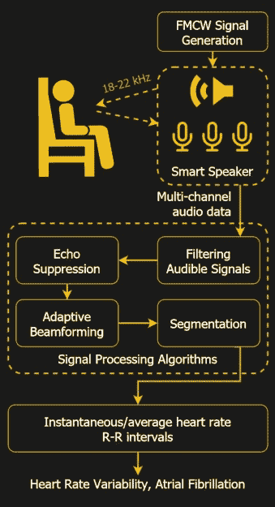
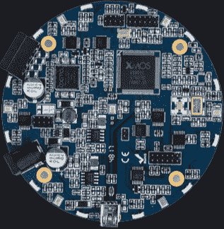

# 嘿谷歌，我的心脏还在跳动吗？

> 原文：<https://hackaday.com/2021/03/23/hey-google-is-my-heart-still-beating/>

华盛顿大学的研究人员正在研究亚马逊的 Echo 和谷歌的 Nest 等智能扬声器的潜在医疗用途，他们最近发布了一篇论文，详细介绍了他们的非接触式声学心跳检测实验。由于其敏感的麦克风阵列，通常用于帮助定位用户的语音命令，该团队提出，这些负担得起且越来越受欢迎的智能家居设备可以作为不引人注目的生命体征监视器来过双重生活。这篇论文甚至说，即使房间里有多人，他们的技术也可以用来监测特定目标个人的心跳和呼吸频率。

这些是一些大胆的主张，但它们并非没有先例。2019 年在 UW 大学进行的先前研究展示了智能扬声器技术如何用于[检测心脏骤停](https://www.nature.com/articles/s41746-019-0128-7)和[监测婴儿呼吸](https://dl.acm.org/doi/10.1145/3300061.3345453)。最新的论文可以被视为早期实验的高潮:一个单一的软件不仅可以监测附近病人的生命体征，还可以实际检测医疗紧急情况。这样一个项目的救生潜力，特别是对非常年轻和年老的人来说，将是难以置信的。

那么，你什么时候才能在你在黄金日买到的廉价 Echo Dot 上安装心脏监测技能呢？嗯，正如这类研究中经常出现的情况一样，将这项技术应用于现实世界远不如在实验室中那么容易。虽然这一概念很有前途，值得进一步研究，但在我们低级的智能扬声器能够进行《星际迷航》式的生命信号检测之前，可能还需要一段时间。

## 你现在能听到我吗？

研究人员在论文中解释说，他们的工作建立在早期实验的基础上，这些实验使用强大的超声波传感器来检测患者胸部、腹部和颈部的微小位移。相对较大的运动是正常呼吸作用的结果，而较小的亚毫米偏转对应于个人的心跳。虽然这项研究表明，从远处用声音检测生命体征是可能的，但该论文称，所使用的超声波传输的频率和强度是他们正在研究的消费智能扬声器硬件无法实现的。

 事实上，该论文解释说，标准智能扬声器首先并不特别适合超声波传输或接收，因为它们自然被设计成优先考虑人类语音和音乐。也就是说，研究人员提到了这样一个事实，即[谷歌的 Nest 已经使用超声波测距来调整视觉元素](https://blog.google/products/google-nest/ultrasound-sensing/)，如字体大小。确定观众站在离屏幕多远的地方，与检测他们颈动脉 0.5 毫米的振动相差甚远，但这是一个开始。

该团队的声纳实现是围绕智能扬声器硬件的固有限制设计的，并在 18 kHz 和 22 kHz 之间产生 50 ms 调频连续波(FMCW)啁啾。这使得软件不仅可以计算到固定目标的非常精确的距离，而且可以忽略任何超出预定范围的回声。

尽管如此，这些频率下的声音波长还是远远大于软件所寻找的一些运动。由于身体只有 0.3 毫米到 0.8 毫米的偏差，个体心跳尤其难以检测。应用几层滤波器来尝试和提高信噪比，自适应波束形成允许扬声器对准目标。

该论文的结论是，虽然得到的脉搏数据不如用作对照的传统心电图(ECG)读数准确，但对于健康患者和患有各种心脏异常的患者来说，它足以成为有用的诊断工具。尤其是考虑到非接触方法提供的优势，尤其是对于远程医疗应用。

## 理想条件

虽然研究人员能够通过他们的测试设置获得一些令人印象深刻的数据，但应该说有几个警告(至少现在)会使这项技术难以付诸实践。首先，智能扬声器需要对准患者的胸部，并放置在 40 厘米至 60 厘米(15 英寸至 23 英寸)的距离。准确性随着距离的增加而下降，至少在这个版本的软件中，任何超过一米的回波都被认为是背景噪音，完全被忽略。

Ideal placement for the smart speaker.

这显然与正常的智能扬声器放置不一致。即使扬声器离病人足够近，比如在床或椅子旁边的桌子上，它通常会指向天花板。虽然测试确实表明，当患者向左或向右移动时，软件能够正常工作，但错误率大大增加。

为了发挥作用，该设备可能需要放置在一个定制的支架上，以便在进行测量时保持在理想的位置。这并不是一个巨大的负担，成本在很大程度上可以忽略不计，但它确实说明了这种方法的相对不灵活性。

有趣的是，测试显示病人穿的衣服对声音读数只有轻微的影响。虽然紧身服装产生了最好的结果，但即使宽松的上衣和医院长袍也不会阻止系统收集有用的数据。然而，厚织物或多层衣服确实会减弱信号，这可能是一个取决于气候的潜在问题。

同样，该论文发现，该系统无法从极度肥胖的患者中可靠地提取心律，因为多余的组织抑制了潜在的身体运动。因此，体重指数(身体质量指数)为 35 或更高的患者被排除在主要测试组之外。该软件分别与五名身体质量指数中值为 38.6 的个人进行了评估，其中，它只能检测一名参与者的心率。该论文指出，这与以前的实验结果一致，并指出肥胖患者目前不适合非接触式传感技术。

## 闯入有围墙的花园

扬声器的位置和病人穿的衣服类型的问题，从大的方面来看，是相当小的。一些改进显然是必要的，显然这不会像在你的亚马逊 Echo 上安装一个软件并在你的手机上显示婴儿的心率那样简单，而不需要进行一些特殊的考虑，但所有的部分似乎都已经到位，可以让一些人来实施这个想法。不幸的是，尽管有如此有前景的研究，将这种能力带到消费者智能扬声器现在还不可能。

虽然论文广泛引用了这些商业设备，并在所有实验中使用它们的硬件功能作为限制因素，但研究人员承认，他们开发的软件实际上不能用于谷歌或亚马逊等公司目前可用的任何产品。一个简单的事实是，开发者可用的[API 不提供实现他们的声纳技术所需的底层硬件访问](https://hackaday.com/2018/01/17/an-alexa-skill-among-other-things-in-a-few-minutes/)。让第三方应用直接控制扬声器和麦克风会引发明显的安全问题，因此这种功能要么需要由制造商从一开始就内置到系统中，要么可能被归入专门为医疗保健提供商提供的单元中。

## 绕了一大圈

即使官僚主义的担忧使该团队的软件远离商业可用的智能扬声器，他们进行的研究仍然是非常有价值的。不需要身体接触就能负担得起的自动获取患者生命体征的方法所提供的可能性无可否认地具有吸引力，尤其是在新冠肺炎威胁挥之不去的情况下。非常需要能够帮助监测和诊断潜在传染性患者而不会暴露给护理他们的护士和医生的技术，即使当前的危机已经过去，这种技术也将继续引起人们的极大兴趣。

miniDSP UMA-8-S

如果商业智能音箱不是这个软件的可行平台，那会怎样？首先，你可以简单地构建你自己的硬件。如本文结尾所述，所有实验都是使用 miniDSP 的 UMA-8-S 七麦克风阵列和连接到台式计算机的 PUI 音频 AS05308AS-R 扬声器进行的。UMA-8-S 本身就是一个开发套件，包括具有波束形成功能的板载数字信号处理器(DSP)。它面向专业用户和 DIY 用户，看起来是一个非常有趣的设备。

该团队表示，只要你同意非商业许可，他们项目的 Python 源代码也可以根据请求获得。简而言之，任何想要重新创建这个项目的人都可以很容易地获得它。无论它是成为生物黑客的探索领域，还是被某个科技企业家提炼和营销，这项技术在未来几年将会浮出水面，这似乎是不可避免的。