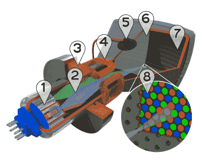
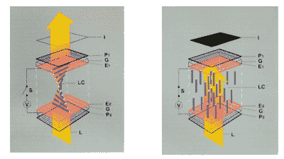
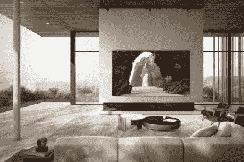

# MicroLEDs:照亮通往坚实的有机发光二极管竞争对手的道路

> 原文：<https://hackaday.com/2021/04/12/microleds-lighting-the-way-to-a-solid-oled-competitor/>

我们习惯于在体育场馆和户外显示屏上看到巨大的 LED 显示屏。将同样的技术带入您的客厅需要什么？非常非常小的发光二极管。微型 led。

近十年来，MicroLED 屏幕一直被传言即将出现，这意味着现在是它们真正成为现实的时候了。当然，显示技术已经从早期推动电视和家用电脑革命的阴极射线管(CRT)技术走了很长的路。在 20 世纪 90 年代后期，液晶显示(LCD)技术成为 CRT 的可行替代品，提供了一种薄而无失真的图像，具有像素级完美的图像再现。除了最终拥有壁挂式电视之外，液晶显示器还允许在许多新的地方安装显示器。

从那时起，与 CRT 相比，LCD 的缺陷成了症结所在。CRT 的优良特性，如非常快的响应时间、深黑色和零色偏，无论从哪个角度看，都导致了各种各样的 LCD 技术来重现这些特性。有一段时间，等离子显示器似乎很有希望成为大屏幕，但有机发光二极管(OLEDs)已经取而代之，SED 和 FED 等仍在开发中的技术也已被搁置。

虽然有机发光二极管在图像质量方面非常好，但它的缺点包括老化和不同有机染料对颜色的不均匀磨损。MicroLEDs 希望利用有机发光二极管的弱点，通过使用无机 LED 技术带来更亮的屏幕，没有老化，只是非常非常小。

那么，如何将一个标准的半导体 LED 缩小到一个像素的尺寸呢？人们什么时候才能买到 MicroLED 显示器呢？让我们来看看。

## 关于照片的一切

Schematic view of a color CRT: three electron guns along with the deflection coils to target the electrons onto the phosphor layer.

显示器最重要的特性当然是能够产生足够数量的光子来创建清晰的图像。在阴极射线管的情况下，这是通过加速电子并将其撞向荧光层来实现的。每次撞击都会导致磷光体分子的能量状态发生变化，最终导致增加的能量以光子的形式再次发射出去。根据使用的磷光体，光子的波长会有所不同，很快，就有了显示器。

CRT 体积庞大的原因是每种颜色使用一个电子枪。虽然这是相当有效的，并且电磁控制的使用有助于令人印象深刻的快速扫描速率，但它确实给了 CRT 一定的深度，该深度是显示器尺寸的函数。21 世纪初，佳能和索尼对这些经典 CRT 进行了有趣的改进，分别采用了 [SED](https://en.wikipedia.org/wiki/Surface-conduction_electron-emitter_display) 和 [FED](https://en.wikipedia.org/wiki/Field-emission_display) 的形式。这些显示技术使用半导体技术为每个像素创建一个电子枪，它可以在仅仅几毫米远的地方向荧光层发射。

然而，那时 LCD 技术已经开始变得稳固。不像有些相似的等离子显示技术，SED 和 FED 从未投入大规模生产。即使在那时，LCD 技术本身也经历了一些巨大的增长，试图超越早期的[无源矩阵](https://en.wikipedia.org/wiki/Passive_matrix_addressing)LCD，其反应时间慢，重影大，视角非常窄，使用原始的扭曲向列相( [TN](https://en.wikipedia.org/wiki/Twisted_nematic_field_effect) )面板。

尽管在 20 世纪 90 年代和 21 世纪初，液晶显示器明显不如 CRT，但液晶显示器确实很薄。薄到足以放入移动设备，如笔记本电脑和当时的“智能助理”，如个人数字助理([PDA](https://en.wikipedia.org/wiki/Personal_digital_assistant))。随着液晶显示器获得了诸如消除大多数重影的有源矩阵技术和改善视角的新液晶排列(如 [IPS](https://en.wikipedia.org/wiki/IPS_panel) ，MVA)等功能，它们也越来越受欢迎。显然，笨重的显示器将成为过去。

## 背光的诅咒

Schematic overview of a twisted nematic (TN) LC display, showing the OFF and ON state, respectively.

一个液晶显示器有许多层，使其工作。有液晶层可以阻挡或让光通过，也有彩色滤光片为像素提供颜色，还有 TFT 控制和偏振层。大多数液晶显示器使用背光源，提供最终到达我们眼睛的光子。由于背光和我们的 Mark I 眼球之间的所有这些层，相当多的能量永远不会离开显示器堆栈。

在“黑色”像素的情况下，目的是使用 LC 层阻挡该部分中 100%的背光能量。这是一种浪费，而且由于液晶层中的晶体不能完全阻挡光线，液晶显示器不能产生纯黑色。虽然一些 LCD 技术(例如 MVA)在这里提供了更好的结果，但这在其他地方会有所妥协，例如缩短响应时间。

这说明了阴极射线管显示器和液晶显示器之间最根本的区别:阴极射线管基本上是黑暗的，电子不会击中它。SEDs、fed 和等离子显示器也是自发光的，有机发光二极管也是如此。对于高动态范围内容，这是一个至关重要的因素。

随着 LCD 转向[基于 LED 的背光](https://en.wikipedia.org/wiki/LED-backlit_LCD)，情况有所改善，因为 LCD 可以有不同的背光部分，可以单独激活。通过在背光中使用更多更小的 led，所谓的调光区的数量可以增加，从而产生更暗的黑色。你可以看到这是怎么回事，对不对？

## 未来是不言自明的

经过几十年的显示技术发展，决定显示技术受欢迎程度的因素基本上归结为四个因素:

*   它的生产成本有多低。
*   它再现颜色的能力有多强。
*   它的伸缩性有多好。
*   它涵盖了多少用例。

在液晶显示器优于阴极射线管的情况下，显而易见的是，为什么阴极射线管无法竞争，为什么等离子屏幕从来没有引起大的轰动。这也清楚地表明，正如三星退出液晶显示器市场所表明的那样，液晶显示器在某种程度上已经走进了死胡同。

This is how Samsung apparently envisions MicroLED TVs will be used. Good thing that they have very high brightness levels. (Credit: Samsung)

微型 LED 是在 20 多年前发明的，虽然三星的 Wall(墙)正在有限的商业应用中，但最令人兴奋的发展可能会在今年出现，这是一款“负担得起”的微型 LED 电视，假设你的目标是一款 76 英寸的微型 led 电视，价格大约相当于早期等离子显示器的价格。

更小的 MicroLED 显示屏暂时不太可能出现。不成熟的制造技术和进一步降低像素间距的需求是目前的瓶颈。后一点很快在三星今年发布的 MicroLED 电视规格中体现出来:它们只支持 4K，即使是 110 英寸的版本。在 50 英寸的情况下，1080p(全高清)将是人们在不导致生产成本飙升的情况下最大的希望。

## 时间问题

尽管新技术可能很酷，但人们不能指望它们有一天会从生产线上下来，完美无缺，随时可以投入使用。早期的 CRT 和无源矩阵 LCD 以其独特的方式很糟糕。然而，随着技术的成熟，CRT 以非常低廉的价格成为了可靠的主力，LCD 变得相当容易接受。

有机发光二极管技术最初在早期的索尼原型上有大约 1000 小时的乐观寿命，但今天我们随处可见有机发光二极管显示器，从手机到电视，甚至是嵌入式应用的小型单色或多色屏幕。由于 MicroLED 的优势是基于众所周知的半导体技术，因此没有理由怀疑它将经历类似的演变。

与液晶显示器相比，MicroLED 具有更高的亮度和更长的寿命，更低的延迟，更高的对比度，更大的色彩饱和度，以及简化的显示堆栈，难怪 MicroLED 显示器不仅由三星生产，还由索尼(“水晶 LED”)和友达光电以及少数其他显示器制造商生产，以及小型(< 5 英寸)MicroLED 显示器的[诱人前景](https://www.anandtech.com/show/15174/japan-display-develops-16inch-micro-led-display-module-265-ppi-3000-nits)。

我们知道每个人都喜欢大量的微型 led。一旦它们变得如此平常，你们的爱会长久吗？