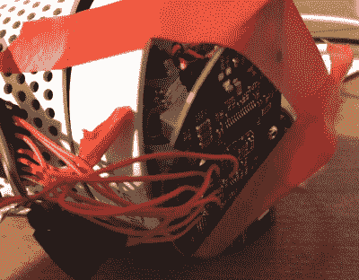

# 亚马逊 Echo 获得开源大脑移植

> 原文：<https://hackaday.com/2021/03/22/amazon-echo-gets-open-source-brain-transplant/>

毫无疑问，亚马逊的 Alexa 生态系统可以轻松地将语音控制添加到智能家居中，但并不是每个人都对它的工作方式感到兴奋。事实上，你所有的命令都是从亚马逊的服务器上弹出来的，而不是留在网络内部，这对我们当中更注重隐私的人来说是绝对不行的，老实说，很难责怪他们。当你仔细想想，整件事都令人毛骨悚然。

这正是为什么[André Hentschel]决定研究用开源替代方案替换他的 Amazon Echo 上的固件。由于设备底部的诊断端口，Linux 驱动的第一代 Echo 几年前就已经扎根，甚至有几个固件映像漂浮在那里，他可以在那里闲逛。理论上，他所要做的就是移除任何回调到亚马逊服务器的东西，并用类似的自由软件库和工具替换专有部分。

Taping into the Echo’s debug port.

当然，结果比那要复杂一点。最初的 Echo 运行在 2.6.x 系列 Linux 内核上，即使对于 2014 年发布的设备来说，这也已经过时了。由于 glibc 的版本同样陈旧，更新的 Linux 软件将拒绝运行。[André]发现为 Echo 构建最新的文件系统映像不成问题，但让利基设备的硬件在更现代的内核上工作就是另一回事了。

他最终让麦克风阵列工作，但不是板载数字信号处理器(DSP)。没有 DSP，Echo 的硬件时代真正开始显现，很明显，这个七岁的智能扬声器需要一些帮助才能完成工作。

[André]提出的解决方案与该设备最初的工作方式没有什么不同:Echo 在本地执行唤醒词检测，然后将实际的语音处理卸载到一台更强大的计算机上。除了在这种情况下，另一台计算机在同一个网络上，而不是隐藏在亚马逊的云中。Porcupine 项目提供唤醒词检测，语音样本通过 [voice2json](https://github.com/synesthesiam/voice2json) 分解成可操作的意图，响应由久负盛名的 eSpeak 语音合成器提供。

正如你在下面的视频中看到的，整体体验与 stock 非常相似，并带有花哨的 LED 环动作。事实上，由于豪猪允许多个唤醒词，你甚至可以说可用性已经得到了改善。虽然[André]说[增加对 Mycroft 的支持将是一个合乎逻辑的扩展](https://hackaday.com/2015/09/23/echo-meet-mycroft/)，但他的近期目标是在该项目的 GitLab 存储库中记录和提供所有内容，以便其他人可以开始自己进行试验。

 <https://hackaday.com/wp-content/uploads/2021/03/openecho_video.webm?_=1>

[https://hackaday.com/wp-content/uploads/2021/03/openecho_video.webm](https://hackaday.com/wp-content/uploads/2021/03/openecho_video.webm)