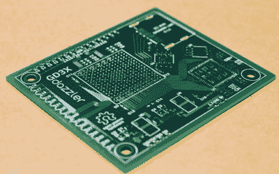

# 电线与文字 Python 中的 PCB 布线

> 原文：<https://hackaday.com/2021/03/30/wires-vs-words-pcb-routing-in-python/>

ExCamera 实验室的[James Bowman]宁愿花费数小时键入代码，而不是在 PCB 布局工具中以图形方式推动走线，他开发了一种用 Python 路由 PCB 的方法 [CuFlow](https://excamera.com/sphinx/article-cuflow-crossbar.html) 。无论你是否赞同这个概念，你都必须承认结果看起来相当不错。

GD3X Dazzler PCB routed using CuFlow

这个项目的关键是一个[James]称之为 rivers 的概念——上面显示的炫目板只包含其中的八个。连接通过一条或多条河流到达它们的目的地，这些河流可以按照需要以非常 Pythonic 化的方式被分割、连接和合并。河流导航是使用类似海龟图形的命令来执行的，比如`left(90)`和恰当命名的`shimmy(d)`来对齐两条移位的河流。他还大量使用引脚/栅极交换来使路由更加平滑，还有一个漂亮的`shuffler`功能，可以以交叉方式任意重新排列信号。通过为每个器件的库定义嵌入信号`escapes`,布线至复杂封装(如图所示的 BGA)变得更加容易。

我们完全同意[James]对这些天来如此多的原理图只不过是一个视觉网络列表，根本不能代表设计的逻辑流程和功能的沮丧。然而，CuFlow 通过将它们深埋在线路连接细节中，进一步混淆了互连。或许，如果 CuFlow 与类似于 SKiDL Python 示意性描述语言的东西融合在一起，这个概念会获得更多的关注？

也就是说，我们喜欢他在 CuFlow 中实现的概念和路由方法。请访问 GitHub 库亲自查看一下，在那里他写了更多关于他的动机和各种技术的细节。你可能还记得[James]的两个嵌入式系统开发工具，我们在 2018 年讨论过——T2 的 SPI 驱动程序和 T4 的 I2C 驱动程序。