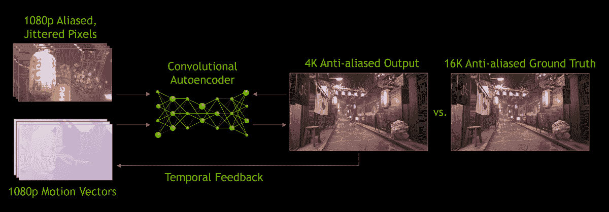

# 人工智能升级和内容交付的未来

> 原文：<https://hackaday.com/2021/04/05/ai-upscaling-and-the-future-of-content-delivery/>

谣言工厂最近一直在谈论任天堂计划在假期推出他们非常受欢迎的 Switch 控制台的新版本。更快的 CPU、更多的 RAM 和改进的有机发光二极管显示器几乎是必然的，正如你所期待的一代中期更新。这些升级的规格几乎肯定会带来虚高的价格，但鉴于目前交换机令人难以置信的需求，50 美元甚至 100 美元的涨幅不太可能阻止许多潜在的买家。

但是[根据来自*彭博*](https://www.bloomberg.com/news/articles/2021-03-23/nintendo-to-use-new-nvidia-graphics-chip-in-2021-switch-upgrade) 的一份报告，新的开关可能比你预期的技术保守的任天堂有更多的变化。他们的消息来源称，新系统将利用能够进行深度学习超级采样(DLSS)的 NVIDIA 芯片组，该功能目前仅在高端 GeForce RTX 20 和 GeForce RTX 30 系列 GPU 上提供。这项技术已经在过去几年中被几个著名的 PC 游戏所采用，它使用机器学习来实时提升渲染图像。因此，该引擎可以用较低的分辨率渲染游戏，并让 DLSS 来弥补差异，而不是让 GPU 产生原生的 4K 图像。

The current model Nintendo Switch

这项技术的意义是巨大的，尤其是在计算能力有限的设备上。对于 Switch 来说，当它从坞站上拆下来时，可以兼作电池供电的手持设备，使用 DLSS 可以让它产生类似于它与之竞争的更大更贵的 Xbox 和 PlayStation 系统的视觉效果。如果任天堂和英伟达能够证明 DLSS 在像 Switch 这样小的东西上是可行的，我们很可能会看到这项技术应用到未来的智能手机和平板电脑上，以弥补它们相对有限的 GPU。

但是为什么就此打住呢？如果像 DLSS 这样的人工智能系统可以放大视频游戏，那么同样的技术也可以应用于其他形式的内容。未来的电视不会让你的互联网连接充满 16K 的视频流，而是会使用在流行节目和电影上训练的机器学习算法来充分利用它们所拥有的东西吗？

## 你能走多低？

显然，你不需要机器学习来调整图像的大小。你可以很容易地将标准分辨率的视频放大到高清，事实上，当你观看旧内容时，你的电视或蓝光播放器正在这样做。但是，不需要特别敏锐的眼睛，就能立即分辨出为了适应高清显示屏而放大的 DVD 和以该分辨率制作的现代内容之间的区别。拿一张 720 x 480 的图像，把它放大到 1920 x 1080，甚至是 4K 的 3840 x 2160，会导致一些非常明显的图像质量下降。

为了解决这个基本问题，人工智能增强的缩放实际上创建了新的视觉数据，以填补源分辨率和目标分辨率之间的差距。在 DLSS 的案例中，英伟达通过拍摄同一款游戏的低分辨率和高分辨率图像来训练他们的神经网络，并让他们内部的超级计算机分析差异。为了最大化结果，高分辨率图像被渲染到在计算上不切实际或者甚至不可能实时实现的细节水平。结合运动矢量数据，神经网络的任务不仅是填充必要的视觉信息，使低分辨率图像更好地接近理想目标，而且预测下一帧动画可能会是什么样子。

[NVIDIA’s DLSS 2.0 Architecture](https://www.nvidia.com/en-us/geforce/news/nvidia-dlss-2-0-a-big-leap-in-ai-rendering/)

虽然在撰写本文时，只有不到 50 款 PC 游戏支持最新版本的 DLSS，但到目前为止，结果非常令人乐观。该技术将使当前的计算机能够更长时间地运行更新、更复杂的游戏，并且对于当前的游戏来说，将大大改善每秒帧数(FPS)的渲染。换句话说，如果你有一台足够强大的计算机，可以在 1920 x 1080 下以 30 FPS 的速度运行游戏，那么如果游戏以 1280 x 720 的速度渲染并使用 DLSS 放大，这台计算机可能会达到 60 FPS。

在过去的一两年里，有很多机会可以对 DLSS 在受支持的游戏上的真实性能进行基准测试，YouTube 上充满了面对面的比较，显示了这项技术的能力。在一次特别极端的测试中， [2kliksphilip 以 427 x 240](https://www.youtube.com/watch?v=_gQ202CFKzA) 的速度跑完了 2019 年的*控制*和 2020 年的*死亡搁浅*，并使用 DLSS 将其放大到 1280 x 720。虽然结果并不完美，但这两款游戏最终看起来都比他们有权考虑的分辨率好得多，我们更可能将它们与任天堂 64 而不是现代游戏 PC 联系起来。

 [https://www.youtube.com/embed/_gQ202CFKzA?version=3&rel=1&showsearch=0&showinfo=1&iv_load_policy=1&fs=1&hl=en-US&autohide=2&wmode=transparent](https://www.youtube.com/embed/_gQ202CFKzA?version=3&rel=1&showsearch=0&showinfo=1&iv_load_policy=1&fs=1&hl=en-US&autohide=2&wmode=transparent)

## 人工智能增强娱乐

虽然这些可能还为时尚早，但似乎很明显，像深度学习超级采样这样的机器学习系统在游戏领域有很大的前景。但是这个想法不仅仅局限于视频游戏。使用类似算法来增强没有更高分辨率版本的老电影和电视节目也有很大的推动力。专有和开放软件现在都可以利用现代 GPU 的计算能力来升级静态图像和视频。

 在这个领域的开源工具中，[Video2X 项目是众所周知的，并且正在积极开发中](https://github.com/k4yt3x/video2x)。这个 Python 3 框架使用了 waifu2x 和 Anime4K 升级器，您可能已经从它们的名字中了解到了，它们主要是为动画设计的。这个想法是，你可以拍摄一部仅以标准清晰度发布的动画电影或系列，并通过一个专门训练过视觉相似内容的神经网络来运行它，将其分辨率提高到 1080 甚至 4K。

虽然根据您的操作系统和硬件平台，不同的 GPU 加速框架可能会使软件启动并运行起来有些复杂，但这是任何拥有相对现代的计算机的人都能够自己完成的事情。举个例子，我从 *Big Buck Bunny* 拿了一个 640 x 360 的帧，在 Video2X:

    

与原生的 1920 x 1080 图像相比，我们可以看到一些细微的差异。兔子皮毛的阴影没有那么细致入微，眼睛缺乏一定的光泽，最明显的是草已经从单个叶片变成了看起来更像油画的东西。但是如果这两张图片不是并排的，你真的会注意到这些吗？

## 需要一些组件

在前面的例子中，AI 能够将图像的分辨率提高三倍，而图形伪影可以忽略不计。但也许更令人印象深刻的是，640 x 360 帧的文件大小只有原始 1920 x 1080 帧的五分之一。将这种差异外推到一部故事片的长度，很明显技术会对与流媒体视频相关的巨大带宽和存储成本产生巨大影响。

想象一下，在未来，你的设备不是从互联网上观看超高分辨率的电影，而是获得目标分辨率 1/2 甚至 1/3 的视频流，以及针对该特定内容训练的神经网络模型。然后，你的人工智能播放器可以获取这个“脱水”的视频，并将其实时缩放到适合你的显示器的任何分辨率。与其让你的网络连接饱和，倒不如说这有点像《回到未来 II》中他们送披萨的方式。

唯一的技术挑战是执行这种升级所需的时间:当在相当高端的硬件上运行 Video2X 时，1 或 2 FPS 的渲染速度被认为很快。要实现实时人工智能视频缩放，需要巨大的计算能力，但英伟达在 DLSS 方面取得的进展无疑令人鼓舞。当然，电影爱好者会认为这样的复制可能不符合导演的意图，但当人们在上班途中每次用手机看 30 分钟电影时，可以肯定地说这艘船已经启航了。